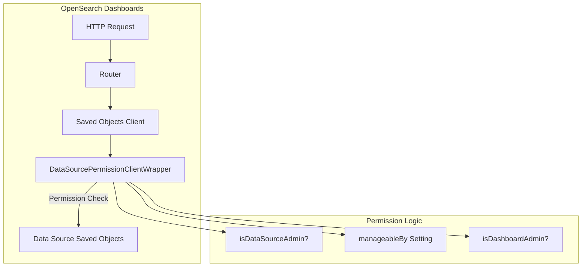

---
tags:
  - opensearch-dashboards
---
# Data Source Permissions

## Summary

Data Source Permissions is a security feature in OpenSearch Dashboards that controls access to data source operations based on user roles. It uses a client wrapper pattern to intercept saved object operations and enforce permission checks, ensuring that only authorized users can create, update, or delete data sources.

## Details

### Architecture



### Components

| Component | Description |
|-----------|-------------|
| `DataSourcePermissionClientWrapper` | Wraps the saved objects client to enforce permission checks |
| `manageableBy` setting | Controls who can manage data sources (`all`, `none`, `dashboard_admin`) |
| `isDataSourceAdmin` | Flag indicating if user has data source admin privileges |
| `isDashboardAdmin` | Flag indicating if user has dashboard admin privileges |

### Configuration

| Setting | Description | Default |
|---------|-------------|---------|
| `manageableBy` | Controls data source management permissions | `all` |

#### Permission Modes

| Mode | Description |
|------|-------------|
| `all` | Any user can manage data sources |
| `none` | No user can manage data sources (except data source admins) |
| `dashboard_admin` | Only dashboard admins can manage data sources |

### How It Works

1. When a saved object operation is requested, the wrapper intercepts it
2. If the user is a data source admin, all operations are allowed
3. If `manageableBy` is `all`, all operations are allowed
4. If `manageableBy` is `dashboard_admin`, only dashboard admins can perform operations
5. If `manageableBy` is `none`, operations are blocked with a permission error
6. For non-data-source saved objects, operations pass through unchanged

### Usage Example

```yaml
# opensearch_dashboards.yml
# Configure data source management permissions
data_source.manageableBy: "dashboard_admin"
```

### Error Handling

When a user lacks permission, the wrapper throws a forbidden error:

```json
{
  "statusCode": 403,
  "error": "Forbidden",
  "message": "You have no permission to perform this operation"
}
```

## Limitations

- Permission checks only apply to data source saved objects
- The wrapper must expose all saved object client functions to avoid runtime errors
- Permission settings are cluster-wide, not per-data-source

## Change History

- **v2.18.0** (2024-11-05): Fixed missing saved object client functions in permission wrapper


## References

### Documentation
- [Data Sources Documentation](https://docs.opensearch.org/2.18/dashboards/management/data-sources/): Official documentation
- [Data Source Permissions](https://docs.opensearch.org/2.18/security/access-control/permissions/#data-source-permissions): Permission configuration
- [Multiple Data Sources](https://docs.opensearch.org/2.18/dashboards/management/multi-data-sources/): Configuring multiple data sources

### Pull Requests
| Version | PR | Description | Related Issue |
|---------|-----|-------------|---------------|
| v2.18.0 | [#8118](https://github.com/opensearch-project/OpenSearch-Dashboards/pull/8118) | Fix missing functions in client wrapper | [#1234](https://github.com/opensearch-project/OpenSearch-Dashboards/issues/1234) |
