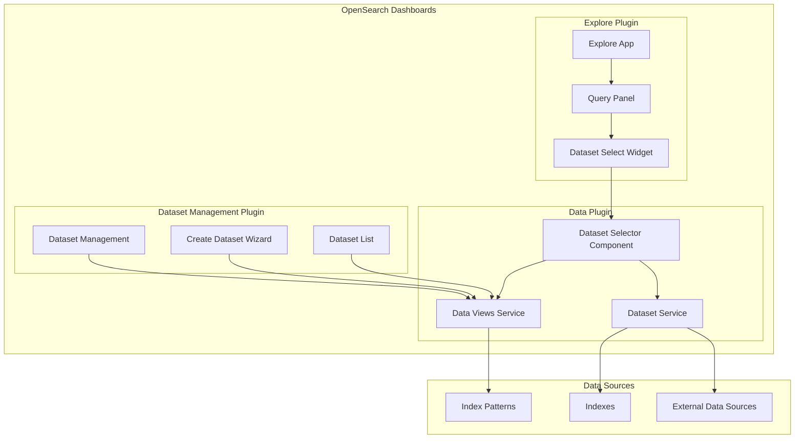
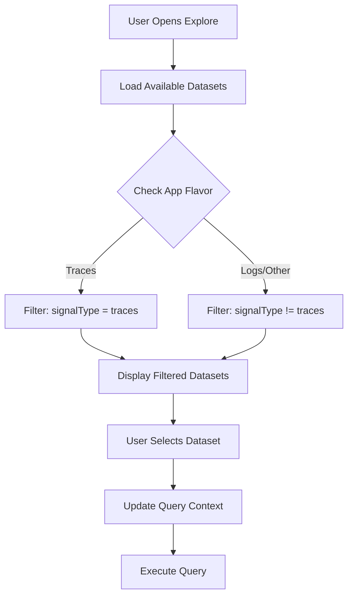

---
tags:
  - domain/core
  - component/dashboards
  - dashboards
  - indexing
  - observability
  - search
---
# Dataset Explorer

## Summary

The Dataset Explorer is a feature in OpenSearch Dashboards that provides an enhanced interface for selecting and managing datasets. It allows users to browse, filter, and select datasets (index patterns and indexes) for use in the Explore application. The feature includes signal type filtering to separate different types of observability data (logs, metrics, traces) and a dedicated dataset management plugin.

## Details

### Architecture



### Data Flow



### Components

| Component | Description |
|-----------|-------------|
| `DatasetSelect` | Main dataset selector component with filtering and search |
| `DatasetSelector` | Advanced dataset selector with type navigation |
| `DetailedDataset` | Extended dataset interface with metadata |
| `SignalType` | Enum for categorizing datasets by signal type |
| `DatasetSelectWidget` | Explore-specific wrapper with flavor-based filtering |
| `dataset_management` | Plugin for dataset CRUD operations |

### Configuration

| Setting | Description | Default |
|---------|-------------|---------|
| `datasetManagement.enabled` | Enable the dataset management plugin | `false` |
| `datasetManagement.aliasedAsIndexPattern` | Display datasets as "Index Patterns" in UI | `true` |
| `explore.supportedTypes` | Dataset types supported in Explore | `['INDEXES', 'INDEX_PATTERN']` |

### SignalType Values

| Value | Description | Use Case |
|-------|-------------|----------|
| `logs` | Log data | Log Explorer, general log analysis |
| `metrics` | Metric data | Metrics visualization |
| `traces` | Trace data | Distributed tracing, APM |

### Usage Example

#### Basic Dataset Selection

```typescript
import { DatasetSelect } from '@opensearch-project/opensearch-dashboards/data';

const MyComponent = () => {
  const handleSelect = (dataset: Dataset) => {
    console.log('Selected dataset:', dataset);
  };

  return (
    <DatasetSelect
      onSelect={handleSelect}
      appName="my-app"
      supportedTypes={['INDEX_PATTERN', 'INDEXES']}
    />
  );
};
```

#### Filtering by SignalType

```typescript
import { DatasetSelect, DetailedDataset, SignalType } from '@opensearch-project/opensearch-dashboards/data';

const TracesDatasetSelector = () => {
  const onFilter = (dataset: DetailedDataset) => {
    return dataset.signalType === SignalType.Traces;
  };

  return (
    <DatasetSelect
      onSelect={handleSelect}
      onFilter={onFilter}
    />
  );
};
```

#### Creating a Dataset with SignalType

```typescript
// Via saved objects API
const createTracesDataset = async () => {
  await savedObjects.create('index-pattern', {
    title: 'traces-*',
    timeFieldName: 'timestamp',
    signalType: 'traces',
  });
};
```

### Configuration File

```yaml
# opensearch_dashboards.yml

# Enable dataset management plugin
datasetManagement.enabled: true

# Use "Dataset" label instead of "Index Pattern"
datasetManagement.aliasedAsIndexPattern: false
```

## Limitations

- SignalType must be set via API; no UI for setting during creation yet
- Dataset management plugin is experimental and disabled by default
- Only three signal types are currently supported (logs, metrics, traces)
- Filtering is binary (traces vs non-traces) in the current implementation

## Change History

- **v3.3.0** (2026-01-11): Initial implementation with SignalType filtering, configurable dataset types, and dataset management plugin


## References

### Documentation
- [Data Sources Documentation](https://docs.opensearch.org/3.0/dashboards/management/data-sources/)

### Blog Posts
- [OpenSearch 3.3 Release Blog](https://opensearch.org/blog/explore-opensearch-3-3/)

### Pull Requests
| Version | PR | Description | Related Issue |
|---------|-----|-------------|---------------|
| v3.3.0 | [#10355](https://github.com/opensearch-project/OpenSearch-Dashboards/pull/10355) | Update for datasets, redirection, and accordion timeline | [#1234](https://github.com/opensearch-project/OpenSearch-Dashboards/issues/1234) |
| v3.3.0 | [#10379](https://github.com/opensearch-project/OpenSearch-Dashboards/pull/10379) | Allow apps to configure available types in the dataset explorer |   |
| v3.3.0 | [#10491](https://github.com/opensearch-project/OpenSearch-Dashboards/pull/10491) | Introduce dataset SignalType | [#1234](https://github.com/opensearch-project/OpenSearch-Dashboards/issues/1234) |
| v3.3.0 | [#10554](https://github.com/opensearch-project/OpenSearch-Dashboards/pull/10554) | Dataset type and management | [#1234](https://github.com/opensearch-project/OpenSearch-Dashboards/issues/1234) |
