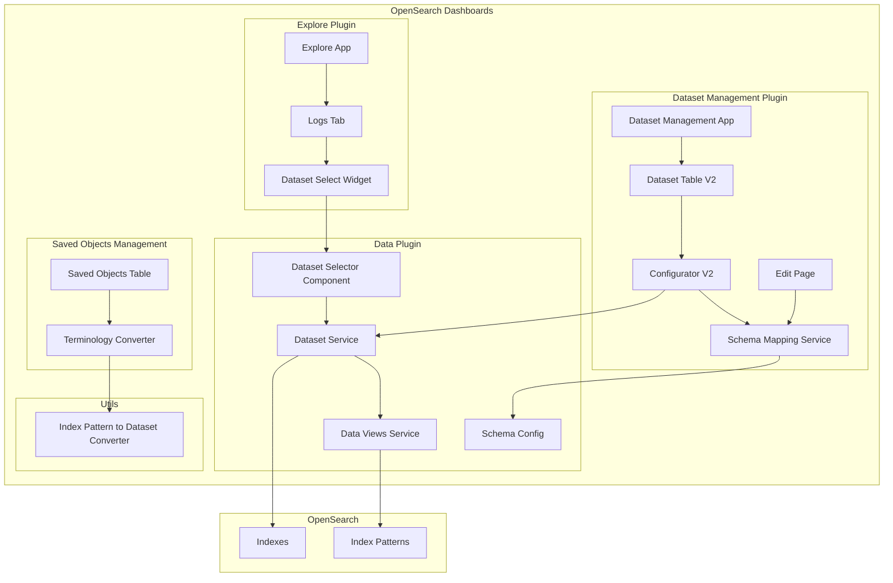
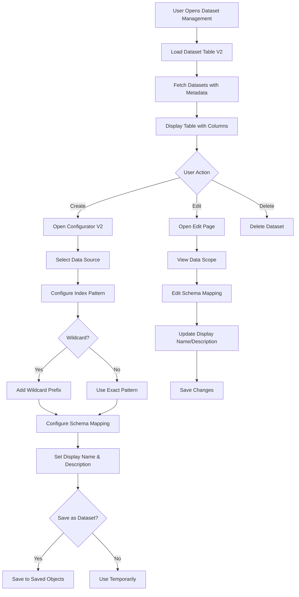

---
tags:
  - domain/core
  - component/dashboards
  - dashboards
  - indexing
---
# Dataset Management

## Summary

Dataset Management is a plugin in OpenSearch Dashboards that provides a comprehensive interface for creating, editing, and managing datasets. It extends the traditional index pattern concept with enhanced metadata support including display names, descriptions, and schema mappings. The plugin enables users to define reusable data configurations with OTel schema support, wildcard patterns, and signal type categorization.

## Details

### Architecture



### Data Flow



### Components

| Component | Description |
|-----------|-------------|
| `DatasetManagement` | Main plugin entry point and app registration |
| `DatasetTableV2` | Enhanced table with display name, signal type, description columns |
| `ConfiguratorV2` | Dataset creation wizard with save-on-create capability |
| `SchemaMapping` | Service for mapping data fields to UI attributes |
| `SaveAsDatasetOption` | Checkbox for saving dataset during creation |
| `DatasetMetadataFields` | Input fields for name and description |
| `useDatasetFields` | Hook for field fetching logic |
| `useDatasetTableData` | Hook for loading datasets and sources |
| `useDatasetSelector` | Hook for selector modal management |
| `DatasetTableHeader` | Header with title and create button |
| `DataScopeCell` | Cell displaying data source with icon |
| `CorrelationEmptyState` | Empty state for logs datasets |
| `convertIndexPatternToDataset` | Terminology conversion utility |

### Configuration

| Setting | Description | Default |
|---------|-------------|---------|
| `datasetManagement.enabled` | Enable the dataset management plugin | `false` |
| `datasetManagement.aliasedAsIndexPattern` | Display datasets as "Index Patterns" in UI | `true` |

### Dataset Properties

| Property | Description | Required |
|----------|-------------|----------|
| `title` | Index pattern (e.g., `logs-*`) | Yes |
| `timeFieldName` | Time field for time-based queries | No |
| `displayName` | Human-readable name | No |
| `description` | Dataset description | No |
| `signalType` | Signal type (logs, metrics, traces) | No |
| `schemaMappings` | Field-to-attribute mappings | No |

### Schema Mapping Format

```json
{
  "schemaMappings": {
    "<schemaName>": {
      "<attributeName>": "<fieldName>"
    }
  }
}
```

### Supported Schema Types

| Schema | Description | Attributes |
|--------|-------------|------------|
| `otel` | OpenTelemetry | timestamp, traceId, spanId, message, severity |

### Usage Example

#### Creating a Dataset with Full Configuration

```typescript
// Create dataset with all metadata
const dataset = {
  title: 'otel-logs-*',
  timeFieldName: '@timestamp',
  displayName: 'OpenTelemetry Logs',
  description: 'Application logs collected via OpenTelemetry Collector',
  signalType: 'logs',
  schemaMappings: {
    otel: {
      timestamp: '@timestamp',
      traceId: 'trace.id',
      spanId: 'span.id',
      message: 'body',
      severity: 'severity_text'
    }
  }
};

await savedObjects.create('index-pattern', dataset);
```

#### Using Terminology Converter

```typescript
import { convertIndexPatternToDataset } from '@opensearch-project/opensearch-dashboards/utils';

// Case-preserving conversion
convertIndexPatternToDataset('Index Pattern');   // → 'Dataset'
convertIndexPatternToDataset('INDEX PATTERNS');  // → 'DATASETS'
convertIndexPatternToDataset('index-pattern');   // → 'dataset'
convertIndexPatternToDataset('indexpattern');    // → 'dataset'
```

#### Configuration File

```yaml
# opensearch_dashboards.yml

# Enable dataset management plugin
datasetManagement.enabled: true

# Use "Dataset" terminology instead of "Index Pattern"
datasetManagement.aliasedAsIndexPattern: false
```

## Limitations

- Schema mapping UI currently supports only OTel schema
- Terminology conversion uses MutationObserver for dynamic portal content
- Display name and description require plugin to be enabled
- Wildcard prefix only supported for index datasets (not data streams)
- Schema mappings are stored per-dataset, not globally

## Change History

- **v3.4.0** (2026-01-11): Major enhancements including schema mapping, wildcard prefix support, multiple log datasets, enhanced table with metadata columns, and dynamic terminology conversion
- **v3.3.0** (2026-01-11): Initial implementation with basic dataset type and management plugin

## Related Features
- [OpenSearch Core](../opensearch/opensearch-actionplugin-rest-handler-wrapper.md)

## References

### Documentation
- [Index Patterns Documentation](https://docs.opensearch.org/3.0/dashboards/management/index-patterns/)
- [Dashboards Management](https://docs.opensearch.org/3.0/dashboards/management/management-index/)

### Pull Requests
| Version | PR | Description | Related Issue |
|---------|-----|-------------|---------------|
| v3.4.0 | [#10623](https://github.com/opensearch-project/OpenSearch-Dashboards/pull/10623) | Wildcard prefix support for index datasets | [#1234](https://github.com/opensearch-project/OpenSearch-Dashboards/issues/1234) |
| v3.4.0 | [#10690](https://github.com/opensearch-project/OpenSearch-Dashboards/pull/10690) | Save dataset from configurator | [#1234](https://github.com/opensearch-project/OpenSearch-Dashboards/issues/1234) |
| v3.4.0 | [#10703](https://github.com/opensearch-project/OpenSearch-Dashboards/pull/10703) | Logs tab with accordion UI |   |
| v3.4.0 | [#10704](https://github.com/opensearch-project/OpenSearch-Dashboards/pull/10704) | Dataset creation flow update | [#1234](https://github.com/opensearch-project/OpenSearch-Dashboards/issues/1234) |
| v3.4.0 | [#10714](https://github.com/opensearch-project/OpenSearch-Dashboards/pull/10714) | Schema mapping introduction | [#1234](https://github.com/opensearch-project/OpenSearch-Dashboards/issues/1234) |
| v3.4.0 | [#10716](https://github.com/opensearch-project/OpenSearch-Dashboards/pull/10716) | Multiple log datasets support |   |
| v3.4.0 | [#10737](https://github.com/opensearch-project/OpenSearch-Dashboards/pull/10737) | Data scope and schema mapping on edit page | [#1234](https://github.com/opensearch-project/OpenSearch-Dashboards/issues/1234) |
| v3.4.0 | [#10776](https://github.com/opensearch-project/OpenSearch-Dashboards/pull/10776) | Dataset table with display name/description | [#1234](https://github.com/opensearch-project/OpenSearch-Dashboards/issues/1234) |
| v3.4.0 | [#10779](https://github.com/opensearch-project/OpenSearch-Dashboards/pull/10779) | Display name/description on edit page | [#1234](https://github.com/opensearch-project/OpenSearch-Dashboards/issues/1234) |
| v3.4.0 | [#10781](https://github.com/opensearch-project/OpenSearch-Dashboards/pull/10781) | Empty logs component |   |
| v3.4.0 | [#10791](https://github.com/opensearch-project/OpenSearch-Dashboards/pull/10791) | Index pattern → dataset terminology conversion | [#1234](https://github.com/opensearch-project/OpenSearch-Dashboards/issues/1234) |
| v3.4.0 | [#10572](https://github.com/opensearch-project/OpenSearch-Dashboards/pull/10572) | Fix dataset filter by signal type | [#1234](https://github.com/opensearch-project/OpenSearch-Dashboards/issues/1234) |
| v3.4.0 | [#10692](https://github.com/opensearch-project/OpenSearch-Dashboards/pull/10692) | Restrict patterns tab to default datasets |   |
| v3.3.0 | [#10554](https://github.com/opensearch-project/OpenSearch-Dashboards/pull/10554) | Initial dataset type and management | [#1234](https://github.com/opensearch-project/OpenSearch-Dashboards/issues/1234) |
