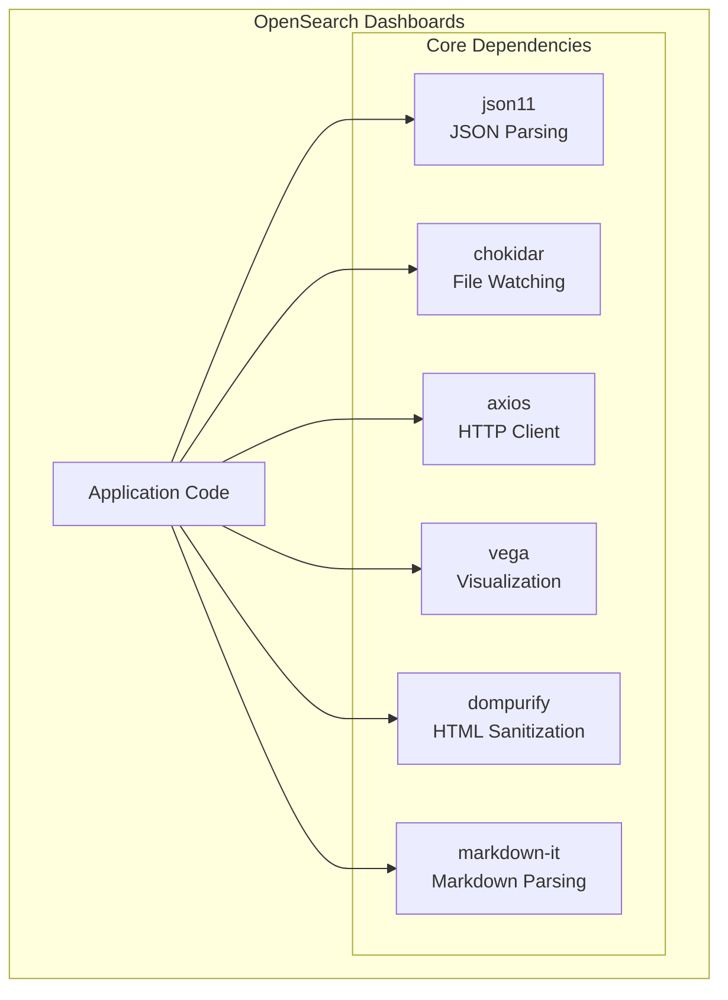

---
tags:
  - opensearch-dashboards
---
# Dependency Updates (OpenSearch Dashboards)

## Summary

OpenSearch Dashboards maintains a set of core dependencies that are regularly updated to address security vulnerabilities, improve performance, and ensure compatibility. This feature tracks significant dependency updates that impact the stability and security of the Dashboards application.

## Details

### Architecture



### Key Dependencies

| Dependency | Purpose | Security Impact |
|------------|---------|-----------------|
| js-yaml | YAML parsing for config files | CVE-2025-64718 (prototype pollution) |
| json11 | JSON parsing with extended features | UTF-8 safety in JSON stringification |
| chokidar | File system watching for development | Development tooling |
| axios | HTTP client for API requests | CVE-2024-39338 |
| vega | Visualization grammar for charts | CVE-2025-25304 (XSS vulnerability) |
| dompurify | HTML sanitization | CVE-2025-26791 |
| markdown-it | Markdown parsing and rendering | Security improvements |

### Configuration

Dependencies are managed through:

| File | Purpose |
|------|---------|
| `package.json` | Direct dependency declarations |
| `yarn.lock` | Locked dependency versions |
| `packages/*/package.json` | Package-specific dependencies |

### Usage Example

Dependencies are automatically resolved during installation:

```bash
# Install all dependencies
yarn install

# Update a specific dependency
yarn upgrade json11@^2.0.0
```

## Limitations

- Dependency updates may introduce breaking changes requiring code modifications
- Security patches should be applied promptly but require testing
- Some dependencies are pinned to specific versions for compatibility
- Vega updates may require webpack configuration changes

## Change History

- **v3.5.0** (2026-02-11): CVE fixes — js-yaml upgraded to 4.1.1 (CVE-2025-64718 prototype pollution), removed `@modelcontextprotocol/sdk` and `node-forge` as direct dependencies, added Yarn resolution override for js-yaml, eliminated js-yaml v3.x from dependency tree
- **v3.0.0** (2025-05-13): Security updates for vega (5.32.0), dompurify (3.2.4), markdown-it (13.0.2) addressing CVE-2025-25304 and CVE-2025-26791
- **v2.18.0** (2024-10-22): JSON11 upgrade to 2.0.0 for UTF-8 safety, chokidar bump to 3.6.0
- **v2.16.0** (2024-08-06): Multiple CVE fixes - tar (CVE-2024-28863), ejs (CVE-2024-33883), braces (CVE-2024-4067/4068), jimp/phin (GHSA-x565-32qp-m3vf), axios (SNYK-JS-AXIOS-6144788), ws (CVE-2024-37890); Babel dependency fix


## References

### Documentation
- [GHSA-mp7w-mhcv-673j](https://github.com/vega/vega/security/advisories/GHSA-mp7w-mhcv-673j): Vega XSS vulnerability advisory
- [OpenSearch Forum](https://forum.opensearch.org/t/json-parse-bad-escaped-character/20211): Community discussion

### Pull Requests
| Version | PR | Description | Related Issue |
|---------|-----|-------------|---------------|
| v3.5.0 | [#11048](https://github.com/opensearch-project/OpenSearch-Dashboards/pull/11048) | CVE fixes: js-yaml 4.1.1, remove @modelcontextprotocol/sdk and node-forge | - |
| v3.0.0 | [#9623](https://github.com/opensearch-project/OpenSearch-Dashboards/pull/9623) | Bump vega from 5.23.0 to 5.32.0 | [#9400](https://github.com/opensearch-project/OpenSearch-Dashboards/issues/9400) |
| v3.0.0 | [#9447](https://github.com/opensearch-project/OpenSearch-Dashboards/pull/9447) | Bump dompurify from 3.1.6 to 3.2.4 |   |
| v3.0.0 | [#9412](https://github.com/opensearch-project/OpenSearch-Dashboards/pull/9412) | Bump markdown-it from 12.3.2 to 13.0.2 |   |
| v2.18.0 | [#8603](https://github.com/opensearch-project/OpenSearch-Dashboards/pull/8603) | Upgrade JSON11 from 1.1.2 to 2.0.0 | [#7367](https://github.com/opensearch-project/OpenSearch-Dashboards/issues/7367) |
| v2.18.0 | [#8490](https://github.com/opensearch-project/OpenSearch-Dashboards/pull/8490) | Bump chokidar from 3.5.3 to 3.6.0 |   |
| v2.16.0 | [#7541](https://github.com/opensearch-project/OpenSearch-Dashboards/pull/7541) | Fix babel error (update @babel/traverse and @babel/plugin-transform-class-static-block) |   |
| v2.16.0 | [#6492](https://github.com/opensearch-project/OpenSearch-Dashboards/pull/6492) | [CVE-2024-28863] Bump tar from 6.1.13 to 6.2.1 | [#6488](https://github.com/opensearch-project/OpenSearch-Dashboards/issues/6488) |
| v2.16.0 | [#6770](https://github.com/opensearch-project/OpenSearch-Dashboards/pull/6770) | [CVE-2024-33883] Bump ejs from 3.1.7 to 3.1.10 | [#6769](https://github.com/opensearch-project/OpenSearch-Dashboards/issues/6769) |
| v2.16.0 | [#6911](https://github.com/opensearch-project/OpenSearch-Dashboards/pull/6911) | [CVE-2024-4067/4068] Bump braces-dependent packages | [#6791](https://github.com/opensearch-project/OpenSearch-Dashboards/issues/6791), [#6792](https://github.com/opensearch-project/OpenSearch-Dashboards/issues/6792) |
| v2.16.0 | [#6977](https://github.com/opensearch-project/OpenSearch-Dashboards/pull/6977) | [GHSA-x565-32qp-m3vf] Bump jimp to remove phin |   |
| v2.16.0 | [#7149](https://github.com/opensearch-project/OpenSearch-Dashboards/pull/7149) | [SNYK-JS-AXIOS-6144788] Bump axios to 1.7.2 |   |
| v2.16.0 | [#7153](https://github.com/opensearch-project/OpenSearch-Dashboards/pull/7153) | [CVE-2024-37890] Bump ws to 8.17.1/7.5.10 |   |

### Issues (Design / RFC)
- [Issue #9400](https://github.com/opensearch-project/OpenSearch-Dashboards/issues/9400): CVE-2025-25304 in vega-selections
- [Issue #7367](https://github.com/opensearch-project/OpenSearch-Dashboards/issues/7367): JSON.parse bad escaped character bug
