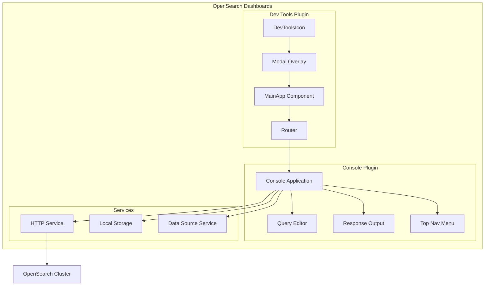
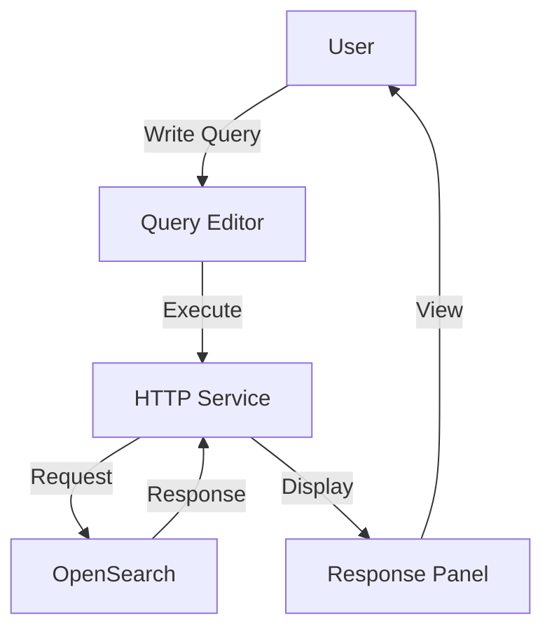

---
tags:
  - opensearch-dashboards
---
# Dev Tools

## Summary

Dev Tools is a development environment in OpenSearch Dashboards that provides an interactive console for running queries, exploring data, and debugging problems. It allows developers and administrators to interact directly with OpenSearch APIs, test queries, and manage cluster configurations without leaving the Dashboards interface.

## Details

### Architecture



### Data Flow



### Components

| Component | Description |
|-----------|-------------|
| `DevToolsIcon` | Header icon that opens Dev Tools modal |
| `MainApp` | Main application wrapper with routing |
| `DevToolsWrapper` | Container for dev tool applications |
| `TopNavMenu` | Navigation menu with History, Settings, Help, Export, Import |
| `Editor` | Split-panel editor with request/response views |
| `NetworkRequestStatusBar` | Displays request status and timing |

### Configuration

| Setting | Description | Default |
|---------|-------------|---------|
| `console:autocomplete` | Enable autocomplete suggestions | `true` |
| `console:fontSize` | Editor font size | `14` |
| `console:history` | Enable query history | `true` |
| `home:useNewHomePage` | Enable modal-based Dev Tools | `false` |

### Usage Example

Access Dev Tools from the OpenSearch Dashboards menu:

**Management > Dev Tools**

Or click the console icon in the header (when new UX is enabled).

```json
// Example: Search all indices
GET _search
{
  "query": {
    "match_all": {}
  }
}

// Example: Check cluster health
GET _cluster/health

// Example: List all indices
GET _cat/indices?v
```

### Features

- **Query Console**: Interactive editor for running OpenSearch queries
- **Autocomplete**: Context-aware suggestions for APIs and fields
- **History**: Access previously executed queries
- **Import/Export**: Save and load query collections
- **Multi-line Support**: Write complex queries with proper formatting
- **Response Formatting**: Pretty-printed JSON responses
- **Request Timing**: View execution time for queries
- **Multiple Data Sources**: Connect to different OpenSearch clusters (when MDS enabled)

## Limitations

- Query history is stored in browser local storage
- Large responses may impact browser performance
- Modal mode uses in-memory routing (no browser history)

## Change History

- **v2.18.0** (2024-11-05): Changed Dev Tools to render inside a modal overlay for improved UX


## References

### Documentation
- [Dev Tools Documentation](https://docs.opensearch.org/latest/dashboards/dev-tools/index-dev/): Official documentation
- [Running queries in the Dev Tools console](https://docs.opensearch.org/latest/dashboards/dev-tools/run-queries/): Query guide

### Blog Posts
- [Top 3 scenarios for managing multiple clusters](https://opensearch.org/blog/top-3-scenarios-where-managing-multiple-clusters-with-one-opensearch-dashboards-is-a-life-saver/): Blog post on Dev Tools with MDS

### Pull Requests
| Version | PR | Description | Related Issue |
|---------|-----|-------------|---------------|
| v2.18.0 | [#7938](https://github.com/opensearch-project/OpenSearch-Dashboards/pull/7938) | Change dev tools to a modal | [#1234](https://github.com/opensearch-project/OpenSearch-Dashboards/issues/1234) |
