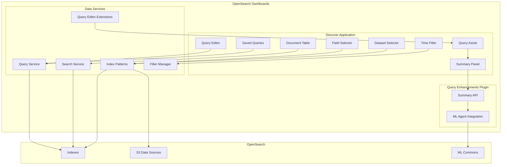
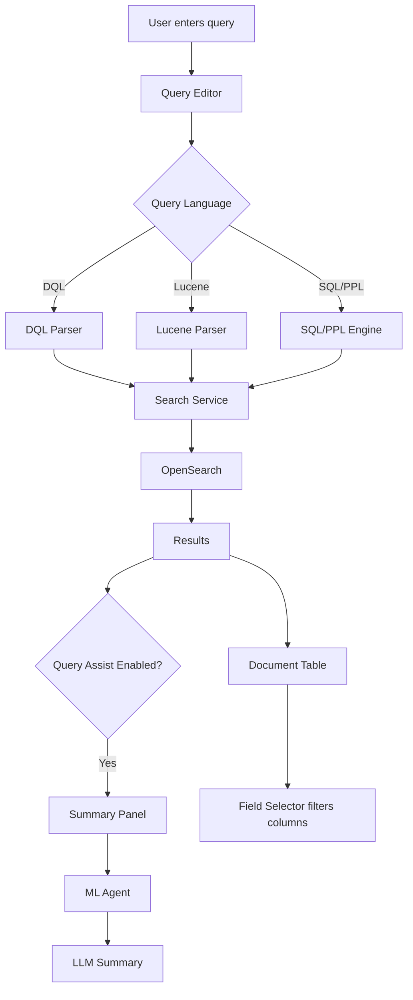

---
tags:
  - opensearch-dashboards
---
# Discover

## Summary

Discover is the data exploration application in OpenSearch Dashboards that allows users to interactively search, filter, and analyze data stored in OpenSearch indexes. It provides a powerful interface for ad-hoc data exploration with support for multiple query languages (DQL, Lucene, SQL, PPL), time-based filtering, field selection, document inspection, and AI-powered data summarization.

## Details

### Architecture



### Data Flow



### Components

| Component | Description |
|-----------|-------------|
| Query Editor | Input area for search queries with language selection |
| Query Assist | AI-powered query assistance with natural language input |
| Summary Panel | Displays LLM-generated summaries of query results |
| Time Filter | Controls time range for time-based indexes |
| Field Selector | Sidebar for selecting and filtering visible fields |
| Document Table | Displays search results with expandable documents |
| Saved Queries | Stores and loads frequently used queries |
| Dataset Selector | Selects data source with cache management and indexed views support |

### Configuration

| Setting | Description | Default |
|---------|-------------|---------|
| `discover:searchOnPageLoad` | Run search when Discover loads | On |
| `discover:sort:defaultOrder` | Default sort order for time-based indexes | desc |
| `discover:sampleSize` | Number of documents to show | 500 |
| `query:enhancements:enabled` | Enable query enhancements (SQL/PPL support) | Off |
| `queryEnhancements.queryAssist.summary.enabled` | Enable AI data summary panel | false |
| `queryEnhancements.queryAssist.summary.branding.label` | Custom title for summary panel | (none) |

### Usage Example

```
# DQL Query Example
status:error AND response.code >= 500

# PPL Query Example (with query enhancements enabled)
source=logs | where status = 'error' | stats count() by host

# Time Filter
Last 15 minutes, Last 24 hours, Custom range

# Field Selection
Select fields from sidebar to customize table columns
```

### Data Summary Setup

To enable AI-powered data summaries:

```yaml
# opensearch_dashboards.yml
queryEnhancements.queryAssist.summary.enabled: true
```

Requires ML agent configuration:
1. Create a data summary agent with LLM connector
2. Register the agent as root agent for `os_data2summary`
3. Use PPL queries in Discover to see generated summaries

## Limitations

- Data summary requires ML agent configuration with LLM connector
- Summary feature only works with PPL queries when query assist is enabled
- S3 field support requires query enhancements to be enabled
- Cache refresh clears all dataset caches, not individual ones

## Change History

- **v3.4.0** (2025-11-06): Added log pattern detection for Discover Summary - automatically uses specialized `os_data2summary_with_log_pattern` agent for log indexes
- **v3.2.0** (2025-08-05): Fixed empty page issue when no index patterns exist, added Cypress tests for discover visualization
- **v3.0.0** (2025-05-13): Added CSV export functionality, reorganized results display with ResultsActionBar, customizable summary panel title, experimental Data plugin `__enhance` API with resultsActionBar, and 6 bug fixes for saved search handling and workspace integration
- **v2.19.0** (2025-01-14): Added indexed views framework to dataset selector, results canvas banner framework, data2summary agent validation, default query string framework, custom time filter logic per dataset type, query editor bottom panel extension, and Cypress test data attributes
- **v2.18.0** (2024-11-05): Added AI-powered data summary panel, updated visual appearance, cache management in dataset selector, and 14 bug fixes for stability and usability
- **v2.16.0** (2024-08-06): Fixed Discover Next styling issues (query bar, dataset navigator, language selector, field search) and database loading display for external data sources


## References

### Documentation
- [Analyzing data in Discover](https://docs.opensearch.org/2.18/dashboards/discover/index-discover/): Official documentation
- [Data Summary Documentation](https://docs.opensearch.org/2.18/dashboards/dashboards-assistant/data-summary/): AI summary feature docs

### Pull Requests
| Version | PR | Description | Related Issue |
|---------|-----|-------------|---------------|
| v3.4.0 | [#550](https://github.com/opensearch-project/dashboards-assistant/pull/550) | Support log pattern in discover summary |   |
| v3.4.0 | [#9693](https://github.com/opensearch-project/OpenSearch-Dashboards/pull/9693) | Support log pattern agent in discover summary | [#1234](https://github.com/opensearch-project/OpenSearch-Dashboards/issues/1234) |
| v3.2.0 | [#10345](https://github.com/opensearch-project/OpenSearch-Dashboards/pull/10345) | Fix empty page when no index patterns exist |   |
| v3.2.0 | [#10315](https://github.com/opensearch-project/OpenSearch-Dashboards/pull/10315) | Add cypress tests for discover visualization | [#1234](https://github.com/opensearch-project/OpenSearch-Dashboards/issues/1234) |
| v3.0.0 | [#9530](https://github.com/opensearch-project/OpenSearch-Dashboards/pull/9530) | Add CSV export from Discover page |   |
| v3.0.0 | [#9498](https://github.com/opensearch-project/OpenSearch-Dashboards/pull/9498) | Move HITs counter and show results count |   |
| v3.0.0 | [#9494](https://github.com/opensearch-project/OpenSearch-Dashboards/pull/9494) | Update position of query summary and editor | [#1234](https://github.com/opensearch-project/OpenSearch-Dashboards/issues/1234) |
| v3.0.0 | [#9481](https://github.com/opensearch-project/OpenSearch-Dashboards/pull/9481) | Allow customizing summary panel title | [#1234](https://github.com/opensearch-project/OpenSearch-Dashboards/issues/1234) |
| v3.0.0 | [#9469](https://github.com/opensearch-project/OpenSearch-Dashboards/pull/9469) | Update formatHit to accept type parameter |   |
| v3.0.0 | [#9655](https://github.com/opensearch-project/OpenSearch-Dashboards/pull/9655) | Enable experimental __enhance with resultsActionBar |   |
| v3.0.0 | [#9316](https://github.com/opensearch-project/OpenSearch-Dashboards/pull/9316) | Clean up sync URL subscription in topNav | [#1234](https://github.com/opensearch-project/OpenSearch-Dashboards/issues/1234) |
| v3.0.0 | [#9347](https://github.com/opensearch-project/OpenSearch-Dashboards/pull/9347) | Fix flattenHit modifying original array | [#1234](https://github.com/opensearch-project/OpenSearch-Dashboards/issues/1234) |
| v3.0.0 | [#9523](https://github.com/opensearch-project/OpenSearch-Dashboards/pull/9523) | Correctly show selected columns from saved search | [#1234](https://github.com/opensearch-project/OpenSearch-Dashboards/issues/1234) |
| v3.0.0 | [#9529](https://github.com/opensearch-project/OpenSearch-Dashboards/pull/9529) | Correctly load saved search from snapshot URL | [#1234](https://github.com/opensearch-project/OpenSearch-Dashboards/issues/1234) |
| v3.0.0 | [#9541](https://github.com/opensearch-project/OpenSearch-Dashboards/pull/9541) | Correctly load saved search query in query editor | [#1234](https://github.com/opensearch-project/OpenSearch-Dashboards/issues/1234) |
| v3.0.0 | [#9465](https://github.com/opensearch-project/OpenSearch-Dashboards/pull/9465) | Prevent visiting Discover outside workspace | [#1234](https://github.com/opensearch-project/OpenSearch-Dashboards/issues/1234) |
| v2.19.0 | [#8682](https://github.com/opensearch-project/OpenSearch-Dashboards/pull/8682) | Add data test subject for discover cypress test |   |
| v2.19.0 | [#8716](https://github.com/opensearch-project/OpenSearch-Dashboards/pull/8716) | Add data2summary agent check in data summary panel |   |
| v2.19.0 | [#8851](https://github.com/opensearch-project/OpenSearch-Dashboards/pull/8851) | Indexed views framework - show indexed views in dataset selector |   |
| v2.19.0 | [#8896](https://github.com/opensearch-project/OpenSearch-Dashboards/pull/8896) | Framework for default query string using dataset and language |   |
| v2.19.0 | [#8932](https://github.com/opensearch-project/OpenSearch-Dashboards/pull/8932) | Support custom time filter logic based on dataset type |   |
| v2.18.0 | [#8186](https://github.com/opensearch-project/OpenSearch-Dashboards/pull/8186) | Add data summary panel in discover |   |
| v2.18.0 | [#8214](https://github.com/opensearch-project/OpenSearch-Dashboards/pull/8214) | Add cache time and refresh button to dataset selector | [#1234](https://github.com/opensearch-project/OpenSearch-Dashboards/issues/1234) |
| v2.18.0 | [#8651](https://github.com/opensearch-project/OpenSearch-Dashboards/pull/8651) | Update the appearance of Discover |   |
| v2.18.0 | [#8352](https://github.com/opensearch-project/OpenSearch-Dashboards/pull/8352) | Add discover summary error info and button click logic | [#1234](https://github.com/opensearch-project/OpenSearch-Dashboards/issues/1234) |
| v2.18.0 | [#8060](https://github.com/opensearch-project/OpenSearch-Dashboards/pull/8060) | Fix row rendering in Discover infinite scroll |   |
| v2.18.0 | [#8082](https://github.com/opensearch-project/OpenSearch-Dashboards/pull/8082) | Fix infinite loop cause discover hang | [#1234](https://github.com/opensearch-project/OpenSearch-Dashboards/issues/1234) |
| v2.18.0 | [#8609](https://github.com/opensearch-project/OpenSearch-Dashboards/pull/8609) | Add support for S3 fields in Discover |   |
| v2.18.0 | [#8659](https://github.com/opensearch-project/OpenSearch-Dashboards/pull/8659) | Fix UI stuck on searching after deleting index pattern | [#8612](https://github.com/opensearch-project/OpenSearch-Dashboards/issues/8612) |
| v2.18.0 | [#8755](https://github.com/opensearch-project/OpenSearch-Dashboards/pull/8755) | Fix time field wrapping overlap on language change |   |
| v2.18.0 | [#8707](https://github.com/opensearch-project/OpenSearch-Dashboards/pull/8707) | Ensure saved query loaded properly from asset |   |

### Issues (Design / RFC)
- [Issue #8177](https://github.com/opensearch-project/OpenSearch-Dashboards/issues/8177): Feature request for LLM data summary
- [Issue #7626](https://github.com/opensearch-project/OpenSearch-Dashboards/issues/7626): Discover hang bug report
- [Issue #8612](https://github.com/opensearch-project/OpenSearch-Dashboards/issues/8612): Bug report for deleted index pattern issue
- [Issue #9309](https://github.com/opensearch-project/OpenSearch-Dashboards/issues/9309): URL sync subscription leak
- [Issue #9318](https://github.com/opensearch-project/OpenSearch-Dashboards/issues/9318): flattenHit array mutation bug

### v2.16.0 Pull Requests
| PR | Description |
|----|-------------|
| [#7546](https://github.com/opensearch-project/OpenSearch-Dashboards/pull/7546) | Fixes Discover next styling |
| [#7567](https://github.com/opensearch-project/OpenSearch-Dashboards/pull/7567) | Fixes databases not being displayed upon success |
