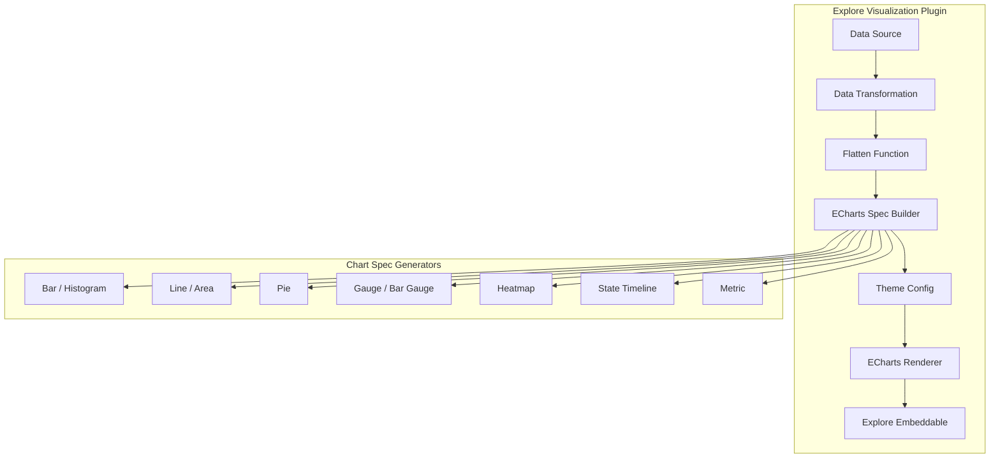

---
tags:
  - opensearch-dashboards
---
# ECharts Migration

## Summary

The ECharts Migration replaces the Vega-Lite rendering engine in OpenSearch Dashboards' Explore (Discover) visualization plugin with Apache ECharts. This provides a unified spec-based chart pipeline with better performance, richer interactivity, theme support, and faceted multi-grid rendering across all chart types.

## Details

### Architecture

### Components

| Component | Description |
|-----------|-------------|
| ECharts Renderer | Core rendering component with auto-resize, fixed grid margins, theme integration |
| Spec Builder Pipeline | Unified pipeline that assembles ECharts option specs from data and configuration |
| Data Transformation | Flatten function for data normalization, null-to-zero replacement, interval-to-tick mapping |
| Theme Config | ECharts theme configuration integrated with OpenSearch Dashboards theming |
| Explore Embeddable | Dashboard embeddable component updated to support ECharts rendering path |

### Supported Chart Types

| Chart Type | Features |
|---|---|
| Bar chart | Standard bar, stacked bar, faceted bar with multi-grid rendering |
| Line chart | Single/multi-series, faceted, time-series with hover-only dots |
| Area chart | Simple, multi-series, faceted, category-based, stacked (0.5 opacity) |
| Pie chart | Dynamic titles, legend positioning (left/right/bottom), truncation control |
| Gauge | Threshold-based coloring, value display, title toggle |
| Bar gauge | Horizontal bars, unfilled area toggle, label positioning, invalid value handling |
| Heatmap | Threshold color mode, color schema mode |
| State timeline | 4 subtypes (time-category, time-numerical, time-category-category, time-category-numerical), value/range mapping, threshold color switching |
| Metric | Threshold-driven colors, sparklines, percentage-change display, dynamic font sizing |
| Histogram | Numeric data binning with aggregation (SUM, MEAN, MAX, MIN, COUNT) |

### Configuration

| Setting | Description | Default |
|---------|-------------|---------|
| `__DEVELOPMENT__.discover.vis.render` | Rendering engine selector | `echarts` |
| Area opacity | Opacity for area chart fill | `0.5` |
| Legend display | Show legend for multi-series charts only | Auto (hidden for single series) |
| Line dots | Show data points on line charts | Hover only |

## Limitations

- Migration is scoped to the Explore (Discover) visualization plugin; legacy Visualize editor is not affected
- Heatmap color scale may not be visually obvious when data is centered around a narrow range
- State timeline value mapping takes priority over range mapping when both are configured
- Responsive grid sizing adjusts based on legend and visualMap to avoid overlap, but extreme cases may still require manual adjustment

## Change History

- **v3.5.0** (2026-02-11): Complete migration from Vega-Lite to ECharts for all 10 chart types in Explore visualization. Added theme support, embeddable rendering, data transformation refactoring, and multiple bug fixes for axes, layout, and UX.

## References

### Pull Requests
| Version | PR | Description |
|---------|-----|-------------|
| v3.5.0 | [#11077](https://github.com/opensearch-project/OpenSearch-Dashboards/pull/11077) | Introducing ECharts to discover visualization |
| v3.5.0 | [#11111](https://github.com/opensearch-project/OpenSearch-Dashboards/pull/11111) | Migrate explore area chart from vega-lite to echarts |
| v3.5.0 | [#11113](https://github.com/opensearch-project/OpenSearch-Dashboards/pull/11113) | Migrate line and facet bar chart to echart |
| v3.5.0 | [#11116](https://github.com/opensearch-project/OpenSearch-Dashboards/pull/11116) | Migrate pie chart |
| v3.5.0 | [#11136](https://github.com/opensearch-project/OpenSearch-Dashboards/pull/11136) | Migrate state timeline |
| v3.5.0 | [#11155](https://github.com/opensearch-project/OpenSearch-Dashboards/pull/11155) | Add echarts implementation of metric visualization |
| v3.5.0 | [#11163](https://github.com/opensearch-project/OpenSearch-Dashboards/pull/11163) | Migrate bar gauge |
| v3.5.0 | [#11164](https://github.com/opensearch-project/OpenSearch-Dashboards/pull/11164) | Echarts implementation of histogram visualization |
| v3.5.0 | [#11170](https://github.com/opensearch-project/OpenSearch-Dashboards/pull/11170) | Migrate gauge to ECharts |
| v3.5.0 | [#11184](https://github.com/opensearch-project/OpenSearch-Dashboards/pull/11184) | Add theme config for echarts / embeddable fix |
| v3.5.0 | [#11192](https://github.com/opensearch-project/OpenSearch-Dashboards/pull/11192) | Migrate heatmap to echarts |
| v3.5.0 | [#11230](https://github.com/opensearch-project/OpenSearch-Dashboards/pull/11230) | Discover visualization fix and UX improvements |
| v3.5.0 | [#11244](https://github.com/opensearch-project/OpenSearch-Dashboards/pull/11244) | Address bugs for echarts migration |
| v3.5.0 | [#11257](https://github.com/opensearch-project/OpenSearch-Dashboards/pull/11257) | Bug y_two axis not working |
| v3.5.0 | [#11298](https://github.com/opensearch-project/OpenSearch-Dashboards/pull/11298) | Histogram x-axis incorrectly have type 'category' |
| v3.5.0 | [#10935](https://github.com/opensearch-project/OpenSearch-Dashboards/pull/10935) | Axes panel of line & area chart to use StandardAxes |
| v3.5.0 | [#11124](https://github.com/opensearch-project/OpenSearch-Dashboards/pull/11124) | Discover vis data transformation refactor with flatten function |
