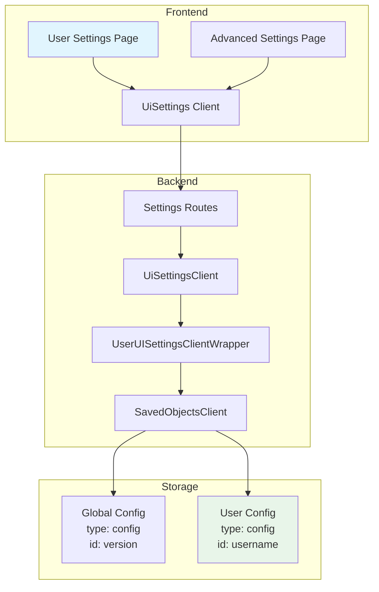
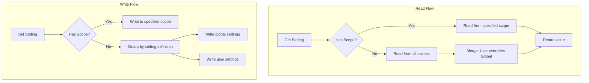

---
tags:
  - dashboards
---

# Experimental Features - User Personal Settings

## Summary

User Personal Settings is an experimental feature in OpenSearch Dashboards that enables individual users to customize their dashboard preferences independently from global settings. This feature introduces a scoped settings architecture where settings can be defined as `global`, `user`, or both, allowing for personalized user experiences while maintaining system-wide defaults.

Key benefits:
- Users can customize preferences without affecting other users
- Settings are persisted per user identity
- Seamless integration with existing uiSettings infrastructure
- Optional permission control via ACL

## Details

### Architecture



### Data Flow



### Components

| Component | Location | Description |
|-----------|----------|-------------|
| `UiSettingScope` | `src/core/types/ui_settings.ts` | Enum defining GLOBAL and USER scopes |
| `UserSettingsApp` | `src/plugins/advanced_settings/public/management_app/user_settings.tsx` | React component for user settings page |
| `UserUISettingsClientWrapper` | `src/plugins/advanced_settings/server/saved_objects/` | Translates user ID placeholders to actual usernames |
| `CURRENT_USER_PLACEHOLDER` | `src/core/server/ui_settings/utils.ts` | Constant `<current_user>` used as placeholder |

### Configuration

| Setting | Type | Description | Default |
|---------|------|-------------|---------|
| `scope` | `UiSettingScope \| UiSettingScope[]` | Defines where the setting is stored | `UiSettingScope.GLOBAL` |
| `userSettings.enabled` | `boolean` | Capability flag indicating if user settings are available | `false` |

### Usage Example

#### Registering a User-Scoped Setting

```typescript
import { UiSettingScope } from 'opensearch-dashboards/public';

core.uiSettings.register({
  'theme:darkMode': {
    name: 'Dark Mode',
    value: false,
    description: 'Enable dark mode for the interface',
    scope: [UiSettingScope.GLOBAL, UiSettingScope.USER],
    schema: schema.boolean(),
  },
  defaultWorkspace: {
    name: 'Default Workspace',
    value: '',
    description: 'Your default workspace',
    scope: UiSettingScope.USER,
    schema: schema.string(),
  },
});
```

#### Reading Settings

```typescript
// Get merged value (user overrides global)
const darkMode = await uiSettings.get('theme:darkMode');

// Get specifically from user scope
const userDarkMode = await uiSettings.get('theme:darkMode', UiSettingScope.USER);

// Get specifically from global scope
const globalDarkMode = await uiSettings.get('theme:darkMode', UiSettingScope.GLOBAL);
```

#### Writing Settings

```typescript
// Write to appropriate scope based on setting definition
await uiSettings.set('defaultWorkspace', 'workspace-123');

// Explicitly write to user scope
await uiSettings.set('theme:darkMode', true, UiSettingScope.USER);
```

#### REST API

```bash
# Get user settings
curl -X GET 'http://localhost:5601/api/opensearch-dashboards/settings?scope=user' \
  -H 'Authorization: Basic <credentials>'

# Set user settings
curl -X POST 'http://localhost:5601/api/opensearch-dashboards/settings?scope=user' \
  -H 'Authorization: Basic <credentials>' \
  -H 'Content-Type: application/json' \
  -H 'osd-xsrf: osd-fetch' \
  -d '{"changes": {"defaultWorkspace": "my-workspace"}}'
```

## Limitations

- **Authentication Required**: User-level settings only work when authentication is enabled
- **Experimental Status**: Feature is marked experimental and may change in future releases
- **Nav Groups Required**: User Settings page visibility requires nav groups to be enabled
- **No Version Migration**: User settings do not automatically migrate between OSD versions (unlike global settings)
- **Single User Storage**: Settings are stored per username, not supporting multiple profiles per user

## Change History

- **v3.2.0** (2026-01-10): Improved UiSettingsClient robustness for non-existent setting keys
- **v2.18.0** (2024-10-22): Initial implementation with user settings page, scoped uiSettings, and UserUISettingsClientWrapper

## Related Features
- [OpenSearch Core](../opensearch/opensearch-actionplugin-rest-handler-wrapper.md)

## References

### Documentation
- [Workspace Documentation](https://docs.opensearch.org/2.18/dashboards/workspace/workspace/): OpenSearch Dashboards Workspace

### Pull Requests
| Version | PR | Description | Related Issue |
|---------|-----|-------------|---------------|
| v3.2.0 | [#9927](https://github.com/opensearch-project/OpenSearch-Dashboards/pull/9927) | Make UI setting client more robust when setting key does not exist |   |
| v2.18.0 | [#7953](https://github.com/opensearch-project/OpenSearch-Dashboards/pull/7953) | Initial implementation of user level settings | [#1234](https://github.com/opensearch-project/OpenSearch-Dashboards/issues/1234) |

### Issues (Design / RFC)
- [Issue #7821](https://github.com/opensearch-project/OpenSearch-Dashboards/issues/7821): RFC - User level settings
- [Issue #7909](https://github.com/opensearch-project/OpenSearch-Dashboards/issues/7909): User setting page feature request
