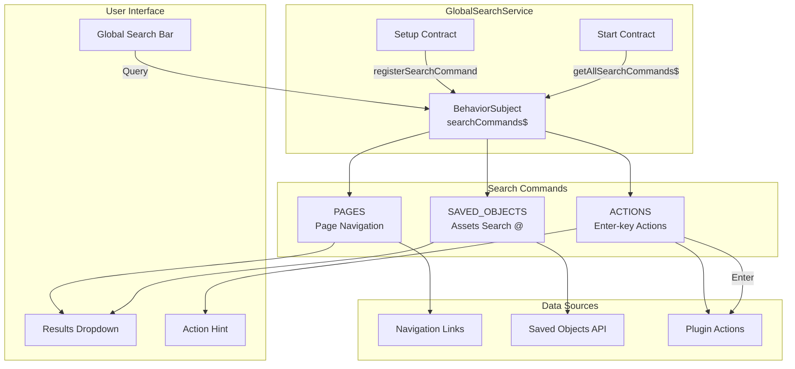
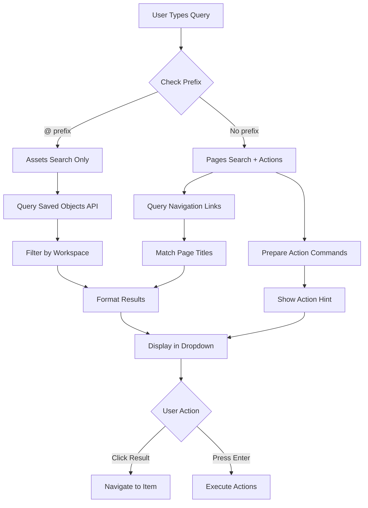

---
tags:
  - domain/core
  - component/dashboards
  - dashboards
  - search
---
# Global Search

## Summary

Global Search is a unified search experience in OpenSearch Dashboards that allows users to quickly find and navigate to pages, saved objects (dashboards, visualizations), and execute custom actions directly from a centralized search bar. The feature supports prefix-based filtering, workspace-aware asset search, and extensible command registration for plugin integration.

## Details

### Architecture



### Data Flow



### Components

| Component | Description |
|-----------|-------------|
| `GlobalSearchService` | Core service managing search command registration and execution |
| `HeaderSearchBar` | UI component rendering the search input and results dropdown |
| `searchAssets` | Function to search dashboards and visualizations via saved objects API |
| `workspaceSearchPages` | Function to search navigation pages within workspace context |

### Search Command Types

| Type | Symbol | Description |
|------|--------|-------------|
| `PAGES` | (none) | Search navigation pages and menu items |
| `SAVED_OBJECTS` | `@` | Search saved objects (dashboards, visualizations) |
| `ACTIONS` | (none) | Execute custom actions on Enter key |

### Configuration

| Setting | Description | Default |
|---------|-------------|---------|
| `inputPlaceholder` | Custom placeholder text for search input | `"Search menu or assets"` |
| `action` | Callback function executed on Enter key press | `undefined` |

### Public API

**Setup Contract**:

```typescript
export interface GlobalSearchServiceSetupContract {
  registerSearchCommand(searchCommand: GlobalSearchCommand): void;
}
```

**Start Contract**:

```typescript
export interface GlobalSearchServiceStartContract {
  getAllSearchCommands(): GlobalSearchCommand[];
  getAllSearchCommands$(): Observable<GlobalSearchCommand[]>;
  registerSearchCommand(searchCommand: GlobalSearchCommand): void;
  unregisterSearchCommand(id: string): void;
}
```

**GlobalSearchCommand Interface**:

```typescript
export interface GlobalSearchCommand {
  id: string;
  type: 'PAGES' | 'SAVED_OBJECTS' | 'ACTIONS';
  inputPlaceholder?: string;
  run(
    value: string,
    callback?: () => void,
    options?: GlobalSearchCommandRunOptions
  ): Promise<ReactNode[]>;
  action?: (payload: { content: string }) => void;
}

export interface GlobalSearchCommandRunOptions {
  abortSignal?: AbortSignal;
}
```

### Usage Example

**Registering a Custom Search Command**:

```typescript
// In plugin setup
public setup(core: CoreSetup) {
  core.chrome.globalSearch.registerSearchCommand({
    id: 'myPluginSearch',
    type: 'PAGES',
    inputPlaceholder: 'Search my plugin...',
    run: async (query, callback, options) => {
      const results = await searchMyPlugin(query, options?.abortSignal);
      return results.map(item => (
        <EuiLink href={item.url} onClick={callback}>
          {item.title}
        </EuiLink>
      ));
    }
  });
}
```

**Registering an Action Command**:

```typescript
core.chrome.globalSearch.registerSearchCommand({
  id: 'aiChatbot',
  type: 'ACTIONS',
  run: async () => [],
  action: ({ content }) => {
    openChatbot({ initialQuery: content });
  }
});
```

**Subscribing to Command Changes**:

```typescript
chrome.globalSearch.getAllSearchCommands$().subscribe(commands => {
  console.log(`Available commands: ${commands.length}`);
});
```

## Limitations

- Assets search currently supports only `dashboard` and `visualization` types
- Action commands receive only the search query text, not page context (filters, time range, etc.)
- The `@` prefix is required to search assets; default search only queries pages
- When multiple commands specify `inputPlaceholder`, only the first registered command's placeholder is used
- Search results are limited to 10 items per command type

## Change History

- **v3.4.0** (2025-10-29): Added assets search command (`@` prefix) for searching dashboards and visualizations; enhanced GlobalSearchCommand interface with `action` property for Enter-key triggered actions; migrated to observable-based architecture with `getAllSearchCommands$`; added request cancellation support via `abortSignal`
- **v3.3.0**: Fixed global search URL handling in workspace context
- **v2.18.0** (2024-11-05): Initial implementation - added global search bar into left navigation for searching pages across workspaces


## References

### Pull Requests
| Version | PR | Description | Related Issue |
|---------|-----|-------------|---------------|
| v3.4.0 | [#10789](https://github.com/opensearch-project/OpenSearch-Dashboards/pull/10789) | Add assets search command and enhance search commands | [#1234](https://github.com/opensearch-project/OpenSearch-Dashboards/issues/1234) |
| v3.3.0 | [#10414](https://github.com/opensearch-project/OpenSearch-Dashboards/pull/10414) | Global search URL in workspace | [#1234](https://github.com/opensearch-project/OpenSearch-Dashboards/issues/1234) |
| v2.18.0 | [#8538](https://github.com/opensearch-project/OpenSearch-Dashboards/pull/8538) | Add global search bar into left nav | [#1234](https://github.com/opensearch-project/OpenSearch-Dashboards/issues/1234) |

### Issues (Design / RFC)
- [Issue #10741](https://github.com/opensearch-project/OpenSearch-Dashboards/issues/10741): RFC - Global Search Enhancements for New Home
