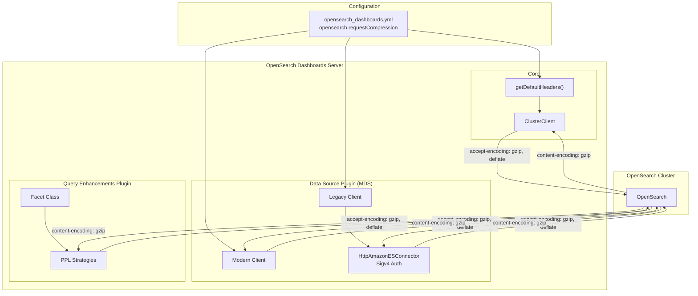

---
tags:
  - opensearch-dashboards
---
# Dashboards gzip Support

## Summary

OpenSearch Dashboards supports optional gzip/deflate HTTP response compression for requests to OpenSearch clusters. When enabled, Dashboards sends `Accept-Encoding: gzip, deflate` headers, allowing OpenSearch to return compressed responses. This dramatically reduces payload sizes and improves query latency, especially for large result sets in Discover/Explore workloads.

## Details

### Architecture



### Components

| Component | Description |
|-----------|-------------|
| `getDefaultHeaders()` | Function in `default_headers.ts` that conditionally includes `accept-encoding` header based on `requestCompression` config |
| `OpenSearchConfig.requestCompression` | Boolean config property propagated from `opensearch_dashboards.yml` |
| `HttpAmazonESConnector` | Custom HTTP connector for IAM Sigv4 auth that decompresses gzip/deflate responses via `zlib` |
| `Facet` class | Utility in `query_enhancements` plugin with per-request `requestCompression` option for PPL queries |

### Configuration

| Setting | Description | Default |
|---------|-------------|---------|
| `opensearch.requestCompression` | Request compressed responses from OpenSearch to reduce payload size | `false` |

```yaml
# opensearch_dashboards.yml
opensearch.requestCompression: true
```

### Client Paths

The compression setting affects multiple client paths:

| Client Path | Mechanism | Controlled By |
|-------------|-----------|---------------|
| Core OpenSearch client | `accept-encoding` header via `getDefaultHeaders()` | `opensearch.requestCompression` |
| MDS modern client | `accept-encoding` header in client options | `opensearch.requestCompression` |
| MDS legacy client | `suggestCompression` option | `opensearch.requestCompression` |
| MDS Sigv4 connector | Decompression via `zlib` in `streamToString()` | Always active (handles compressed responses) |
| PPL search strategies | `requestCompression` option on `Facet` class | Hardcoded `true` per strategy |

### Key Files

| File | Purpose |
|------|---------|
| `src/core/server/opensearch/default_headers.ts` | `getDefaultHeaders()` function |
| `src/core/server/opensearch/opensearch_config.ts` | `requestCompression` schema definition |
| `src/core/server/opensearch/client/client_config.ts` | Core client header injection |
| `src/plugins/data_source/server/client/client_config.ts` | MDS modern client config |
| `src/plugins/data_source/server/legacy/client_config.ts` | MDS legacy client config |
| `src/plugins/data_source/server/legacy/http_aws_es/connector.js` | Sigv4 connector with decompression |
| `src/plugins/query_enhancements/server/utils/facet.ts` | Facet class with per-request compression |
| `config/opensearch_dashboards.yml` | User-facing configuration |

## Limitations

- Disabled by default to avoid breaking clients that do not handle compressed responses
- PPL query compression operates independently from the global `opensearch.requestCompression` flag
- SQL queries do not have compression enabled in the `query_enhancements` plugin
- Custom plugins making direct OpenSearch API calls need to handle compression independently

## Change History

- **v3.5.0** (2026-02-11): Initial implementation with global `opensearch.requestCompression` flag (default: `false`) and independent PPL query compression

## References

### Documentation
- [RFC: Enable HTTP Response Compression](https://github.com/opensearch-project/OpenSearch-Dashboards/issues/11130)

### Pull Requests
| Version | PR | Description |
|---------|-----|-------------|
| v3.5.0 | [#11135](https://github.com/opensearch-project/OpenSearch-Dashboards/pull/11135) | Initial gzip support for OpenSearch responses |
| v3.5.0 | [#11158](https://github.com/opensearch-project/OpenSearch-Dashboards/pull/11158) | Fix decompression in HttpAmazonESConnector for Sigv4 auth |
| v3.5.0 | [#11205](https://github.com/opensearch-project/OpenSearch-Dashboards/pull/11205) | Add `opensearch.requestCompression` feature flag (disabled by default) |
| v3.5.0 | [#11240](https://github.com/opensearch-project/OpenSearch-Dashboards/pull/11240) | Add gzip compression for PPL queries via Facet class |
