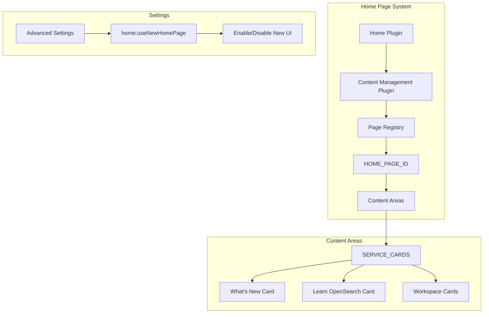

---
tags:
  - opensearch-dashboards
---
# Home Page

## Summary

The OpenSearch Dashboards Home Page provides a customizable landing experience with dynamic content areas, static information cards, and workspace integration. It serves as the central hub for users to access documentation, recent items, and getting started resources.

## Details

### Architecture



### Components

| Component | Description |
|-----------|-------------|
| `HomeListCard` | Renders static content cards with title, description list, and optional "View all" link |
| `SectionTypeService` | Manages home page sections and content providers |
| Content Management | Plugin that handles dynamic content registration and rendering |

### Configuration

| Setting | Description | Default |
|---------|-------------|---------|
| `home:useNewHomePage` | Enable the new home page UI | `false` |

### Static List Cards

The home page includes pre-configured static cards:

#### What's New Card
Displays latest updates and announcements with links to documentation.

#### Learn OpenSearch Card
Provides quick access to:
- Quickstart guide
- Building data visualizations
- Creating dashboards

### Content Provider Registration

Plugins can register content providers to add cards to the home page:

```typescript
contentManagement.registerContentProvider({
  id: 'my_card',
  getContent: () => ({
    id: 'my_content',
    kind: 'custom',
    order: 5,
    render: () => React.createElement(MyComponent),
  }),
  getTargetArea: () => HOME_CONTENT_AREAS.SERVICE_CARDS,
});
```

## Limitations

- Static card content is hardcoded and not configurable via UI
- New home page requires explicit opt-in via advanced settings
- Some features require additional permissions when workspace is enabled

## Change History

- **v2.16.0** (2024-08-06): Added static list cards (What's New, Learn OpenSearch); fixed crash for users without write permissions

## References

### Documentation
- [OpenSearch Dashboards Quickstart](https://opensearch.org/docs/latest/dashboards/quickstart/)

### Pull Requests
| Version | PR | Description |
|---------|-----|-------------|
| v2.16.0 | [#7351](https://github.com/opensearch-project/OpenSearch-Dashboards/pull/7351) | Add home page static list card |
| v2.16.0 | [#7054](https://github.com/opensearch-project/OpenSearch-Dashboards/pull/7054) | Fix crash for anonymous users without write permission |
