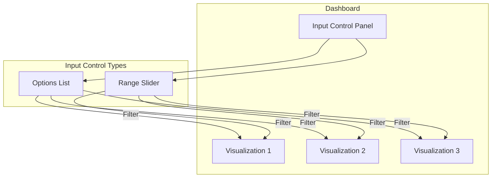

---
tags:
  - dashboards
---

# Input Control Visualization

## Summary

Input Control Visualization is a panel type in OpenSearch Dashboards that allows users to add interactive filter controls to dashboards. Unlike traditional visualizations, Controls provide interactive inputs that filter data across all visualizations in a dashboard. Users can create two types of controls: **Options list** (dropdown for terms aggregation filtering) and **Range slider** (for filtering within specified value ranges).

## Details

### Architecture

### Components

| Component | Description |
|-----------|-------------|
| `input_control_vis` plugin | Core plugin providing Input Control visualization type |
| `RangeControl` | Component for range slider controls using `ValidatedDualRange` |
| `ListControl` | Component for dropdown options list controls |
| `FormRow` | Wrapper component for control layout and labels |
| `ValidatedDualRange` | EUI-based dual range slider with validation |

### Control Types

| Type | Description | Use Case |
|------|-------------|----------|
| Options List | Dropdown selection from terms aggregation | Filter by categorical fields (e.g., `machine.os.keyword`) |
| Range Slider | Dual-handle slider for numeric ranges | Filter by numeric fields (e.g., `hour_of_day`, `price`) |

### Configuration

| Setting | Description | Default |
|---------|-------------|---------|
| `decimalPlaces` | Number of decimal places for range values | `0` |
| `min` | Minimum value for range slider | Auto-detected from data |
| `max` | Maximum value for range slider | Auto-detected from data |
| `disabled` | Whether the control is disabled | `false` |

### Usage Example

To add an Input Control to a dashboard:

1. Navigate to **Visualize** > **Create visualization**
2. Select **Controls** as the visualization type
3. Configure control options:
   - Choose control type (Options list or Range slider)
   - Select index pattern and field
   - Configure additional options (label, parent control, etc.)
4. Save and add to dashboard

## Limitations

- Controls filter data across all visualizations in the dashboard
- Range slider requires numeric fields
- Options list works best with keyword fields for exact matching
- Parent-child control relationships require careful configuration

## Change History

- **v2.18.0** (2024-11-05): Fixed sizing of disabled ValidatedDualRange components in range slider controls

## Related Features
- [OpenSearch Core](../opensearch/opensearch-actionplugin-rest-handler-wrapper.md)

## References

### Documentation
- [Building data visualizations](https://docs.opensearch.org/2.18/dashboards/visualize/viz-index/): OpenSearch Dashboards visualization documentation
- [PR #8108](https://github.com/opensearch-project/OpenSearch-Dashboards/pull/8108): Disabled range control sizing fix

### Pull Requests
| Version | PR | Description | Related Issue |
|---------|-----|-------------|---------------|
| v2.18.0 | [#8108](https://github.com/opensearch-project/OpenSearch-Dashboards/pull/8108) | Fix disabled ValidatedDualRange component sizing |   |
