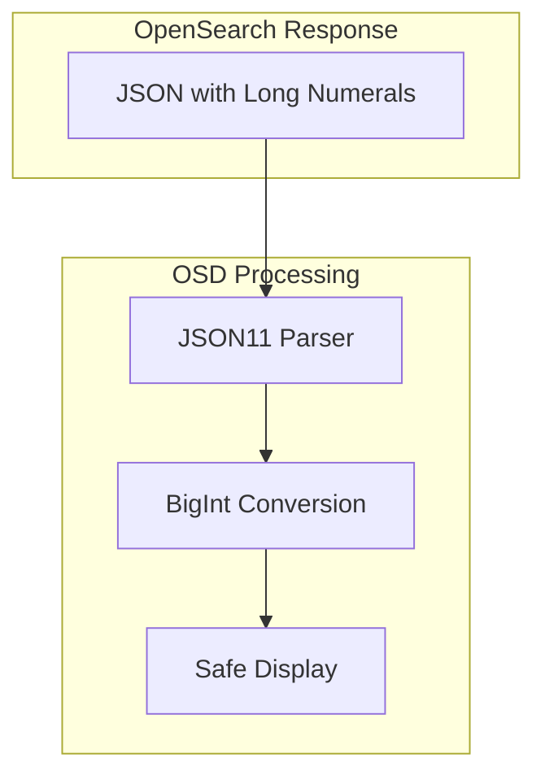

---
tags:
  - opensearch-dashboards
---
# JSON11 Long Numerals

## Summary

OpenSearch Dashboards uses JSON11, an AST-based JSON parser, to handle long numeric values (17+ digits) that exceed JavaScript's safe integer limit. This ensures numeric precision is preserved when displaying data from OpenSearch that contains large identifiers, timestamps, or other numeric values generated by systems using 64-bit integers.

## Details

### Problem

JavaScript's `Number` type is a 64-bit floating-point value that can safely represent integers up to `Number.MAX_SAFE_INTEGER` (9,007,199,254,740,991). Numeric values with 17 or more digits are corrupted by native JSON parsing, causing data integrity issues in OpenSearch Dashboards.

### Architecture



### Components

| Component | Description |
|-----------|-------------|
| `@osd/std` | Core utilities package containing JSON parsing functions |
| `json11` | AST-based JSON parser with long numeral support |
| `@opensearch-project/opensearch` | OpenSearch client with JSON11 integration |

### Configuration

The JSON11 parser is configured with the following options:

| Option | Value | Description |
|--------|-------|-------------|
| `withLongNumerals` | `true` | Enables BigInt conversion for long numerals during parsing |
| `withBigInt` | `false` | Outputs BigInt values as numeric strings during stringify |
| `quote` | `"` | Uses double quotes for JSON strings |
| `quoteNames` | `true` | Quotes all property names |

### Usage Example

```typescript
import { stringify, parse } from '@osd/std';

// Parsing JSON with long numerals
const data = parse('{"id": 12345678901234567890}');
// data.id is BigInt(12345678901234567890)

// Stringifying objects with BigInt values
const json = stringify({ id: BigInt('12345678901234567890') });
// json is '{"id": 12345678901234567890}'
```

## Limitations

- BigInt values cannot be used directly in arithmetic operations with regular numbers
- Some downstream consumers may need to handle BigInt values explicitly
- Performance overhead is minimal but present compared to native JSON parsing

## Change History

- **v2.16.0** (2024-08-06): Replaced regex-based long numeral handling with JSON11 AST-based parser, improving performance from ~90s to ~200ms for large datasets

## References

### Documentation
- [JSON11 npm package](https://www.npmjs.com/package/json11)

### Pull Requests
| Version | PR | Description |
|---------|-----|-------------|
| v2.16.0 | [#6915](https://github.com/opensearch-project/OpenSearch-Dashboards/pull/6915) | Use JSON11 for handling long numerals |

### Related Issues
| Issue | Description |
|-------|-------------|
| [#6377](https://github.com/opensearch-project/OpenSearch-Dashboards/issues/6377) | opensearch-with-long-numerals blocks and times out from Discover page |
