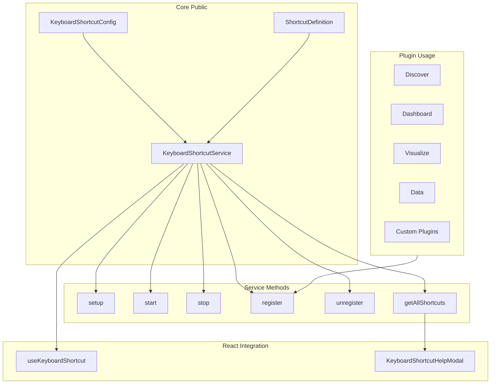
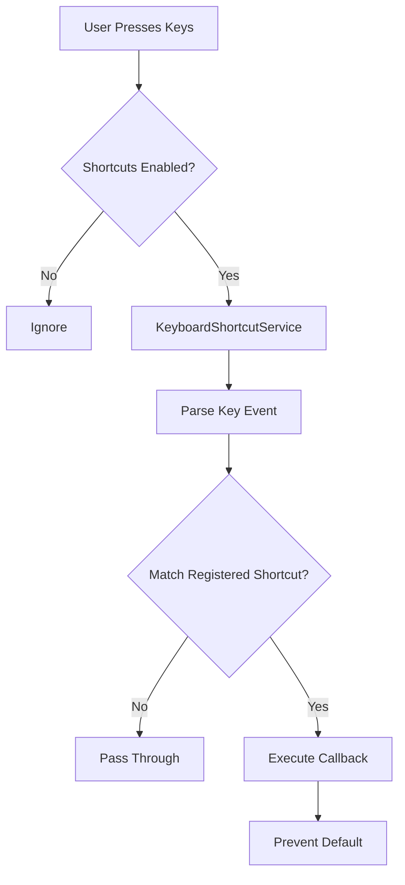

---
tags:
  - domain/core
  - component/dashboards
  - dashboards
---
# Keyboard Shortcuts

## Summary

OpenSearch Dashboards Keyboard Shortcuts is a feature that enables users to navigate and interact with the application using keyboard combinations. It provides a centralized service for registering, managing, and executing shortcuts, along with a discoverable help modal and React integration hooks for plugin developers.

## Details

### Architecture



### Data Flow



### Components

| Component | Description |
|-----------|-------------|
| `KeyboardShortcutService` | Core service that manages shortcut registration, event listening, and execution |
| `KeyboardShortcutConfig` | Configuration interface with `enabled` boolean |
| `ShortcutDefinition` | Interface defining shortcut properties (id, pluginId, name, category, keys, execute) |
| `KeyboardShortcutHelpModal` | React component displaying all registered shortcuts in a categorized modal |
| `KeyboardShortcutIcon` | Navigation icon component that triggers the help modal |
| `useKeyboardShortcut` | React hook for registering shortcuts with automatic lifecycle management |
| `KeyStringParser` | Utility for parsing key strings and generating platform-specific display strings |

### Configuration

| Setting | Description | Default |
|---------|-------------|---------|
| `opensearchDashboards.keyboardShortcuts.enabled` | Enable or disable the keyboard shortcuts feature globally | `true` |

### ShortcutDefinition Interface

```typescript
interface ShortcutDefinition {
  id: string;           // Unique identifier for the shortcut
  pluginId: string;     // Plugin that owns this shortcut
  name: string;         // Human-readable name
  category: string;     // Category for grouping in help modal
  keys: string;         // Key combination (e.g., 'cmd+s', 'g d')
  execute: () => void;  // Callback function to execute
}
```

### Key Format

The `keys` property supports:
- **Modifier combinations**: `cmd+s`, `ctrl+shift+a`, `alt+f`
- **Sequence shortcuts**: `g d` (press g, then d)
- **Platform-agnostic modifiers**: `cmd` maps to Cmd on Mac, Ctrl on Windows/Linux

### Built-in Shortcuts

| Shortcut | Action | Category |
|----------|--------|----------|
| `Shift+/` | Show keyboard shortcuts help | Navigation |
| `g d` | Go to Discover | Navigation |
| `g b` | Go to Dashboard | Navigation |
| `g v` | Go to Visualization | Navigation |
| `Shift+t` | Open Date Picker | Open |
| `Shift+r` | Refresh Results | Query |
| `Cmd/Ctrl+/` | Comment/uncomment line | Editing |
| `Shift+Option/Alt+/` | Block comment | Editing |

### Usage Example

#### Plugin Registration

```typescript
// In plugin's start() method
public start(core: CoreStart) {
  if (core.keyboardShortcut) {
    core.keyboardShortcut.register({
      id: 'my-custom-action',
      pluginId: 'myPlugin',
      name: 'My Custom Action',
      category: 'custom',
      keys: 'cmd+shift+m',
      execute: () => {
        // Perform action
      },
    });
  }
}
```

#### React Hook Usage

```typescript
function MyComponent() {
  const { services } = useOpenSearchDashboards();
  
  const handleAction = useCallback(() => {
    // Action logic
  }, []);

  services.keyboardShortcut?.useKeyboardShortcut({
    id: 'component-action',
    pluginId: 'myPlugin',
    name: 'Component Action',
    category: 'editing',
    keys: 'cmd+e',
    execute: handleAction,
  });

  return <div>Component</div>;
}
```

#### Configuration

```yaml
# opensearch_dashboards.yml
opensearchDashboards.keyboardShortcuts.enabled: true
```

## Limitations

- Keyboard shortcuts may conflict with browser or operating system shortcuts
- Sequence shortcuts require keys to be pressed within a defined time window
- Shortcuts are disabled when focus is in text input fields to avoid conflicts
- Navigation shortcuts require an active workspace selection
- Custom shortcuts must have unique id+pluginId combinations

## Change History

- **v3.3.0** (2025-09): Initial implementation with configuration, help modal, React hooks, navigation shortcuts, and query editor shortcuts


## References

### Documentation
- [Dev Tools Console Documentation](https://docs.opensearch.org/3.0/dashboards/dev-tools/run-queries/): Keyboard shortcuts in Dev Tools

### Pull Requests
| Version | PR | Description | Related Issue |
|---------|-----|-------------|---------------|
| v3.3.0 | [#10409](https://github.com/opensearch-project/OpenSearch-Dashboards/pull/10409) | Add keyboard shortcuts configuration option |   |
| v3.3.0 | [#10455](https://github.com/opensearch-project/OpenSearch-Dashboards/pull/10455) | Add useKeyboardShortcut hook |   |
| v3.3.0 | [#10466](https://github.com/opensearch-project/OpenSearch-Dashboards/pull/10466) | Add keyboard shortcut help modal |   |
| v3.3.0 | [#10509](https://github.com/opensearch-project/OpenSearch-Dashboards/pull/10509) | Register navigation shortcuts |   |
| v3.3.0 | [#10543](https://github.com/opensearch-project/OpenSearch-Dashboards/pull/10543) | Add Cypress tests, enable by default |   |
| v3.3.0 | [#10545](https://github.com/opensearch-project/OpenSearch-Dashboards/pull/10545) | Enable comment shortcuts in Query Editor | [#1234](https://github.com/opensearch-project/OpenSearch-Dashboards/issues/1234) |
