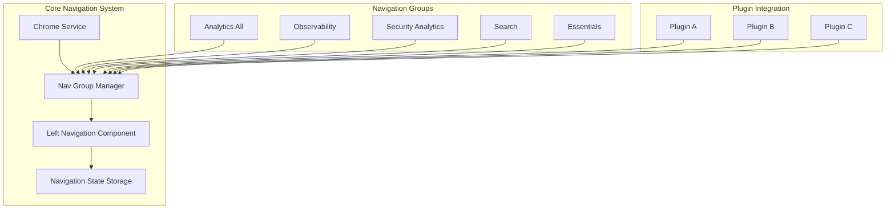
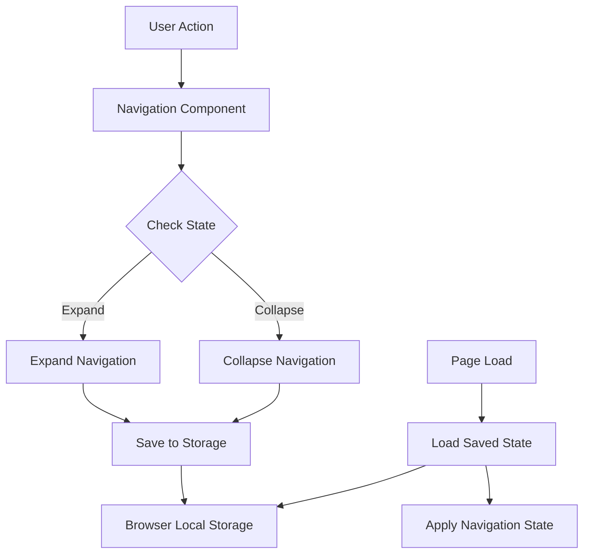

---
tags:
  - opensearch-dashboards
---
# Navigation

## Summary

OpenSearch Dashboards provides a configurable left navigation system that allows users to access various applications and features. The navigation supports multiple use cases (Analytics, Observability, Security Analytics, Search, Essentials) with customizable menu structures. Key features include collapsible navigation, persistent state, responsive design for different screen sizes, and docking/undocking capabilities.

## Details

### Architecture



### Data Flow



### Components

| Component | Description |
|-----------|-------------|
| Chrome Service | Core service managing browser chrome including navigation |
| Nav Group Manager | Manages navigation groups and their associated links |
| Left Navigation Component | UI component rendering the collapsible left navigation |
| Navigation State Storage | Persists navigation expand/collapse state |
| Responsive Handler | Manages navigation behavior across screen sizes |

### Configuration

| Setting | Description | Default |
|---------|-------------|---------|
| `navGroupEnabled` | Enable the new navigation group system | `false` |
| `showInAllNavGroup` | Show link in All use case nav group | `false` |
| Navigation dock state | Docked or undocked navigation | Docked |

### Navigation Groups

| Navigation Group | ID | Type | Order | Description |
|------------------|-----|------|-------|-------------|
| Data Administration | `dataAdministration` | System | 1000 | Data management features |
| Settings and Setup | `settingsAndSetup` | System | 2000 | Configuration and settings |
| All | `all` | System | 3000 | Unified view of all features |
| Observability | `observability` | - | 4000 | Monitoring and analysis |
| Security Analytics | `security-analytics` | - | 5000 | Security threat detection |
| Analytics | `analytics` | - | 6000 | Data analysis and insights |
| Search | `search` | - | 7000 | Search functionality |

### Landing Pages

System navigation groups have dedicated landing pages that display feature cards:

| Landing Page | App ID | Navigation Group |
|--------------|--------|------------------|
| Settings and Setup | `settings_landing` | Settings and Setup |
| Data Administration | `data_administration_landing` | Data Administration |

### Usage Example

#### Docking/Undocking Navigation

Users can dock or undock the navigation menu:
1. Select the menu icon on the upper-left toolbar
2. Select "Dock navigation" or "Undock navigation" at the bottom of the menu

#### Plugin Navigation Registration

```typescript
// Register navigation links for a plugin
public setup(core: CoreSetup) {
  core.chrome.navGroup.addNavLinksToGroup(
    DEFAULT_NAV_GROUPS.all,
    [{
      id: 'myPlugin',
      title: 'My Plugin',
      category: AppCategory.detect,
      showInAllNavGroup: true,
      order: 100
    }]
  );
}
```

#### Responsive Navigation

The navigation automatically adapts to screen size:
- **Large screens**: Full navigation with expand/collapse
- **Small screens**: Collapsed by default, overlay when expanded

## Limitations

- Navigation state is stored in browser local storage (not synced across devices)
- Custom navigation configurations require plugin code changes
- Some legacy plugins may not fully support the new navigation system

## Change History

- **v3.4.0** (2025-10-08): Fixed disabled prop propagation for navigation links - `isDisabled` state now correctly passed to `EuiSideNavItem` components
- **v2.18.0** (2024-10-22): Flattened navigation in Analytics(all) use case, persistent expand/collapse state, small screen compatibility, border style updates, sample data menu restored
- **v2.16.0** (2024-08-06): **Navigation Next** - Major navigation overhaul introducing new collapsible left navigation with navigation groups; added `registerNavGroupUpdater` API for plugins to dynamically update nav groups; added `currentNavGroup$` observable and breadcrumb integration; added recent items section on homepage and recent items popup in top navigation; added new navigation categories; fixed index pattern redirect when nav group enabled; enabled via "Use New Home Page" advanced setting; added "All use case" navigation group with `showInAllNavGroup` plugin property; introduced landing pages for Settings and Setup (`settings_landing`) and Data Administration (`data_administration_landing`) navigation groups; renamed "Detect" category to "Configure" with adjusted ordering; fixed breadcrumb navigation for migrated applications; added `getScopedBreadcrumbs` utility; workspace overview visible in all use cases; fixed Dev Tools tab CSS; fixed navigation-next integration issues; redirect users to home in global when workspace enabled


## References

### Documentation
- [OpenSearch Dashboards Quickstart Guide](https://docs.opensearch.org/2.18/dashboards/quickstart/): Official documentation on navigation

### Pull Requests
| Version | PR | Description | Related Issue |
|---------|-----|-------------|---------------|
| v3.4.0 | [#10678](https://github.com/opensearch-project/OpenSearch-Dashboards/pull/10678) | Fix disabled prop propagation for EuiSideNavItem |   |
| v2.18.0 | [#8332](https://github.com/opensearch-project/OpenSearch-Dashboards/pull/8332) | Flatten left nav in Analytics(all) use case | [#1234](https://github.com/opensearch-project/OpenSearch-Dashboards/issues/1234) |
| v2.18.0 | [#8286](https://github.com/opensearch-project/OpenSearch-Dashboards/pull/8286) | Remember state when expand/collapse left nav | [#1234](https://github.com/opensearch-project/OpenSearch-Dashboards/issues/1234) |
| v2.18.0 | [#8489](https://github.com/opensearch-project/OpenSearch-Dashboards/pull/8489) | Update border style when new left nav expanded | [#1234](https://github.com/opensearch-project/OpenSearch-Dashboards/issues/1234) |
| v2.18.0 | [#8076](https://github.com/opensearch-project/OpenSearch-Dashboards/pull/8076) | Add sample data menu back | [#1234](https://github.com/opensearch-project/OpenSearch-Dashboards/issues/1234) |
| v2.18.0 | [#7962](https://github.com/opensearch-project/OpenSearch-Dashboards/pull/7962) | Make left nav compatible with small screen | [#1234](https://github.com/opensearch-project/OpenSearch-Dashboards/issues/1234) |
| v2.16.0 | [#7117](https://github.com/opensearch-project/OpenSearch-Dashboards/pull/7117) | Add register nav group updater to chrome service | [#7147](https://github.com/opensearch-project/OpenSearch-Dashboards/issues/7147) |
| v2.16.0 | [#7166](https://github.com/opensearch-project/OpenSearch-Dashboards/pull/7166) | Add current nav group into chrome service, prepend to breadcrumbs | [#7131](https://github.com/opensearch-project/OpenSearch-Dashboards/issues/7131), [#7132](https://github.com/opensearch-project/OpenSearch-Dashboards/issues/7132) |
| v2.16.0 | [#7230](https://github.com/opensearch-project/OpenSearch-Dashboards/pull/7230) | Add new left navigation | [#7148](https://github.com/opensearch-project/OpenSearch-Dashboards/issues/7148), [#7094](https://github.com/opensearch-project/OpenSearch-Dashboards/issues/7094) |
| v2.16.0 | [#7235](https://github.com/opensearch-project/OpenSearch-Dashboards/pull/7235) | Add all use case | - |
| v2.16.0 | [#7237](https://github.com/opensearch-project/OpenSearch-Dashboards/pull/7237) | Add recent works in new homepage | - |
| v2.16.0 | [#7257](https://github.com/opensearch-project/OpenSearch-Dashboards/pull/7257) | Add recent items popup in top navigation | - |
| v2.16.0 | [#7275](https://github.com/opensearch-project/OpenSearch-Dashboards/pull/7275) | Add new navigation category | - |
| v2.16.0 | [#7282](https://github.com/opensearch-project/OpenSearch-Dashboards/pull/7282) | Enable landing page for settings and data administration | [#7283](https://github.com/opensearch-project/OpenSearch-Dashboards/issues/7283) |
| v2.16.0 | [#7305](https://github.com/opensearch-project/OpenSearch-Dashboards/pull/7305) | Fix redirect to standard index pattern app when nav group enabled | - |
| v2.16.0 | [#7339](https://github.com/opensearch-project/OpenSearch-Dashboards/pull/7339) | Update category: rename Detect to Configure | - |
| v2.16.0 | [#7551](https://github.com/opensearch-project/OpenSearch-Dashboards/pull/7551) | Redirect user to home in global when workspace enabled | - |
| v2.16.0 | [#7401](https://github.com/opensearch-project/OpenSearch-Dashboards/pull/7401) | Fix breadcrumb for migrated apps with BrowserRouter | - |
| v2.16.0 | [#7356](https://github.com/opensearch-project/OpenSearch-Dashboards/pull/7356) | Fix navigation-next integration issues | - |
| v2.16.0 | [#7328](https://github.com/opensearch-project/OpenSearch-Dashboards/pull/7328) | Update dev tools tab css for new left navigation | - |
