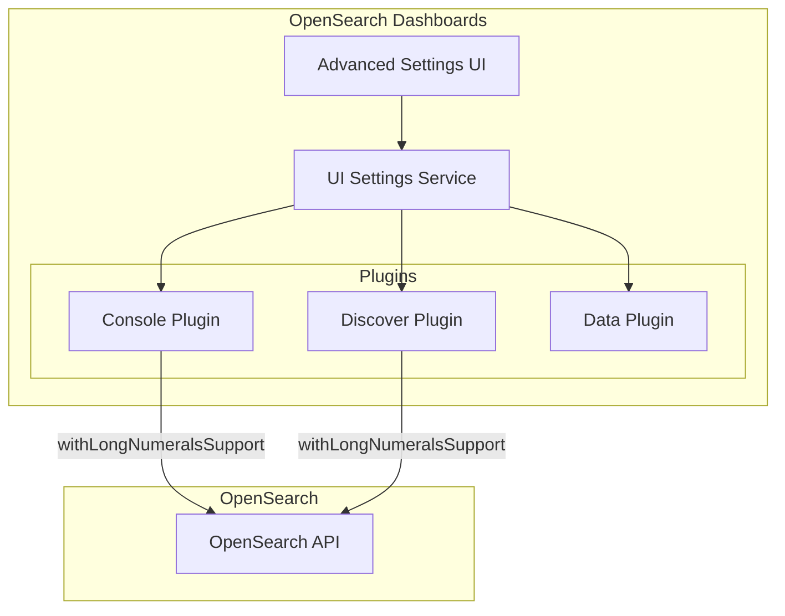

---
tags:
  - opensearch-dashboards
---
# Numeric Precision Setting

## Summary

The Numeric Precision Setting feature provides control over how OpenSearch Dashboards handles extremely large numbers (long numerals) that exceed JavaScript's safe integer limits. Users can enable extended precision for accurate handling of large values or disable it to optimize performance.

## Details

### Architecture



### Components

| Component | Description |
|-----------|-------------|
| `data:withLongNumerals` | UI setting key that controls numeric precision behavior |
| `UI_SETTINGS.DATA_WITH_LONG_NUMERALS` | Constant defined in the Data plugin for accessing the setting |
| `IndexPatternsService.isLongNumeralsSupported()` | Method to check if long numerals support is enabled |
| `withLongNumeralsSupport` | Request parameter passed to OpenSearch API calls |

### Configuration

| Setting | Key | Type | Default | Description |
|---------|-----|------|---------|-------------|
| Extend Numeric Precision | `data:withLongNumerals` | Boolean | `true` | Turn on for precise handling of extremely large numbers. Turn off to optimize performance when high precision for large values isn't required. |

#### Configuration Methods

1. **UI Configuration**: Stack Management → Advanced Settings → Data section
2. **Configuration File** (`opensearch_dashboards.yml`):
   ```yaml
   data.withLongNumerals: true
   ```

### Usage Example

When enabled (default), numeric values outside JavaScript's safe integer range are preserved with full precision:

```json
{
  "long-max": 18014398509481982,
  "long-min": -18014398509481982
}
```

When disabled, these values may lose precision due to JavaScript's floating-point limitations:

```json
{
  "long-max": 18014398509481984,
  "long-min": -18014398509481984
}
```

## Limitations

- Disabling this setting causes precision loss for numeric values outside JavaScript's safe integer range (±9,007,199,254,740,991)
- The setting is global and affects all queries and document views
- Performance impact of enabling long numerals support depends on the volume and frequency of large numeric values in your data

## Change History

- **v2.19.0** (2025-01-21): Added configurable setting to toggle long numerals support on/off. Previously, long numerals support was always enabled.

## References

### Documentation

- [Advanced Settings](https://docs.opensearch.org/2.19/dashboards/management/advanced-settings/)

### Pull Requests

| Version | PR | Description |
|---------|-----|-------------|
| v2.19.0 | [#8837](https://github.com/opensearch-project/OpenSearch-Dashboards/pull/8837) | Add setting to turn extending numeric precision on or off |
