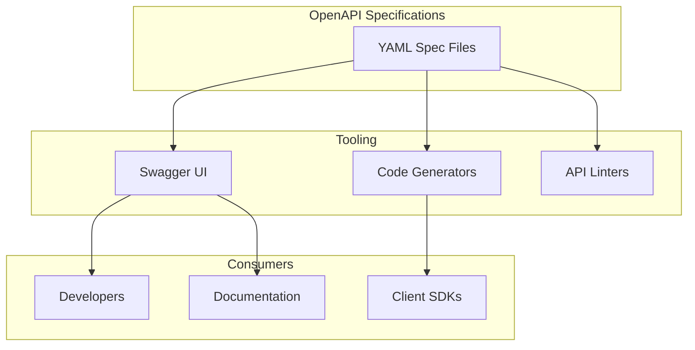

---
tags:
  - opensearch-dashboards
---
# OpenAPI Specification

## Summary

OpenSearch Dashboards provides OpenAPI specifications for its REST APIs, enabling developers to understand, explore, and integrate with Dashboards APIs using standard tooling like Swagger UI and code generators.

## Details

### Architecture



### Components

| Component | Description |
|-----------|-------------|
| Saved Objects API Spec | OpenAPI specification for saved objects CRUD operations |
| Index Patterns API Spec | OpenAPI specification for index pattern field retrieval |

### Covered APIs

#### Saved Objects APIs

| Operation | Method | Endpoint |
|-----------|--------|----------|
| Get | GET | `/api/saved_objects/{type}/{id}` |
| Create | POST | `/api/saved_objects/{type}/{id}` |
| Find | GET | `/api/saved_objects/_find` |
| Bulk Get | POST | `/api/saved_objects/_bulk_get` |
| Bulk Create | POST | `/api/saved_objects/_bulk_create` |
| Bulk Update | PUT | `/api/saved_objects/_bulk_update` |
| Update | PUT | `/api/saved_objects/{type}/{id}` |
| Delete | DELETE | `/api/saved_objects/{type}/{id}` |
| Migrate | POST | `/api/saved_objects/_migrate` |
| Import | POST | `/api/saved_objects/_import` |
| Export | POST | `/api/saved_objects/_export` |
| Resolve Import Errors | POST | `/api/saved_objects/_resolve_import_errors` |

#### Index Patterns APIs

| Operation | Method | Endpoint |
|-----------|--------|----------|
| Get Fields | GET | `/api/index_patterns/_fields_for_wildcard` |

### Usage Example

To view the API documentation locally using Swagger UI:

```bash
# Navigate to the OpenAPI spec directory
cd docs/openapi/saved_objects

# Start a local server
npx serve

# Open http://localhost:3000 in your browser
```

## Limitations

- Only Saved Objects and Index Patterns APIs are currently documented
- Bundling tool for combining specifications is not yet available
- Linting and validation tooling is planned but not implemented

## Change History

- **v2.16.0** (2024-08-06): Added OpenAPI specification for index pattern fields API
- **v2.15.0** (2024-06-04): Initial OpenAPI specifications for Saved Objects APIs (get, create, find, bulk operations, import/export)

## References

### Documentation

- [OpenAPI Specification](https://swagger.io/specification/)
- [Swagger UI](https://swagger.io/tools/swagger-ui/)

### Pull Requests

| Version | PR | Description |
|---------|-----|-------------|
| v2.16.0 | [#7270](https://github.com/opensearch-project/OpenSearch-Dashboards/pull/7270) | Add OpenAPI specification for index pattern fields API |
| v2.15.0 | [#6799](https://github.com/opensearch-project/OpenSearch-Dashboards/pull/6799) | Add OpenAPI specification for GET and CREATE saved object APIs |
| v2.15.0 | [#6855](https://github.com/opensearch-project/OpenSearch-Dashboards/pull/6855) | Add examples for saved object creation |
| v2.15.0 | [#6856](https://github.com/opensearch-project/OpenSearch-Dashboards/pull/6856) | Add OpenAPI doc for saved_object find API |
| v2.15.0 | [#6859](https://github.com/opensearch-project/OpenSearch-Dashboards/pull/6859) | Add OpenAPI specification for bulk create and bulk update APIs |
| v2.15.0 | [#6860](https://github.com/opensearch-project/OpenSearch-Dashboards/pull/6860) | Add OpenAPI specification for bulk_get API |
| v2.15.0 | [#6864](https://github.com/opensearch-project/OpenSearch-Dashboards/pull/6864) | Add OpenAPI specification for update, delete and migrate APIs |
| v2.15.0 | [#6872](https://github.com/opensearch-project/OpenSearch-Dashboards/pull/6872) | Add OpenAPI specification for import and export APIs |
| v2.15.0 | [#6885](https://github.com/opensearch-project/OpenSearch-Dashboards/pull/6885) | Add OpenAPI specifications for resolve import errors API |

### Issues

- [#6719](https://github.com/opensearch-project/OpenSearch-Dashboards/issues/6719) - [Proposal] OpenAPI specifications for dashboards APIs
