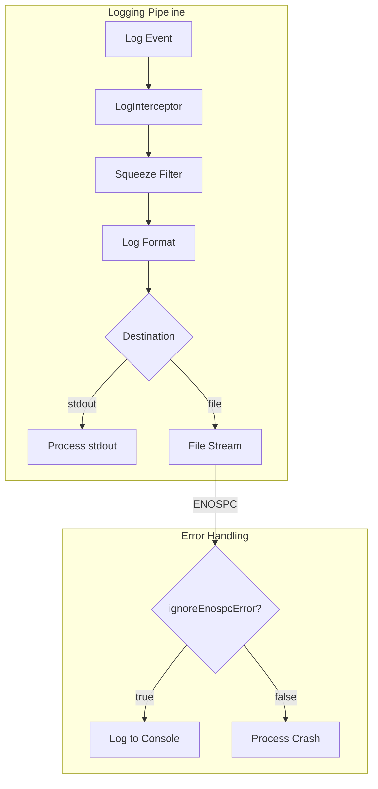

---
tags:
  - opensearch-dashboards
---
# OSD Availability

## Summary

OSD Availability features improve the resilience and stability of OpenSearch Dashboards by handling edge cases that could cause process crashes or service disruptions.

## Details

### Architecture



### Components

| Component | Description |
|-----------|-------------|
| `log_reporter.js` | Manages logging stream pipeline and error handling |
| `configuration.js` | Passes logging configuration to the reporter |
| `schema.js` | Defines configuration schema including `ignoreEnospcError` |

### Configuration

| Setting | Type | Default | Description |
|---------|------|---------|-------------|
| `logging.ignoreEnospcError` | boolean | `false` | When enabled, ENOSPC errors in the logging pipeline are caught and logged to console instead of crashing the process |

### Usage Example

```yaml
# opensearch_dashboards.yml

# Enable graceful handling of disk-full errors
logging.ignoreEnospcError: true

# Recommended: Also configure log rotation to prevent disk issues
logging.dest: /var/log/opensearch-dashboards/opensearch_dashboards.log
logging.rotate.enabled: true
logging.rotate.everyBytes: 10485760
logging.rotate.keepFiles: 7
```

## Limitations

- `logging.ignoreEnospcError` only affects file-based logging destinations
- When enabled, log entries may be lost during disk-full conditions
- The setting is disabled by default to maintain backward compatibility and ensure administrators are aware of disk space issues

## Change History

- **v2.16.0** (2024-08-06): Added `logging.ignoreEnospcError` configuration to prevent process crashes when disk is full

## References

### Pull Requests

| Version | PR | Description |
|---------|-----|-------------|
| v2.16.0 | [#6733](https://github.com/opensearch-project/OpenSearch-Dashboards/pull/6733) | Prevent OSD process crashes when disk is full |

### Issues

| Issue | Description |
|-------|-------------|
| [#6607](https://github.com/opensearch-project/OpenSearch-Dashboards/issues/6607) | Feature request: Allow admin to customize OSD logging exception handling behavior |
