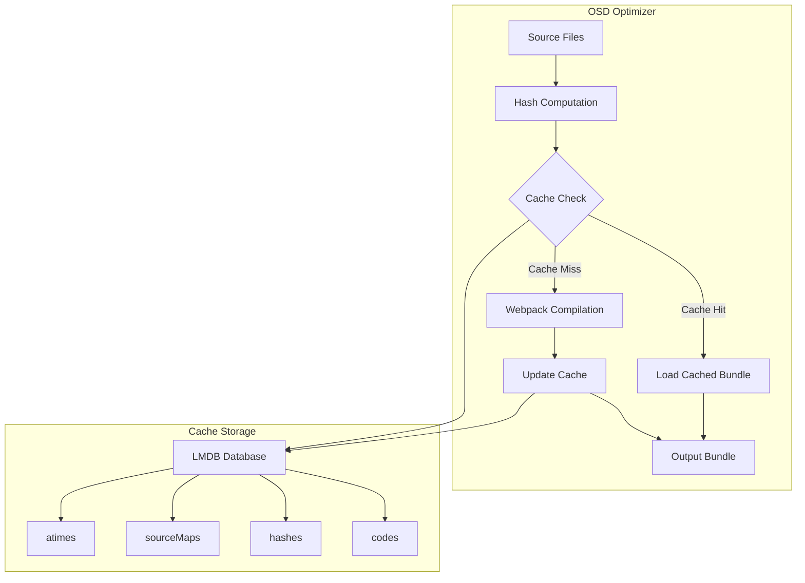
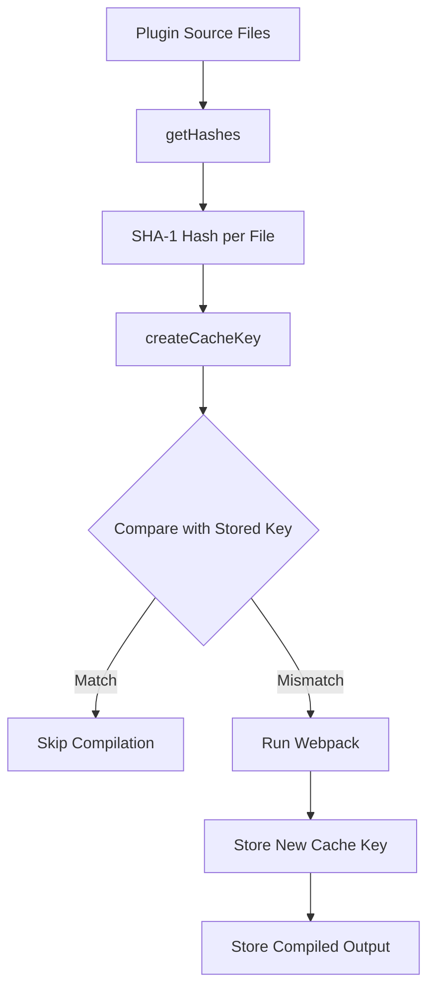

---
tags:
  - domain/core
  - component/dashboards
  - dashboards
  - performance
---
# OSD Optimizer Cache

## Summary

The OSD Optimizer is the build system for OpenSearch Dashboards that compiles and bundles plugin code. It includes a caching mechanism to avoid unnecessary recompilation. Starting from v2.18.0, the cache uses content-based hashing instead of file modification times, enabling effective caching in CI/CD environments.

## Details

### Architecture



### Data Flow



### Components

| Component | Description |
|-----------|-------------|
| `get_hashes.ts` | Computes SHA-1 content hashes for files with concurrency limit of 100 |
| `bundle.ts` | Bundle class with `createCacheKey()` method |
| `cache.ts` | LMDB-based cache storage with codes, hashes, sourceMaps, and atimes databases |
| `bundle_cache.ts` | Determines cache validity by comparing cache keys |
| `cache_keys.ts` | Defines `OptimizerCacheKey` interface and diff logic |
| `run_compilers.ts` | Webpack compilation runner with cache integration |

### Configuration

| Setting | Description | Default |
|---------|-------------|---------|
| Cache location | `.osd-optimizer-cache` directory | Project root |
| Hash algorithm | SHA-1 for content hashing | N/A |
| Concurrency | Max concurrent file hash operations | 100 |

### Usage Example

The optimizer runs automatically during development and build:

```bash
# Development mode (watches for changes)
yarn start

# Production build
yarn build

# Clear cache if issues occur
yarn osd clean
```

### Cache Key Structure

```json
{
  "spec": {
    "id": "plugin-name",
    "type": "plugin",
    "contextDir": "/path/to/plugin"
  },
  "hashes": {
    "/path/to/file1.ts": "base64-sha1-hash",
    "/path/to/file2.ts": "base64-sha1-hash"
  }
}
```

## Limitations

- Cache is invalidated when upgrading from mtime-based versions
- Hash computation has minor overhead compared to mtime checks
- Large codebases may experience longer initial hash computation

## Change History

- **v2.18.0** (2024-10-22): Switched from mtime-based caching to SHA-1 content hashing for CI compatibility


## References

### Pull Requests
| Version | PR | Description | Related Issue |
|---------|-----|-------------|---------------|
| v2.18.0 | [#8472](https://github.com/opensearch-project/OpenSearch-Dashboards/pull/8472) | Switch to content-based hashing | [#8428](https://github.com/opensearch-project/OpenSearch-Dashboards/issues/8428) |

### Issues (Design / RFC)
- [Issue #8428](https://github.com/opensearch-project/OpenSearch-Dashboards/issues/8428): Original feature request for improved cache strategy
- [Issue #2188](https://github.com/opensearch-project/dashboards-observability/issues/2188): Related CI caching discussion
