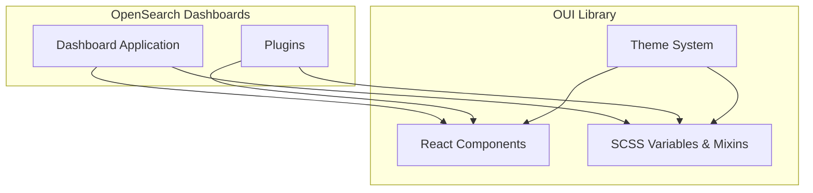

---
tags:
  - domain/core
  - component/dashboards
  - dashboards
---
# OpenSearch UI (OUI)

## Summary

OpenSearch UI (OUI) is the component library that provides the visual foundation for OpenSearch Dashboards. It is a fork of Elastic UI (EUI) maintained by the OpenSearch project, offering React components, SCSS styling, and design patterns specifically tailored for OpenSearch's user interface needs.

## Details

### Architecture



### Components

| Component Category | Description |
|-------------------|-------------|
| Layout | Page layouts, grids, flex groups, panels |
| Navigation | Side nav, breadcrumbs, tabs, pagination |
| Forms | Inputs, selects, checkboxes, buttons |
| Display | Tables, cards, badges, tooltips |
| Feedback | Toasts, modals, loading indicators |

### Configuration

OUI is configured through package dependencies in OpenSearch Dashboards:

| Setting | Description | Example |
|---------|-------------|---------|
| `@elastic/eui` | NPM alias pointing to OUI | `npm:@opensearch-project/oui@1.15.0` |

### Theme System

OUI supports multiple themes through SCSS variables:

```scss
// Light theme colors
$euiColorPrimary: #006BB4;
$euiColorSuccess: #017D73;

// Side navigation
$euiSideNavBackgroundColor: lightOrDarkTheme(#ebe4df, #001c28);
```

### Usage Example

```tsx
import { EuiButton, EuiFlexGroup, EuiFlexItem } from '@elastic/eui';

function MyComponent() {
  return (
    <EuiFlexGroup>
      <EuiFlexItem>
        <EuiButton fill>Primary Action</EuiButton>
      </EuiFlexItem>
    </EuiFlexGroup>
  );
}
```

## Limitations

- OUI is a fork of EUI and may diverge from upstream changes
- Custom themes require understanding of SCSS variable system
- Breaking changes between major versions may require plugin updates

## Change History

- **v3.2.0** (2025-07-29): Updated to OUI 1.21 with `preserveTabContent` prop for `EuiTabbedContent` component
- **v2.18.0** (2024-11-05): Updated to OUI 1.15 with new `$euiSideNavBackgroundColor` variable, font changes from Fira Code to Source Code Pro


## References

### Documentation
- [OpenSearch Dashboards](https://docs.opensearch.org/latest/dashboards/): Official documentation
- [OUI Repository](https://github.com/opensearch-project/oui): OpenSearch UI component library source code

### Pull Requests
| Version | PR | Description | Related Issue |
|---------|-----|-------------|---------------|
| v3.2.0 | [#10153](https://github.com/opensearch-project/OpenSearch-Dashboards/pull/10153) | Update OUI to 1.20 | [#1234](https://github.com/opensearch-project/OpenSearch-Dashboards/issues/1234) |
| v3.2.0 | [#10284](https://github.com/opensearch-project/OpenSearch-Dashboards/pull/10284) | Update OUI to 1.21 | [#1234](https://github.com/opensearch-project/OpenSearch-Dashboards/issues/1234) |
| v2.18.0 | [#8246](https://github.com/opensearch-project/OpenSearch-Dashboards/pull/8246) | Update OUI to 1.13 |   |
| v2.18.0 | [#8372](https://github.com/opensearch-project/OpenSearch-Dashboards/pull/8372) | Update OUI to 1.14 |   |
| v2.18.0 | [#8480](https://github.com/opensearch-project/OpenSearch-Dashboards/pull/8480) | Update OUI to 1.15 |   |
