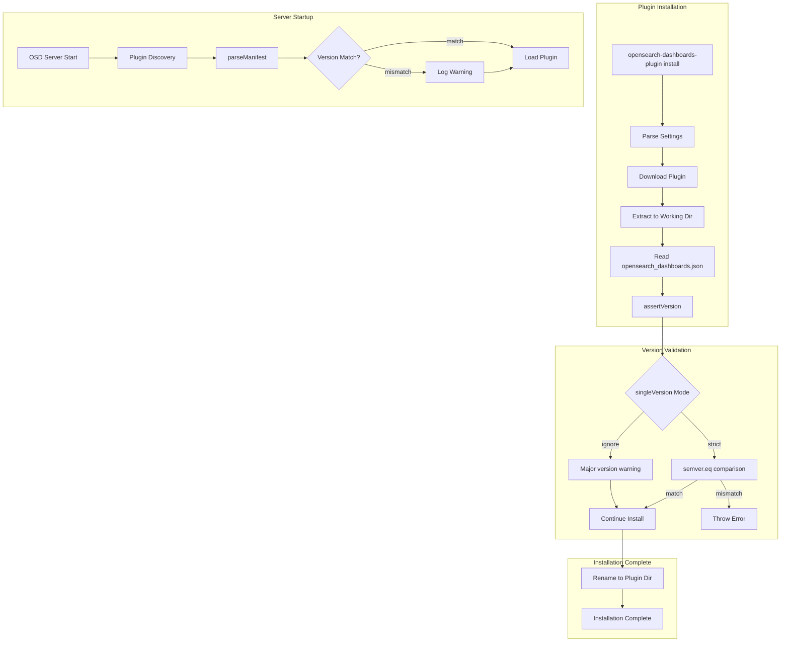

---
tags:
  - opensearch-dashboards
---
# Plugin Compatibility

## Summary

OpenSearch Dashboards plugin compatibility controls how plugins are validated against the Dashboards version during installation and server startup. The system ensures plugins are compatible with the running Dashboards instance, preventing runtime errors from version mismatches. Starting in v3.3.0, administrators can configure the validation strictness using the `--single-version` CLI flag. In v3.5.0, the default was changed from `strict` to `ignore`, and the server-side manifest parser was relaxed to warn instead of error on version mismatches.

## Details

### Architecture



### Components

| Component | File | Description |
|-----------|------|-------------|
| CLI Plugin Install | `src/cli_plugin/install/index.js` | Command-line interface for plugin installation |
| Settings Parser | `src/cli_plugin/install/settings.js` | Parses CLI options including `singleVersion` |
| Version Validator | `src/cli_plugin/install/opensearch_dashboards.js` | `assertVersion()` function for compatibility checks |
| Manifest Parser | `src/core/server/plugins/discovery/plugin_manifest_parser.ts` | Server-side plugin manifest validation (warns on mismatch since v3.5.0) |
| OpenSearch Config | `src/core/server/opensearch/opensearch_config.ts` | `ignoreVersionMismatch` setting |
| Dependency Validator | `packages/osd-pm/src/utils/validate_dependencies.ts` | `singleVersionResolution` for dependency validation |

### Configuration

| Setting | Description | Default (v3.3.0) | Default (v3.5.0+) | Values |
|---------|-------------|-------------------|---------------------|--------|
| `--single-version` | Version validation mode for plugin installation | `strict` | `ignore` | `strict`, `ignore` |
| `opensearch.ignoreVersionMismatch` | Ignore OSD-OpenSearch version mismatch | `false` | `true` | `true`, `false` |

### Usage Example

```bash
# Install plugin with default mode (ignore since v3.5.0)
bin/opensearch-dashboards-plugin install https://example.com/plugin-3.4.0.zip

# Install plugin with strict version matching (opt-in since v3.5.0)
bin/opensearch-dashboards-plugin install --single-version strict https://example.com/plugin-3.5.0.zip
```

### Special Cases

- **Development override**: Plugins with `opensearchDashboardsVersion: "opensearchDashboards"` bypass all version checks
- **Invalid versions**: Both plugin and Dashboards versions must be valid semver; invalid formats now produce warnings instead of errors (since v3.5.0)

## Limitations

- The `ignore` mode does not guarantee plugin functionality with mismatched versions
- Users should verify plugin compatibility manually when using `ignore` mode
- Plugins can still explicitly opt into strict mode via `--single-version strict`

## Change History

- **v3.5.0**: Changed default `--single-version` from `strict` to `ignore`; server-side manifest parser now warns instead of throwing errors on version mismatch; `ignoreVersionMismatch` defaults to `true`
- **v3.3.0** (2026-01-11): Added `--single-version` CLI flag with `strict` and `ignore` modes for flexible version validation


## References

### Documentation
- [Managing OpenSearch Dashboards plugins](https://docs.opensearch.org/3.0/install-and-configure/install-dashboards/plugins/): Official plugin management documentation

### Blog Posts
- [Introduction to OpenSearch Dashboard Plugins](https://opensearch.org/blog/dashboards-plugins-intro/): Plugin architecture overview
- [A comprehensive guide to setting up and connecting self-managed OpenSearch Dashboards](https://opensearch.org/blog/a-comprehensive-guide-to-setup-and-connect-self-managed-dashboards-with-amazon-opensearch-domain/): Discusses version compatibility bypass

### Pull Requests
| Version | PR | Description | Related Issue |
|---------|-----|-------------|---------------|
| v3.5.0 | [#11179](https://github.com/opensearch-project/OpenSearch-Dashboards/pull/11179) | Allow external plugins to be a different version from OSD (warn instead of error) | - |
| v3.5.0 | [#11183](https://github.com/opensearch-project/OpenSearch-Dashboards/pull/11183) | Make single-version=ignore as default | Follow-up to #11179 |
| v3.3.0 | [#10273](https://github.com/opensearch-project/OpenSearch-Dashboards/pull/10273) | Add `--single-version` flag with strict/ignore modes | [#10294](https://github.com/opensearch-project/OpenSearch-Dashboards/issues/10294) |
