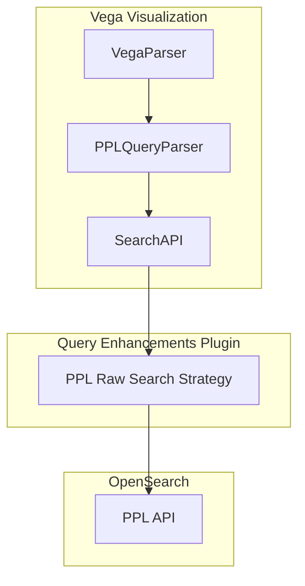

---
tags:
  - opensearch-dashboards
---
# PPL Support in Vega Visualization

## Summary

PPL (Piped Processing Language) support in Vega visualizations enables users to query OpenSearch data using PPL syntax directly within Vega specifications. This provides an alternative to the traditional OpenSearch Query DSL, offering a more intuitive pipe-based query language for data exploration and visualization.

## Details

### Architecture



### Components

| Component | Description |
|-----------|-------------|
| `PPLQueryParser` | Parses PPL queries from Vega specifications and handles time filter injection |
| `pplraw` search strategy | Executes PPL queries and returns raw JSON data for Vega consumption |
| `SearchAPI` | Extended to support PPL strategy option and response inspection |

### Configuration

PPL queries in Vega use the `ppl` data source type with the following structure:

| Setting | Description | Required |
|---------|-------------|----------|
| `body.query` | PPL query string | Yes |
| `%timefield%` | Field name for time filter injection | No |
| `%context%` | Enable dashboard context (time range, filters) | No |
| `data_source_name` | Target data source for multi-data-source setups | No |

### Usage Example

```hjson
{
  $schema: https://vega.github.io/schema/vega-lite/v5.json
  data: {
    url: {
      %context%: true
      %timefield%: @timestamp
      body: {
        query: "source=my_index | stats avg(bytes) by host"
      }
    }
  }
  mark: bar
  encoding: {
    x: { field: host, type: nominal }
    y: { field: avg(bytes), type: quantitative }
  }
}
```

### Time Filter Injection

When `%timefield%` is specified, the PPL parser automatically injects a time filter based on the dashboard's time range:

```
source=my_index | where `@timestamp` >= '2024-01-01 00:00:00.000' and `@timestamp` <= '2024-01-31 23:59:59.999' | stats count() by response
```

## Limitations

- Requires the query enhancements plugin to be enabled
- PPL syntax must be valid; errors are reported in the Vega inspector
- Time filter injection requires explicit `%timefield%` configuration
- Multi-data-source support requires `data_source_name` to be specified

## Change History

- **v2.16.0** (2024-07-23): Initial implementation of PPL support in Vega visualization

## References

### Documentation

- [Vega Visualization](https://docs.opensearch.org/latest/dashboards/visualize/vega/)
- [PPL Documentation](https://docs.opensearch.org/latest/search-plugins/sql/ppl/index/)

### Pull Requests

| Version | PR | Description |
|---------|-----|-------------|
| v2.16.0 | [#7285](https://github.com/opensearch-project/OpenSearch-Dashboards/pull/7285) | Support PPL in vega visualization |
