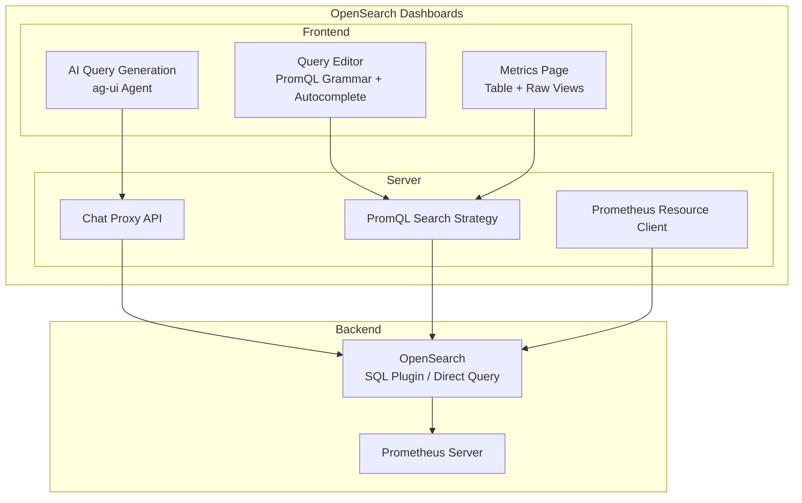

---
tags:
  - opensearch-dashboards
---
# Prometheus Metrics in Explore

## Summary

Prometheus Metrics in Explore integrates Prometheus as a first-class data source within the OpenSearch Dashboards Explore plugin. This enables users to query Prometheus metrics using PromQL directly from the Explore interface, with full syntax highlighting, autocomplete, multi-query support, and AI-powered query generation. The feature was introduced as part of the broader initiative to make OpenSearch Dashboards a unified observability platform that supports both log analytics and metrics monitoring.

## Details

### Architecture



### Components

| Component | Description |
|-----------|-------------|
| PromQL Grammar | ANTLR-based parser providing syntax highlighting and validation for PromQL queries |
| Autocomplete Engine | Context-aware suggestions for metrics, labels, label values, functions, aggregation operators, and time units |
| Metrics Page | Dedicated UI page within Explore for Prometheus data sources with Table and Raw result views |
| PromQL Search Strategy | Server-side strategy that routes PromQL queries through the SQL plugin to Prometheus |
| Prometheus Resource Client | Client for browsing Prometheus resources (labels, values, metrics, metadata) |
| AI Query Generation | Integration with ag-ui agent for natural language to PromQL conversion using `search_prometheus_metadata` tool |
| Chat Proxy API | Server route that forwards PromQL generation requests to the configured observability agent |

### Configuration

| Setting | Description | Default |
|---------|-------------|--------|
| `chat.observabilityAgentId` | Agent ID for PromQL generation via chat proxy API | (none) |
| Explore plugin | Must be enabled with multi-datasource and observability workspace | Disabled |

### Usage Example

1. Enable the Explore plugin (development: `yarn start:explore`)
2. Create a Prometheus data connection in Data Sources management
3. Navigate to Explore → Metrics
4. Select a Prometheus data source
5. Write PromQL queries with autocomplete assistance:
   ```promql
   up; node_cpu_seconds_total{mode="idle"}
   ```
6. View results in Table or Raw format
7. Use AI mode to generate PromQL from natural language descriptions

## Limitations

- Requires Explore plugin with multi-datasource feature and observability workspace
- Multi-query uses semicolon delimiters (not stacked query editors)
- AI query generation limited to single tool call result per prompt (ag-ui agent constraint)
- Prometheus connections always use the local OpenSearch cluster as proxy
- No support for Prometheus range queries in the initial implementation (instant queries only)
- Visualizations (line charts) for time series data not yet included

## Change History

- **v3.5.0**: Initial implementation — PromQL grammar and autocomplete, server APIs, metrics page with table and raw views, multi-query support, AI-powered query generation via ag-ui agent, simplified connection management (local cluster only), improved error handling, removed unused meta field from saved objects

## References

### Documentation
- [RFC: Prometheus as a first class datasource](https://github.com/opensearch-project/OpenSearch-Dashboards/issues/9535)

### Pull Requests
| Version | PR | Description |
|---------|-----|-------------|
| v3.5.0 | [#11039](https://github.com/opensearch-project/OpenSearch-Dashboards/pull/11039) | Add prometheus server APIs and frontend type config |
| v3.5.0 | [#11037](https://github.com/opensearch-project/OpenSearch-Dashboards/pull/11037) | Add prometheus grammar and autocomplete functions |
| v3.5.0 | [#11073](https://github.com/opensearch-project/OpenSearch-Dashboards/pull/11073) | Add prometheus metrics page in explore |
| v3.5.0 | [#11095](https://github.com/opensearch-project/OpenSearch-Dashboards/pull/11095) | Add raw table to prometheus results page |
| v3.5.0 | [#11127](https://github.com/opensearch-project/OpenSearch-Dashboards/pull/11127) | Support multi query for prometheus in explore |
| v3.5.0 | [#11153](https://github.com/opensearch-project/OpenSearch-Dashboards/pull/11153) | Support query generation for PromQL in Explore |
| v3.5.0 | [#11154](https://github.com/opensearch-project/OpenSearch-Dashboards/pull/11154) | Remove MDS support for Prometheus connections |
| v3.5.0 | [#11165](https://github.com/opensearch-project/OpenSearch-Dashboards/pull/11165) | Show PromQL label in explore metrics page query editor |
| v3.5.0 | [#11201](https://github.com/opensearch-project/OpenSearch-Dashboards/pull/11201) | Change PromQL generation to use ag-ui agent |
| v3.5.0 | [#11167](https://github.com/opensearch-project/OpenSearch-Dashboards/pull/11167) | Improve error handling for prometheus APIs |
| v3.5.0 | [#11280](https://github.com/opensearch-project/OpenSearch-Dashboards/pull/11280) | Remove meta field for prometheus data-connection |
