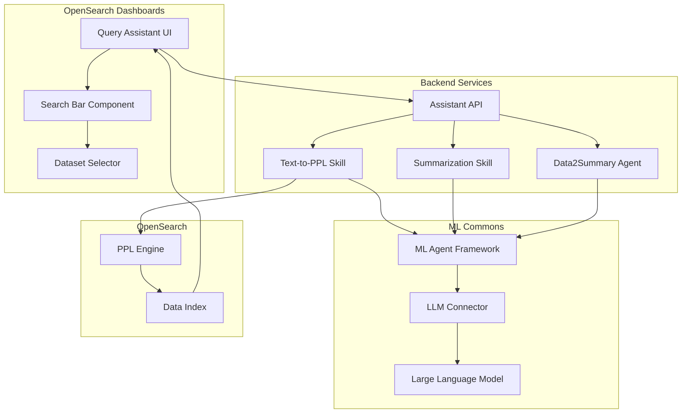
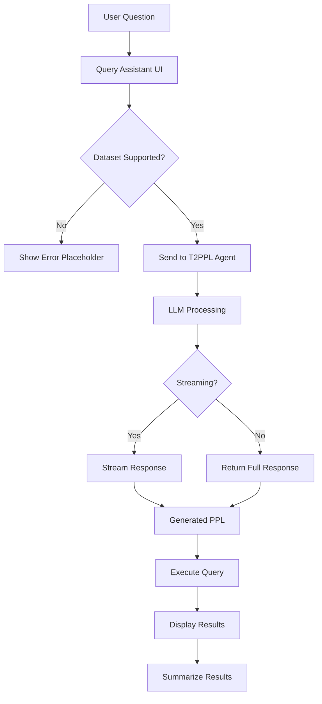

---
tags:
  - domain/core
  - component/dashboards
  - dashboards
  - indexing
  - ml
  - search
  - sql
---
# Query Assistant

## Summary

Query Assistant is an AI-powered feature in OpenSearch Dashboards that enables users to generate PPL (Piped Processing Language) queries from natural language questions. It leverages large language models (LLMs) through the OpenSearch Assistant Toolkit to translate user questions into executable queries, making data exploration accessible to users without deep query language expertise.

## Details

### Architecture



### Data Flow



### Components

| Component | Description |
|-----------|-------------|
| Query Assistant UI | Search bar interface for natural language input |
| Text-to-PPL Skill | Converts natural language to PPL queries using LLM |
| Summarization Skill | Generates human-readable summaries of query results |
| Data2Summary Agent | Agent for generating data summaries |
| Dataset Selector | Allows users to select target index/dataset |
| Streaming Handler | Processes real-time streaming responses from LLM |

### Configuration

| Setting | Description | Default |
|---------|-------------|---------|
| `assistant.chat.enabled` | Enable OpenSearch Assistant | `false` |
| `assistant.next.enabled` | Enable experimental assistant features | `false` |

### Usage Example

```yaml
# Enable Query Assistant in opensearch_dashboards.yml
assistant.chat.enabled: true
assistant.next.enabled: true
```

Configure the root agent:

```json
PUT .plugins-ml-config/_doc/os_chat
{
  "type": "os_chat_root_agent",
  "configuration": {
    "agent_id": "your_root_agent_id"
  }
}
```

Example natural language queries:
- "Show me all errors in the last hour"
- "What are the top 10 source IPs by request count?"
- "Find failed login attempts from yesterday"

## Limitations

- Requires ML Commons plugin and configured LLM connector
- Query generation quality depends on the underlying LLM model
- Only supports datasets/index patterns compatible with PPL
- Streaming requires backend support for `text/event-stream` content type
- Data2Summary agent must be configured for assistant entry to appear

## Change History

- **v3.0.0** (2025): Added streaming support, unsupported dataset handling, prompt customization, markdown rendering for summaries, improved empty result handling, UX style fixes, and multiple bug fixes for UI state management
- **v2.13** (2024): Initial implementation of OpenSearch Assistant toolkit

## Related Features
- [Query Assist (ML Commons)](../ml-commons/ml-commons-query-assist.md)
- [AI Assistant (Dashboards)](../dashboards-assistant/dashboards-assistant.md)
- [OpenSearch Core](../opensearch/opensearch-actionplugin-rest-handler-wrapper.md)

## References

### Documentation
- [OpenSearch Assistant for OpenSearch Dashboards](https://docs.opensearch.org/3.0/dashboards/dashboards-assistant/index/): Official documentation
- [OpenSearch Assistant Toolkit](https://docs.opensearch.org/3.0/ml-commons-plugin/opensearch-assistant/): ML Commons integration guide
- [Build your own chatbot](https://docs.opensearch.org/3.0/ml-commons-plugin/tutorials/build-chatbot/): Tutorial for configuring the assistant

### Blog Posts
- [OpenSearch adds a new generative AI assistant toolkit](https://opensearch.org/blog/opensearch-adds-new-generative-ai-assistant-toolkit/): Introduction blog post

### Pull Requests
| Version | PR | Description | Related Issue |
|---------|-----|-------------|---------------|
| v3.0.0 | [#9647](https://github.com/opensearch-project/OpenSearch-Dashboards/pull/9647) | Support streaming when content type is event stream | [#1234](https://github.com/opensearch-project/OpenSearch-Dashboards/issues/1234) |
| v3.0.0 | [#9232](https://github.com/opensearch-project/OpenSearch-Dashboards/pull/9232) | Display query assistant when dataset is not supported | [#1234](https://github.com/opensearch-project/OpenSearch-Dashboards/issues/1234) |
| v3.0.0 | [#9532](https://github.com/opensearch-project/OpenSearch-Dashboards/pull/9532) | Append prompt for query assistant in request payload |   |
| v3.0.0 | [#9277](https://github.com/opensearch-project/OpenSearch-Dashboards/pull/9277) | Hide assistant entry when data2summary agent missing |   |
| v3.0.0 | [#9464](https://github.com/opensearch-project/OpenSearch-Dashboards/pull/9464) | Organizing generated summary by using markdown format |   |
| v3.0.0 | [#9480](https://github.com/opensearch-project/OpenSearch-Dashboards/pull/9480) | Should not show summary if there is no response | [#1234](https://github.com/opensearch-project/OpenSearch-Dashboards/issues/1234) |
| v3.0.0 | [#9492](https://github.com/opensearch-project/OpenSearch-Dashboards/pull/9492) | Text size in generated summary should be s |   |
| v3.0.0 | [#9509](https://github.com/opensearch-project/OpenSearch-Dashboards/pull/9509) | Fix minor UX style issues on discover summary section |   |
| v3.0.0 | [#9519](https://github.com/opensearch-project/OpenSearch-Dashboards/pull/9519) | Discover summary regression when result is empty | [#1234](https://github.com/opensearch-project/OpenSearch-Dashboards/issues/1234) |
| v3.0.0 | [#9552](https://github.com/opensearch-project/OpenSearch-Dashboards/pull/9552) | Clear discover summary if t2ppl failed | [#1234](https://github.com/opensearch-project/OpenSearch-Dashboards/issues/1234) |
| v3.0.0 | [#9553](https://github.com/opensearch-project/OpenSearch-Dashboards/pull/9553) | Use markdown in discover summary | [#1234](https://github.com/opensearch-project/OpenSearch-Dashboards/issues/1234) |
| v3.0.0 | [#9601](https://github.com/opensearch-project/OpenSearch-Dashboards/pull/9601) | Fix PPL refresh on regeneration |   |
