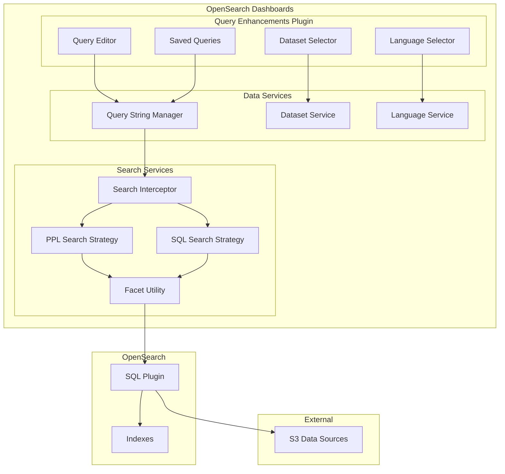
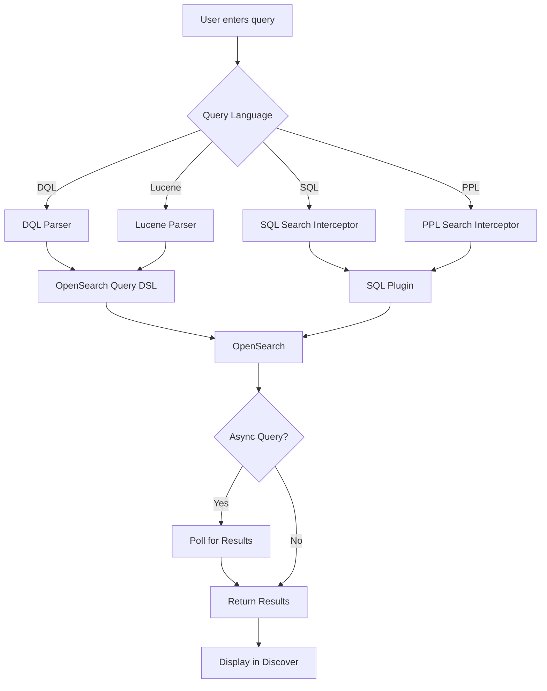

---
tags:
  - domain/core
  - component/dashboards
  - dashboards
  - indexing
  - search
  - sql
---
# Query Enhancements

## Summary

Query Enhancements is an experimental feature in OpenSearch Dashboards that extends the query capabilities in Discover and other applications. It enables support for SQL and PPL (Piped Processing Language) queries alongside the traditional DQL (Dashboards Query Language) and Lucene query syntaxes, and provides enhanced data source connectivity including S3 connections.

## Details

### Architecture



### Data Flow



### Components

| Component | Description |
|-----------|-------------|
| Query String Manager | Manages query state, language selection, and dataset binding |
| Language Service | Registers and manages query languages (DQL, Lucene, SQL, PPL) |
| Dataset Service | Manages data sources and their supported languages |
| Search Interceptor | Routes queries to appropriate search strategies |
| PPL Search Strategy | Handles PPL query execution and result polling |
| SQL Search Strategy | Handles SQL query execution |
| Facet Utility | Processes query results and handles aggregations |
| Saved Query Service | Persists queries with dataset context |

### Configuration

| Setting | Description | Default |
|---------|-------------|---------|
| `query:enhancements:enabled` | Enable query enhancements feature | false |
| `data.search.polling.interval` | Polling interval for async queries (ms) | 5000 |

### Usage Example

```
# Enable Query Enhancements in Advanced Settings
query:enhancements:enabled = true

# SQL Query Example
SELECT * FROM logs-* WHERE status >= 400 LIMIT 100

# PPL Query Example
source = logs-* | where status >= 400 | head 100
```

## Limitations

- Query Enhancements is an experimental feature
- Not all data source types support all query languages
- S3 connections only support SQL and PPL (not DQL or Lucene)
- Async query polling may have latency depending on query complexity

## Change History

- **v3.0.0** (2025-03-11): PPL query bugfixes - grammar parsing in auto-suggest, timezone handling for time columns, millisecond precision in date fields, error message display in query editors, time range handling for non-search queries
- **v2.18.0** (2024-11-05): Bug fixes for async polling, error handling, language compatibility, saved query persistence; Added extensibility for custom search strategies via `defineSearchStrategyRoute`; Added keyboard shortcut (Cmd/Ctrl+Enter) for query execution; Exposed datasets and data_frames modules for external plugin imports


## References

### Documentation
- [Dashboards Query Language (DQL)](https://docs.opensearch.org/3.0/dashboards/dql/): Official DQL documentation
- [PPL Documentation](https://docs.opensearch.org/3.0/search-plugins/sql/ppl/index/): Official PPL language reference
- [Query Workbench](https://docs.opensearch.org/3.0/dashboards/query-workbench/): SQL/PPL query interface documentation

### Pull Requests
| Version | PR | Description | Related Issue |
|---------|-----|-------------|---------------|
| v3.0.0 | [#9120](https://github.com/opensearch-project/OpenSearch-Dashboards/pull/9120) | Fix PPL grammar parsing issues in auto-suggest | [#1234](https://github.com/opensearch-project/OpenSearch-Dashboards/issues/1234) |
| v3.0.0 | [#9379](https://github.com/opensearch-project/OpenSearch-Dashboards/pull/9379) | Make PPL time column respect timezone and date format | [#9104](https://github.com/opensearch-project/OpenSearch-Dashboards/issues/9104) |
| v3.0.0 | [#9436](https://github.com/opensearch-project/OpenSearch-Dashboards/pull/9436) | Make PPL handle milliseconds in date fields | [#1234](https://github.com/opensearch-project/OpenSearch-Dashboards/issues/1234) |
| v3.0.0 | [#9586](https://github.com/opensearch-project/OpenSearch-Dashboards/pull/9586) | Correctly show error message in DQL and PPL query editor | [#1234](https://github.com/opensearch-project/OpenSearch-Dashboards/issues/1234) |
| v3.0.0 | [#9603](https://github.com/opensearch-project/OpenSearch-Dashboards/pull/9603) | Skip appending time range when not querying with source | [#1234](https://github.com/opensearch-project/OpenSearch-Dashboards/issues/1234) |
| v2.18.0 | [#8245](https://github.com/opensearch-project/OpenSearch-Dashboards/pull/8245) | Expose method to register search strategy routes |   |
| v2.18.0 | [#8252](https://github.com/opensearch-project/OpenSearch-Dashboards/pull/8252) | Fix running recent query button | [#1234](https://github.com/opensearch-project/OpenSearch-Dashboards/issues/1234) |
| v2.18.0 | [#8299](https://github.com/opensearch-project/OpenSearch-Dashboards/pull/8299) | Expose datasets and data_frames directories for imports |   |
| v2.18.0 | [#8322](https://github.com/opensearch-project/OpenSearch-Dashboards/pull/8322) | Add keyboard shortcut for running queries | [#1234](https://github.com/opensearch-project/OpenSearch-Dashboards/issues/1234) |
| v2.18.0 | [#8555](https://github.com/opensearch-project/OpenSearch-Dashboards/pull/8555) | Refactored polling logic to poll for results once current request completes |   |
| v2.18.0 | [#8650](https://github.com/opensearch-project/OpenSearch-Dashboards/pull/8650) | Fix random big number when loading in query result | [#1234](https://github.com/opensearch-project/OpenSearch-Dashboards/issues/1234) |
| v2.18.0 | [#8724](https://github.com/opensearch-project/OpenSearch-Dashboards/pull/8724) | Polling for PPL results; Saved dataset to saved queries |   |
| v2.18.0 | [#8743](https://github.com/opensearch-project/OpenSearch-Dashboards/pull/8743) | Fix error handling in query enhancement facet | [#1234](https://github.com/opensearch-project/OpenSearch-Dashboards/issues/1234) |
| v2.18.0 | [#8749](https://github.com/opensearch-project/OpenSearch-Dashboards/pull/8749) | Updates query and language if language is not supported by query data |   |
| v2.18.0 | [#8771](https://github.com/opensearch-project/OpenSearch-Dashboards/pull/8771) | Fix error handling for ppl jobs API | [#1234](https://github.com/opensearch-project/OpenSearch-Dashboards/issues/1234) |
