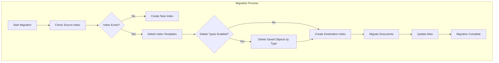

---
tags:
  - opensearch-dashboards
---
# Saved Objects Migration

## Summary

OpenSearch Dashboards provides a saved objects migration system that automatically migrates saved objects (dashboards, visualizations, index patterns, etc.) when upgrading between versions. The migration process handles schema changes and ensures data compatibility across versions.

## Details

### Architecture



### Components

| Component | Description |
|-----------|-------------|
| `IndexMigrator` | Core migration orchestrator that handles index creation and document migration |
| `MigrationContext` | Holds migration state including source/destination index info and configuration |
| `MigrationOpenSearchClient` | Specialized OpenSearch client for migration operations |
| `SavedObjectsSerializer` | Handles serialization/deserialization of saved objects |

### Configuration

| Setting | Type | Default | Description |
|---------|------|---------|-------------|
| `migrations.batchSize` | number | `1000` | Number of documents to migrate per batch |
| `migrations.scrollDuration` | string | `15m` | Scroll context duration for reading documents |
| `migrations.pollInterval` | number | `1500` | Interval (ms) to poll for migration status |
| `migrations.skip` | boolean | `false` | Skip migrations entirely (use with caution) |
| `migrations.delete.enabled` | boolean | `false` | Enable deletion of saved objects by type during migration |
| `migrations.delete.types` | string[] | `[]` | List of saved object types to delete during migration |

### Delete Types Feature

The `migrations.delete` configuration allows administrators to specify saved object types that should be deleted during migration. This is useful when:

- Migrating from legacy systems (Kibana OSS) with incompatible saved object types
- Removing deprecated plugin data that prevents migration
- Cleaning up orphaned saved objects from disabled plugins

```yaml
# opensearch_dashboards.yml
migrations:
  delete:
    enabled: true
    types:
      - ui-metric
      - telemetry
      - legacy-plugin-type
```

**Warning**: This feature permanently deletes saved objects. Ensure you have backups before enabling.

### Usage Example

Standard migration happens automatically on startup. To configure delete types:

```yaml
# opensearch_dashboards.yml

# Enable deletion of specific saved object types during migration
migrations:
  delete:
    enabled: true
    types:
      - ui-metric  # Legacy telemetry data
```

## Limitations

- Migration is a one-way process; rollback requires restoring from backup
- Large indices may take significant time to migrate
- Delete types feature permanently removes data without recovery option
- `migrations.delete.types` must not be empty when `migrations.delete.enabled` is `true`

## Change History

- **v2.16.0** (2024-07-23): Added `migrations.delete` configuration to delete saved objects by type during migration ([#6443](https://github.com/opensearch-project/OpenSearch-Dashboards/pull/6443))

## References

### Documentation
- [Migrating from Kibana OSS to OpenSearch Dashboards](https://docs.opensearch.org/latest/upgrade-to/dashboards-upgrade-to/)

### Pull Requests
| Version | PR | Description |
|---------|-----|-------------|
| v2.16.0 | [#6443](https://github.com/opensearch-project/OpenSearch-Dashboards/pull/6443) | Enable deletion of saved objects by type if configured |

### Related Issues
- [#1040](https://github.com/opensearch-project/OpenSearch-Dashboards/issues/1040) - Telemetry docs migration issue
