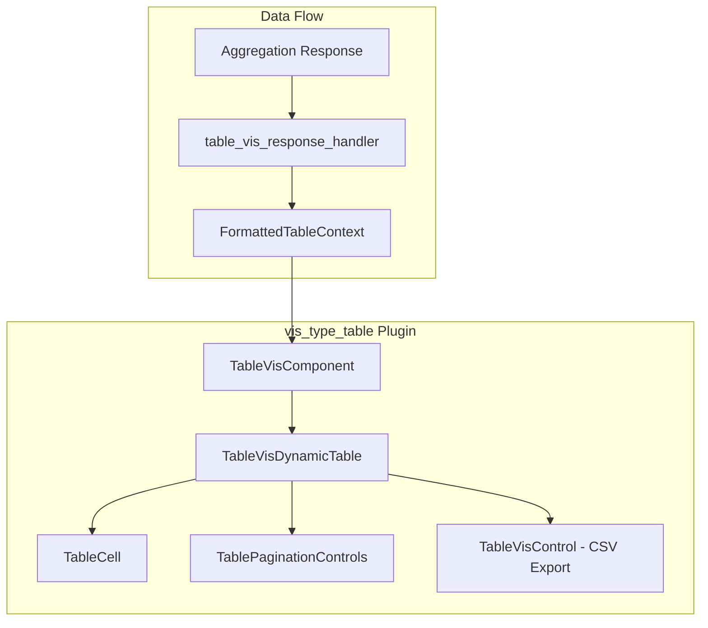

---
tags:
  - opensearch-dashboards
---
# Table Visualization

## Summary

The table visualization is a core visualization type in OpenSearch Dashboards that renders aggregation results as tabular data. It is implemented in the `vis_type_table` plugin and supports sorting, column resizing, pagination, per-cell filtering, footer totals, and CSV export.

## Details

### Architecture

### Components

| Component | Description |
|-----------|-------------|
| `TableVisComponent` | Top-level component, delegates rendering to `TableVisDynamicTable` |
| `TableVisDynamicTable` | Core rendering component using native HTML `<table>` elements |
| `TableCell` | Individual cell renderer with filter-for/filter-out actions |
| `TablePaginationControls` | Page navigation and rows-per-page selector |
| `TableVisControl` | Toolbar with CSV export functionality |

### Configuration

| Setting | Description | Default |
|---------|-------------|---------|
| `perPage` | Rows displayed per page | 10 |
| `showPartialRows` | Show partial rows | false |
| `showMetricsAtAllLevels` | Show metrics at all bucket levels | false |
| `showTotal` | Display footer row with totals | false |
| `totalFunc` | Aggregation function for totals (sum, avg, min, max, count) | sum |
| `percentageCol` | Column to show as percentage | "" |
| `title` | Table title | "" |

### Features

- **Sorting**: Click column headers to sort ascending/descending. Sort state persisted in UI state.
- **Column resizing**: Drag column headers to resize. Width persisted in UI state. Minimum width: 80px.
- **Pagination**: Configurable rows per page (10, 20, 50, 100) with page navigation.
- **Cell filtering**: Filterable columns show filter-for and filter-out buttons on hover, dispatching `filterBucket` events.
- **Footer totals**: Optional footer row showing aggregated totals per column.
- **CSV export**: Export table data via `TableVisControl`.
- **HTML sanitization**: Cell content sanitized with DOMPurify before rendering.
- **Dynamic column widths**: Columns auto-sized based on content with proportional scaling.

## Limitations

- Column resizing is mouse-only (no keyboard accessibility for resize).
- The dynamic column width measurement requires DOM access.
- HTML content rendered via `dangerouslySetInnerHTML` (sanitized).

## Change History

- **v3.5.0** (2025-12-10): Complete rewrite from `EuiDataGrid` to native `<table>` with new `TableVisDynamicTable` component. Added dynamic column sizing, interactive column resizing, custom pagination controls, and per-cell filtering UI. Follow-up fix for header row alignment and truncation logic.

## References

### Documentation
- [Building data visualizations](https://opensearch.org/docs/latest/dashboards/visualize/viz-index/)

### Pull Requests
| Version | PR | Description |
|---------|-----|-------------|
| v3.5.0 | [#11031](https://github.com/opensearch-project/OpenSearch-Dashboards/pull/11031) | Table visualization re-write |
| v3.5.0 | [#11056](https://github.com/opensearch-project/OpenSearch-Dashboards/pull/11056) | Fix table vis header row UI |
