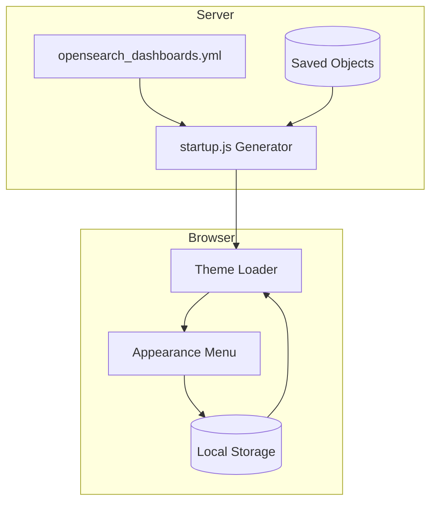

---
tags:
  - opensearch-dashboards
---
# Theme & Dark Mode Settings

## Summary

OpenSearch Dashboards provides user-specific theme and dark mode settings, allowing individual users to customize their appearance preferences independently. Users can choose between light mode, dark mode, or automatic browser-based detection, with settings stored locally per device.

## Details

### Architecture

The theme system in OpenSearch Dashboards separates server-side defaults from client-side user preferences:



### Components

| Component | Description |
|-----------|-------------|
| `startup.js` | Render-blocking script that applies theme before page content loads |
| `HeaderUserThemeMenu` | React component for the appearance menu in global navigation |
| `ui_settings_client.ts` | Client-side settings manager with local storage support |
| `preferBrowserSetting` | UI setting property indicating browser-stored values |

### Configuration

| Setting | Description | Default |
|---------|-------------|---------|
| `theme:enableUserControl` | Enable user control of theme settings | `true` |
| `theme:darkMode` | Dark mode preference | `false` |
| `theme:version` | Theme version (`v7` or `Next (preview)`) | `v7` |

### Theme Options

**Screen Mode:**
- Light mode - Always use light theme
- Dark mode - Always use dark theme  
- Use browser settings - Match OS/browser preference

**Theme Version:**
- v7 - Classic OpenSearch Dashboards theme
- Next (preview) - Modern theme preview

### Usage Example

Users access theme settings via the Appearance menu in the top navigation bar:

1. Click the color palette icon in the header
2. Select theme version (v7 or Next)
3. Select screen mode (Light, Dark, or Browser settings)
4. Click "Apply" to save and reload

### Storage Mechanism

When user control is enabled, theme preferences are stored in browser local storage:

```json
{
  "theme:darkMode": { "userValue": true },
  "theme:version": { "userValue": "Next (preview)" }
}
```

The `useBrowserColorScheme` flag indicates automatic mode detection.

## Limitations

- Theme settings are per-device, not synced across browsers/devices
- Server-side rendering cannot access user theme preferences
- Page reload required for theme changes to take effect
- "Use browser settings" only checks at page load, not dynamically

## Change History

- **v2.16.0** (2024-08-06): Initial implementation - user-specific theme settings with appearance menu and browser settings support

## References

### Documentation
- [OpenSearch Dashboards Quickstart - Appearance Theme](https://docs.opensearch.org/latest/dashboards/quickstart/#customizing-the-appearance-theme)
- [Advanced Settings](https://docs.opensearch.org/latest/dashboards/management/advanced-settings/)

### Pull Requests
| Version | PR | Description |
|---------|-----|-------------|
| v2.16.0 | [#5652](https://github.com/opensearch-project/OpenSearch-Dashboards/pull/5652) | Make theme settings user-specific and user-configurable |

### Issues
- [#4462](https://github.com/opensearch-project/OpenSearch-Dashboards/issues/4462) - Add dark mode option that respects browser settings
- [#4454](https://github.com/opensearch-project/OpenSearch-Dashboards/issues/4454) - User-specific settings (related)
