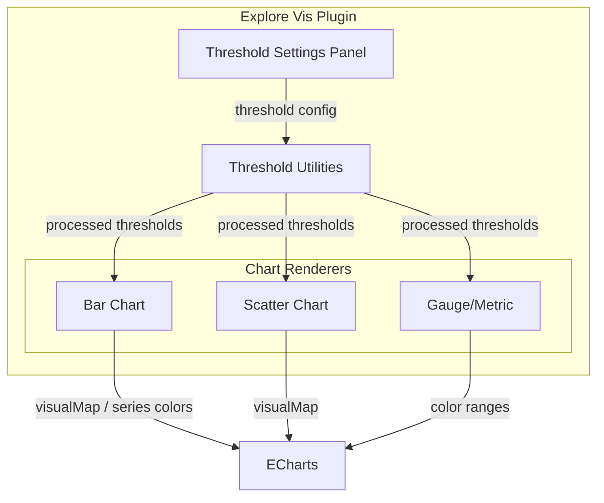

---
tags:
  - opensearch-dashboards
---
# Threshold Visualization

## Summary

Threshold visualization in OpenSearch Dashboards allows users to define value-based color boundaries on charts, enabling data-driven visual highlighting. When enabled, chart elements (bars, scatter points, gauge segments, metrics) are colored according to user-defined threshold ranges, making it easy to identify values that exceed or fall below critical boundaries.

## Details

### Architecture

### Components

| Component | Description |
|-----------|-------------|
| Threshold Settings Panel | UI for defining threshold values and colors |
| Threshold Utilities | Core logic for generation, filtering, range handling, deduplication |
| Bar Chart Renderer | Applies threshold colors to regular and stacked bar charts via data pivoting |
| Scatter Chart Renderer | Uses ECharts `visualMap` for threshold-based point coloring |
| Gauge/Metric Renderer | Applies threshold color ranges to gauge and metric visualizations |

### Supported Chart Types

| Chart Type | Threshold Support | Method |
|------------|-------------------|--------|
| Bar (regular) | ✅ | Series color mapping |
| Bar (stacked) | ✅ | Series color mapping with data pivoting |
| Scatter | ✅ | ECharts `visualMap` component |
| Gauge | ✅ | Color ranges |
| Metric | ✅ | Color ranges |

### Usage

1. Open a visualization in the Explore Vis editor
2. Navigate to the chart settings panel
3. Toggle "Use threshold colors" to enable
4. Define threshold values and assign colors
5. Chart elements will be colored based on their metric values relative to the defined thresholds

## Limitations

- Threshold visualization is available only within the Explore Vis framework (experimental)
- Not available in legacy Visualize or VisBuilder chart types
- Data pivoting for 2-dimension bar charts may have performance implications with very large datasets

## Change History

- **v3.5.0**: Simplified threshold logic for gauge/metric; added threshold colors for bar charts (regular and stacked); added threshold visual map for scatter charts; ensured dark/light mode color consistency; fixed flaky threshold tests

## References

### Pull Requests
| Version | PR | Description |
|---------|-----|-------------|
| v3.5.0 | [#10909](https://github.com/opensearch-project/OpenSearch-Dashboards/pull/10909) | Simplify threshold logic |
| v3.5.0 | [#11106](https://github.com/opensearch-project/OpenSearch-Dashboards/pull/11106) | Data processing for applying threshold colors |
| v3.5.0 | [#11045](https://github.com/opensearch-project/OpenSearch-Dashboards/pull/11045) | Fix flaky test for global threshold custom value |
| v3.5.0 | [#11268](https://github.com/opensearch-project/OpenSearch-Dashboards/pull/11268) | Add thresholds visual map for scatter |
