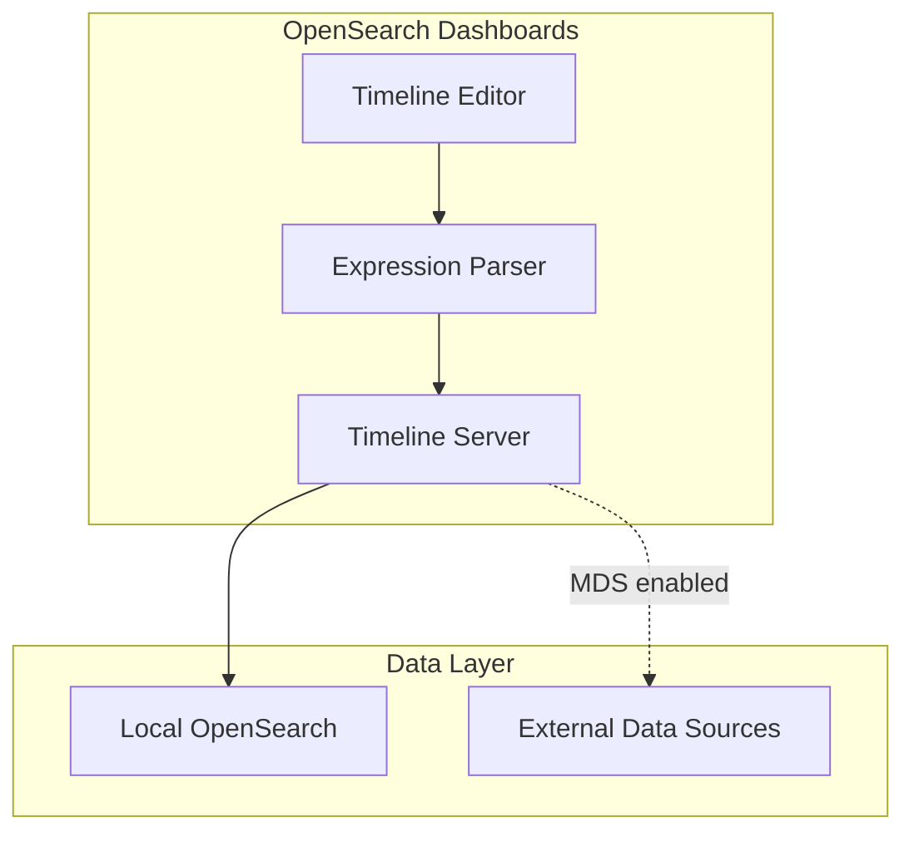

---
tags:
  - opensearch-dashboards
---
# Timeline Visualization

## Summary

Timeline is a data visualization tool in OpenSearch Dashboards for creating time-series visualizations. It uses a simple expression language to access data, perform calculations, and visualize results. Timeline supports Area and Line chart types and can query data from OpenSearch indexes with optional Multiple Data Sources (MDS) support.

## Details

### Architecture



### Components

| Component | Description |
|-----------|-------------|
| `vis_type_timeline` | Core Timeline visualization plugin |
| Expression Editor | UI for writing Timeline expressions |
| `fetchDataSourceIdByName` | Server function to resolve data source names to IDs |

### Configuration

| Setting | Description | Default |
|---------|-------------|---------|
| `timeline:es.default_index` | Default OpenSearch index for `.opensearch()` function | `_all` |
| `timeline:es.timefield` | Default time field | `@timestamp` |
| `timeline:min_interval` | Minimum interval for date histogram | `1ms` |
| `timeline:max_buckets` | Maximum number of buckets | `2000` |
| `data_source.enabled` | Enable MDS support for Timeline | `false` |

### Usage Example

Basic Timeline expression:
```
.opensearch(index=logs-*, timefield=@timestamp, metric=avg:response_time)
```

With data source name (requires MDS enabled):
```
.opensearch(data_source_name="my-cluster", index=logs-*, metric=count)
```

## Limitations

- Timeline visualization types are not fully supported when using multiple data sources
- The `data_source_name` parameter requires MDS to be enabled
- Gantt-chart plugin is not supported with multiple data sources

## Change History

- **v2.16.0** (2024-08-06): Improved error message when MDS is disabled and `data_source_name` is used

## References

### Documentation
- [Building data visualizations - Timeline](https://docs.opensearch.org/latest/dashboards/visualize/viz-index/)
- [Configuring and using multiple data sources](https://docs.opensearch.org/latest/dashboards/management/multi-data-sources/)
- [Advanced settings - Timeline settings](https://docs.opensearch.org/latest/dashboards/management/advanced-settings/)

### Pull Requests
| Version | PR | Description | Related Issue |
|---------|-----|-------------|---------------|
| v2.16.0 | [#7069](https://github.com/opensearch-project/OpenSearch-Dashboards/pull/7069) | Update error message in timeline visualization when MDS disabled | [#7000](https://github.com/opensearch-project/OpenSearch-Dashboards/issues/7000) |
