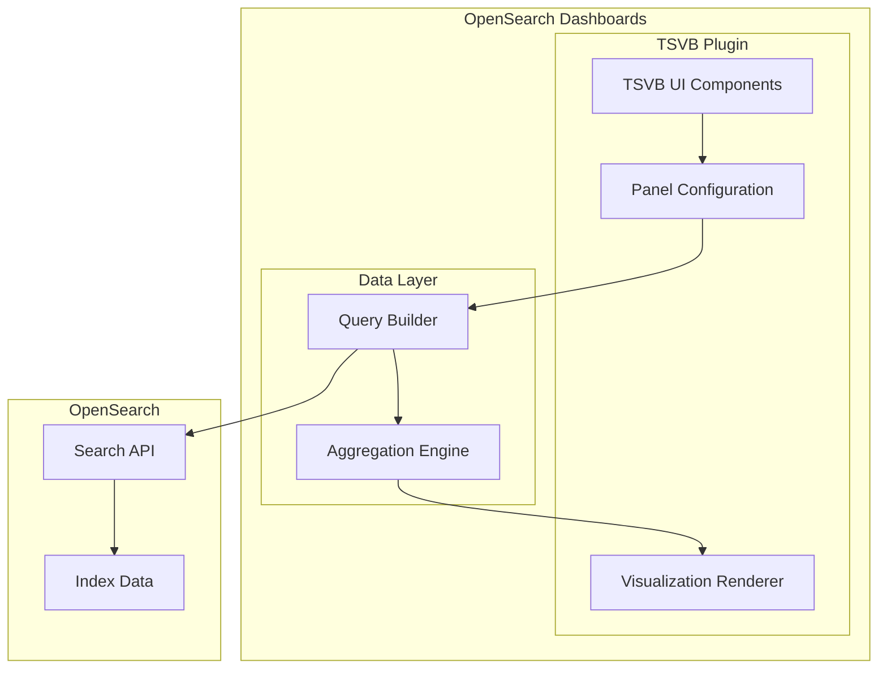

---
tags:
  - opensearch-dashboards
---
# TSVB Visualization

## Summary

The Time-Series Visual Builder (TSVB) is a powerful data visualization tool in OpenSearch Dashboards for creating detailed time-series visualizations. It supports multiple visualization types including Area, Line, Metric, Gauge, Markdown, and Data Table, with features for annotations, multiple data sources, flexible axis configuration, and client-side math expression evaluation.

## Details

### Architecture



### Visualization Types

| Type | Description |
|------|-------------|
| Time Series | Line/area charts with time on X-axis |
| Metric | Single value display |
| Gauge | Circular gauge visualization |
| Top N | Bar chart of top values |
| Table | Tabular data display |
| Markdown | Custom markdown with data variables |

### Axis Configuration

TSVB supports flexible axis configuration for time series visualizations:

| Setting | Description | Options |
|---------|-------------|---------|
| `axis_position` | Position of the Y-axis | `left`, `right`, `hidden` |
| `axis_scale` | Scale type for the axis | `normal`, `log` |
| `axis_min` | Minimum axis value | Number or empty |
| `axis_max` | Maximum axis value | Number or empty |
| `separate_axis` | Enable per-series axis | `0` (no), `1` (yes) |

#### Axis Position Constants

```javascript
export const AXIS_POSITION = {
  LEFT: 'left',
  RIGHT: 'right',
  HIDDEN: 'hidden',
};
```

### Aggregation Types

TSVB supports various aggregation types for data analysis:

| Aggregation | Description |
|-------------|-------------|
| Count | Document count |
| Average | Mean value |
| Sum | Total sum |
| Min/Max | Minimum/Maximum values |
| Cardinality | Unique value count |
| Percentile | Percentile calculations |
| Moving Average | Smoothed trend line |
| Serial Diff | Difference between time periods |
| Top Hit | Most recent document values |

### Multi-Data Source Support

Since v2.14, TSVB supports querying multiple data sources:

```yaml
# opensearch_dashboards.yml
data_source.enabled: true
vis_type_timeseries.enabled: true
```

### Client-Side Math Expression Evaluation

Since v3.5.0, TSVB supports evaluating math expressions in the browser instead of on the server. This reduces the server-side attack surface and offloads computation to clients.

A new `/api/metrics/vis/data-raw` endpoint returns individual metric values without math evaluation. The client-side `process_math_series.js` module then evaluates math expressions using a security-hardened Math.js wrapper that blocks dangerous functions (`import`, `parse`, `evaluate`, `createUnit`, `simplify`, `derivative`).

The evaluation context provides:
- `params.a`, `params.b`, etc. — variable values from component metrics
- `params._index` — current position in the series
- `params._timestamp` — current bucket timestamp
- `params._all` — entire series data (values and timestamps) for advanced expressions
- `params._interval` — bucket size in milliseconds

| Setting | Key | Default | Description |
|---------|-----|---------|-------------|
| TSVB client-side math evaluation | `metrics:clientSideEvaluation` | `true` | Toggle between client-side and server-side evaluation. Requires page reload. |

### Usage Example

```json
{
  "type": "timeseries",
  "series": [
    {
      "id": "series-1",
      "chart_type": "line",
      "line_width": 1,
      "point_size": 1,
      "fill": 0.5,
      "separate_axis": 1,
      "axis_position": "right",
      "axis_scale": "log",
      "formatter": "number"
    }
  ],
  "axis_scale": "normal",
  "axis_position": "left"
}
```

## Limitations

- Axis scale setting requires "Separate Axis" to be enabled for per-series configuration
- Hidden axis position only available for time series with separate axis
- Some input fields use legacy HTML inputs due to type compatibility issues with EUI components
- Client-side math evaluation setting (`metrics:clientSideEvaluation`) requires a page reload to take effect
- Table panel type always uses server-side processing even when client-side evaluation is enabled

## Change History

- **v3.5.0**: Added client-side math expression evaluation with new `/api/metrics/vis/data-raw` endpoint, security-hardened Math.js wrapper, and `metrics:clientSideEvaluation` UI setting ([#11129](https://github.com/opensearch-project/OpenSearch-Dashboards/pull/11129))
- **v2.18.0** (2024-10-29): Added hidden axis option, per-axis scale setting, compressed UI input fields ([#8504](https://github.com/opensearch-project/OpenSearch-Dashboards/pull/8504))
- **v2.14.0**: Added multi-data source support for TSVB visualizations


## References

### Documentation
- [TSVB Documentation](https://docs.opensearch.org/latest/dashboards/visualize/tsvb/): Official documentation

### Blog Posts
- [Visualizing data from multiple data sources](https://opensearch.org/blog/vega-tsvb-mds-visualizations/): Blog post on TSVB with MDS

### Pull Requests
| Version | PR | Description | Related Issue |
|---------|-----|-------------|---------------|
| v3.5.0 | [#11129](https://github.com/opensearch-project/OpenSearch-Dashboards/pull/11129) | Add client-side math expression evaluation for TSVB | [#11081](https://github.com/opensearch-project/OpenSearch-Dashboards/issues/11081) |
| v2.18.0 | [#8504](https://github.com/opensearch-project/OpenSearch-Dashboards/pull/8504) | Allow hiding axis, per-axis scale, compressed input fields | [#1929](https://github.com/opensearch-project/OpenSearch-Dashboards/issues/1929) |
| v2.14.0 | - | Multi-data source support introduced |   |

### Issues (Design / RFC)
- [Issue #11081](https://github.com/opensearch-project/OpenSearch-Dashboards/issues/11081): RFC: Redesign Math Expression Calculation Architecture for Enhanced Security
- [Issue #1929](https://github.com/opensearch-project/OpenSearch-Dashboards/issues/1929): Axis scale override bug
