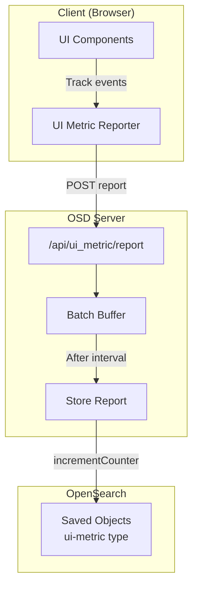

---
tags:
  - opensearch-dashboards
---
# UI Metric Collector

## Summary

The UI Metric Collector is a telemetry feature in OpenSearch Dashboards that tracks user interactions with UI elements and application usage. It collects metrics such as button clicks, page views, and time spent on different applications, storing them in saved objects for analysis. The feature is disabled by default and must be explicitly enabled via configuration.

## Details

### Architecture



### Components

| Component | Description |
|-----------|-------------|
| UI Metric Reporter | Client-side component that tracks UI interactions and sends reports |
| Report API | Server endpoint (`/api/ui_metric/report`) that receives metric reports |
| Batch Buffer | Server-side buffer that accumulates reports before persisting |
| Store Report | Logic to persist metrics to saved objects |
| Stats API | Endpoint (`/api/stats`) to retrieve collected metrics |

### Configuration

| Setting | Description | Default | Since |
|---------|-------------|---------|-------|
| `usageCollection.uiMetric.enabled` | Enable/disable UI Metric Collector | `false` | v2.14.0 |
| `usageCollection.uiMetric.debug` | Enable debug logging | `false` (dev mode) | v2.14.0 |
| `usageCollection.uiMetric.batchingIntervalInS` | Server-side batching interval in seconds | `60` | v2.16.0 |

### Usage Example

#### Enable UI Metric Collector

Add to `opensearch_dashboards.yml`:

```yaml
usageCollection:
  uiMetric:
    enabled: true
    batchingIntervalInS: 60
```

#### Report Format

The client sends reports in the following format:

```json
{
  "report": {
    "reportVersion": 1,
    "uiStatsMetrics": {
      "console-count-GET_cat.indices": {
        "key": "console-count-GET_cat.indices",
        "appName": "console",
        "eventName": "GET_cat.indices",
        "type": "count",
        "stats": {
          "min": 0,
          "max": 1,
          "avg": 0.5,
          "sum": 21
        }
      }
    }
  }
}
```

#### Retrieve Metrics

```bash
GET /api/stats?extended=true&legacy=true&exclude_usage=false
```

Response includes `ui_metric` and `application_usage` fields with collected data.

### Data Model

#### UI Stats Metrics

| Field | Description |
|-------|-------------|
| `key` | Unique identifier (`{appName}-{type}-{eventName}`) |
| `appName` | Application name (e.g., `console`, `discover`) |
| `eventName` | Event being tracked |
| `type` | Metric type (e.g., `count`) |
| `stats.sum` | Total count of events |

#### Application Usage

| Field | Description |
|-------|-------------|
| `appId` | Application identifier |
| `numberOfClicks` | Total clicks in the application |
| `minutesOnScreen` | Time spent in the application |

## Limitations

- Feature is disabled by default; requires explicit configuration to enable
- Server-side batching may lose uncommitted metrics if the server restarts
- Metrics are only persisted when a new report arrives after the batching interval (no background timer)
- No built-in visualization dashboard for collected metrics

## Change History

- **v2.16.0** (2024-08-06): Added server-side batching to reduce write operations when multiple concurrent users report metrics
- **v2.14.0** (2024-05-01): Initial implementation - enabled UI Metric Collector with feature flag

## References

### Documentation

- OpenSearch Dashboards Usage Collection Plugin

### Pull Requests

| Version | PR | Description |
|---------|-----|-------------|
| v2.16.0 | [#6721](https://github.com/opensearch-project/OpenSearch-Dashboards/pull/6721) | Add Server Side Batching for UI Metric Collectors |
| v2.14.0 | [#6203](https://github.com/opensearch-project/OpenSearch-Dashboards/pull/6203) | Enable UI Metric Collector |

### Related Issues

- [#6375](https://github.com/opensearch-project/OpenSearch-Dashboards/issues/6375) - Server Side batching for saving UI metrics
