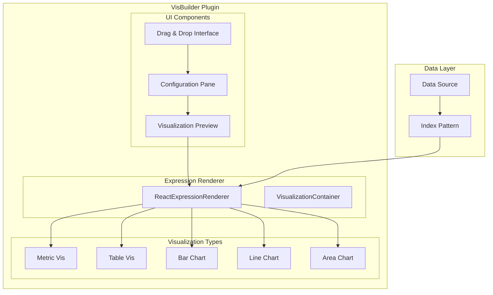

---
tags:
  - opensearch-dashboards
---
# VisBuilder

## Summary

VisBuilder is a drag-and-drop visualization tool in OpenSearch Dashboards that allows users to create data visualizations without preselecting the visualization output type. It provides an immediate view of data with intuitive field-based configuration.

## Details

### Architecture

### Components

| Component | Description |
|-----------|-------------|
| Drag & Drop Interface | Field selector with drag-and-drop to axis wells |
| Configuration Pane | Side panel for configuring visualization options |
| Visualization Preview | Real-time preview of the visualization |
| ReactExpressionRenderer | Expression-based rendering engine |
| VisualizationContainer | Wrapper component for loading states and error handling |

### Supported Visualization Types

| Type | Description |
|------|-------------|
| Metric | Single value display with optional comparison |
| Table | Tabular data display with sorting |
| Bar Chart | Vertical/horizontal bar visualizations |
| Line Chart | Time-series line visualizations |
| Area Chart | Stacked or overlapping area visualizations |

### Configuration

| Setting | Description | Default |
|---------|-------------|---------|
| Index Pattern | Data source for visualization | Required |
| Metrics | Aggregation fields (Y-axis) | Count |
| Buckets | Grouping fields (X-axis) | None |
| Legend | Show/hide legend | Visible |

### Usage Example

1. Navigate to Visualize → Create visualization → VisBuilder
2. Select an index pattern
3. Drag fields from the field list to Metrics or Buckets wells
4. Configure aggregation options in the configuration pane
5. Save the visualization

## Limitations

- Some visualization types may have rendering issues with specific data configurations
- Legend toggle may require page refresh in certain scenarios (fixed in v2.16.0)
- Data source compatibility requires proper index pattern ID handling

## Change History

- **v2.16.0** (2024-08-06): Bug fixes for Metric/Table rendering, configuration pane scrolling, legend toggle, and data source compatibility

## References

### Documentation
- [VisBuilder Documentation](https://docs.opensearch.org/latest/dashboards/visualize/visbuilder/)

### Pull Requests
| Version | PR | Description |
|---------|-----|-------------|
| v2.16.0 | [#6674](https://github.com/opensearch-project/OpenSearch-Dashboards/pull/6674) | Fix flat render structure in Metric and Table Vis |
| v2.16.0 | [#6811](https://github.com/opensearch-project/OpenSearch-Dashboards/pull/6811) | Bug fixes for config pane scroll and legend toggle |
| v2.16.0 | [#6948](https://github.com/opensearch-project/OpenSearch-Dashboards/pull/6948) | Fix vis-builder not rendering with data source |
