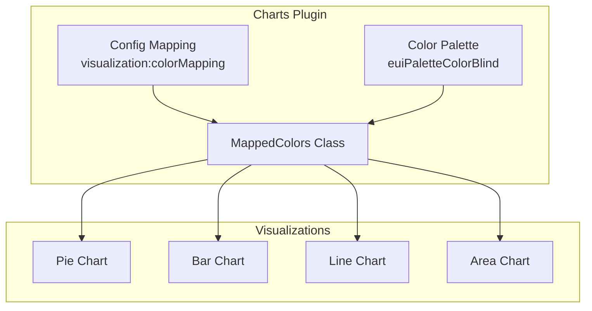

---
tags:
  - opensearch-dashboards
---
# Visualization Color Mapping

## Summary

The Visualization Color Mapping system in OpenSearch Dashboards manages color assignment for data series across all visualizations. It uses the `MappedColors` class to maintain consistent color assignments and leverages the EUI color blind palette for accessibility.

## Details

### Architecture



### Components

| Component | Description |
|-----------|-------------|
| `MappedColors` | Core class managing color-to-key mappings |
| `euiPaletteColorBlind` | EUI function providing accessible color palette |
| `COLOR_MAPPING_SETTING` | UI setting for custom color overrides |

### Configuration

| Setting | Description | Default |
|---------|-------------|---------|
| `visualization:colorMapping` | Custom key-to-color mappings | `{}` |

### Color Palette Behavior

The color palette uses `euiPaletteColorBlind` with dynamic configuration based on the number of data items:

| Items | Rotations | Direction | Order |
|-------|-----------|-----------|-------|
| 1-10 | 1 | `both` | `append` |
| 11-20 | 2 | `lighter` | `append` |
| 21+ | 3+ | `both` | `middle-out` |

### Usage Example

```typescript
// Color mapping is handled automatically by visualizations
// Custom mappings can be set via Advanced Settings:
// visualization:colorMapping: { "error": "#ff0000", "success": "#00ff00" }
```

## Limitations

- Maximum of ~50 distinct colors before palette repetition
- Custom color mappings override automatic assignments
- Color consistency depends on data key stability

## Change History

- **v2.16.0** (2024-08-06): Fixed color ordering for visualizations with more than 10 items by adjusting palette rotation parameters

## References

### Documentation

- [EUI Color Palette](https://oui.opensearch.org/#/utilities/color-palettes): OUI color palette documentation

### Pull Requests

| Version | PR | Description |
|---------|-----|-------------|
| v2.16.0 | [#7051](https://github.com/opensearch-project/OpenSearch-Dashboards/pull/7051) | Fix colors of visualizations with more than 10 items |
