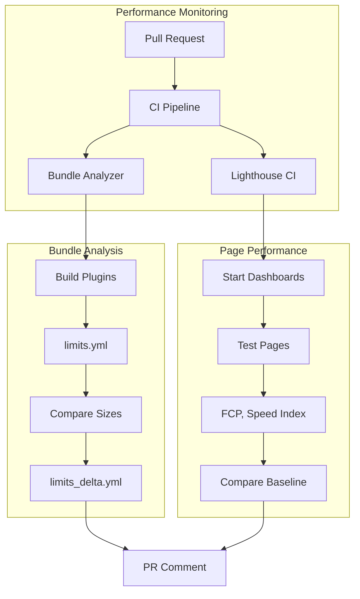

---
tags:
  - domain/core
  - component/dashboards
  - dashboards
  - indexing
  - observability
  - performance
---
# Webpack & Build Performance

## Summary

OpenSearch Dashboards includes automated performance monitoring tools to track bundle sizes and page load metrics. These CI workflows help developers identify performance regressions early by monitoring webpack bundle size variations and running Lighthouse audits on key pages.

## Details

### Architecture



### Components

| Component | Description |
|-----------|-------------|
| `performance_testing.yml` | GitHub Actions workflow for bundle size monitoring |
| `lighthouse_testing.yml` | GitHub Actions workflow for Lighthouse performance testing |
| `.lighthouserc.js` | Lighthouse CI configuration defining URLs and thresholds |
| `baselines/lighthouse_baseline.json` | Performance baseline values for key pages |
| `packages/osd-optimizer/limits.yml` | Bundle size limits per plugin |
| `packages/osd-optimizer/src/limits.ts` | Logic for tracking bundle size variations |

### Configuration

#### Bundle Size Limits

The `limits.yml` file defines maximum bundle sizes for each plugin:

```yaml
pageLoadAssetSize:
  advancedSettings: 27596
  core: 989885
  dashboard: 694542
  data: 2701242
  discover: 778790
  # ... more plugins
```

#### Lighthouse Baselines

Performance thresholds are defined in `baselines/lighthouse_baseline.json`:

| Page | First Contentful Paint | Speed Index |
|------|----------------------|-------------|
| `/app/home` | 2800ms | 20000ms |
| `/app/data-explorer/discover` | 2200ms | 30000ms |
| `/app/dashboards` | 2200ms | 30000ms |
| `/app/visualize` | 2200ms | 28000ms |

### Usage

#### Running Lighthouse Locally

```bash
# Install dependencies
yarn add --dev @lhci/cli puppeteer

# Bootstrap the project
yarn osd bootstrap

# Run Lighthouse CI
yarn lhci autorun --verbose
```

#### Updating Bundle Limits

```bash
# Build plugins and update limits
node scripts/build_opensearch_dashboards_platform_plugins --update-limits
```

#### Validating Bundle Limits

```bash
# Validate limits without updating
node scripts/build_opensearch_dashboards_platform_plugins --validate-limits
```

### Bundle Size Variation Detection

The system tracks bundle size changes with a 5% threshold:

```typescript
const DELTA_LIMIT = 0.05; // 5%

const updateBundleSizeVariation = (log: ToolingLog, metric: Metric) => {
  if (metric.limit != null && metric.value > metric.limit) {
    const delta = (metric.value - metric.limit) / metric.limit;
    if (delta > DELTA_LIMIT) {
      // Log warning and write to limits_delta.yml
    }
  }
};
```

When a plugin exceeds the threshold, a PR comment is generated:

```
📊 **Bundle Size crossed 5% for below plugins**

pageLoadAssetSizeVariation:
  pluginName: 12  # 12% increase
```

### Lighthouse CI Configuration

```javascript
module.exports = {
  ci: {
    collect: {
      url: [
        'http://localhost:5601/app/home',
        'http://localhost:5601/app/dashboards#/view/...',
        'http://localhost:5601/app/data-explorer/discover',
        'http://localhost:5601/app/visualize',
      ],
      numberOfRuns: 1,
      settings: {
        formFactor: 'desktop',
        viewport: { width: 1280, height: 800 },
      },
    },
    assert: {
      assertMatrix: [
        {
          matchingUrlPattern: '/app/home',
          assertions: {
            'first-contentful-paint': ['warn', { maxNumericValue: 2800 }],
            'speed-index': ['warn', { maxNumericValue: 20000 }],
          },
        },
        // ... more pages
      ],
    },
  },
};
```

## Limitations

- Lighthouse CI runs only on PRs targeting `main` branch
- Bundle analyzer skips documentation, test files, and workflow changes
- Performance assertions are warnings only (don't fail the build)
- Lighthouse results may vary based on CI runner performance
- Sample data must be loaded for dashboard performance tests

## Change History

- **v3.0.0** (2025-03-20): Initial implementation with bundle analyzer and Lighthouse CI workflows


## References

### Documentation
- [PR #9320](https://github.com/opensearch-project/OpenSearch-Dashboards/pull/9320): Bundle analyzer implementation
- [PR #9304](https://github.com/opensearch-project/OpenSearch-Dashboards/pull/9304): Lighthouse CI implementation
- [Lighthouse CI](https://github.com/GoogleChrome/lighthouse-ci): Google's Lighthouse CI tool
- [Webpack Bundle Analyzer](https://www.npmjs.com/package/webpack-bundle-analyzer): Bundle analysis tool

### Pull Requests
| Version | PR | Description | Related Issue |
|---------|-----|-------------|---------------|
| v3.0.0 | [#9320](https://github.com/opensearch-project/OpenSearch-Dashboards/pull/9320) | Webpack bundle analyser limit check |   |
| v3.0.0 | [#9304](https://github.com/opensearch-project/OpenSearch-Dashboards/pull/9304) | Lighthouse Page Performance Metrics CI workflow |   |
