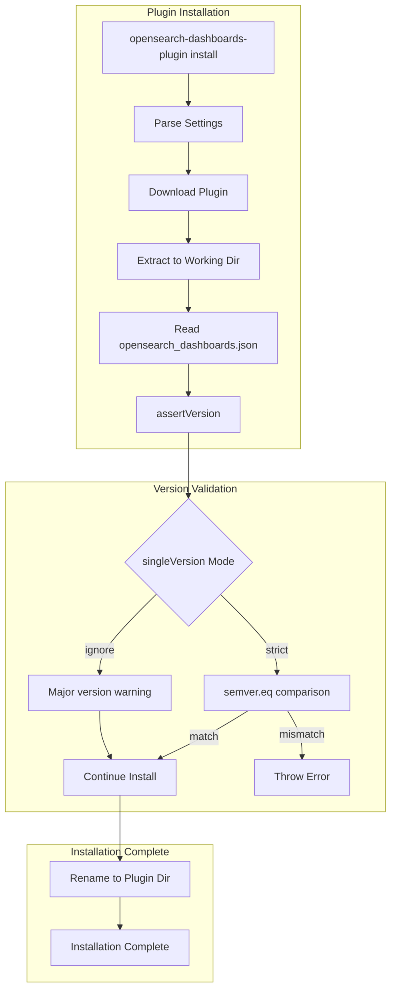
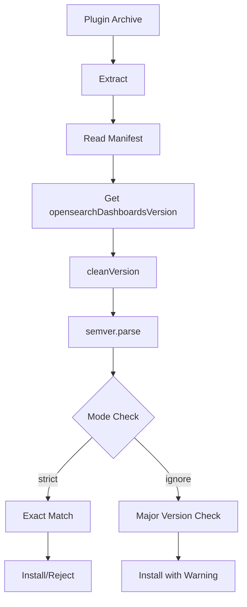

# Plugin Compatibility

## Summary

OpenSearch Dashboards plugin compatibility controls how plugins are validated against the Dashboards version during installation. The system ensures plugins are compatible with the running Dashboards instance, preventing runtime errors from version mismatches. Starting in v3.3.0, administrators can configure the validation strictness using the `--single-version` CLI flag.

## Details

### Architecture



### Data Flow



### Components

| Component | File | Description |
|-----------|------|-------------|
| CLI Plugin Install | `src/cli_plugin/install/index.js` | Command-line interface for plugin installation |
| Settings Parser | `src/cli_plugin/install/settings.js` | Parses CLI options including `singleVersion` |
| Version Validator | `src/cli_plugin/install/opensearch_dashboards.js` | `assertVersion()` function for compatibility checks |
| Manifest Parser | `src/core/server/plugins/discovery/plugin_manifest_parser.ts` | Server-side plugin manifest validation |

### Configuration

| Setting | Description | Default | Values |
|---------|-------------|---------|--------|
| `--single-version` | Version validation mode for plugin installation | `strict` | `strict`, `ignore` |

### Usage Example

```bash
# Install plugin with strict version matching (default)
bin/opensearch-dashboards-plugin install https://example.com/plugin-3.3.0.zip

# Install plugin ignoring version mismatch (for development/testing)
bin/opensearch-dashboards-plugin install --single-version ignore https://example.com/plugin-3.2.0.zip
```

### Version Validation Logic

```javascript
// Strict mode: exact version match required
if (mode === 'strict') {
  if (!semver.eq(actualVersion, expectedVersion)) {
    throw new Error(`Plugin incompatible with OpenSearch Dashboards`);
  }
}

// Ignore mode: warn on major version difference only
if (mode === 'ignore') {
  if (actualVersion.major !== expectedVersion.major) {
    logger.log('WARNING: Major version differs');
  }
}
```

### Special Cases

- **Development override**: Plugins with `opensearchDashboardsVersion: "opensearchDashboards"` bypass all version checks
- **Invalid versions**: Both plugin and Dashboards versions must be valid semver; invalid formats throw errors

## Limitations

- Server-side manifest parsing (`plugin_manifest_parser.ts`) still requires exact version match
- The `ignore` mode does not guarantee plugin functionality with mismatched versions
- Only CLI installation supports the `--single-version` flag; programmatic installation uses strict mode

## Related PRs

| Version | PR | Description |
|---------|-----|-------------|
| v3.3.0 | [#10273](https://github.com/opensearch-project/OpenSearch-Dashboards/pull/10273) | Add `--single-version` flag with strict/ignore modes |

## References

- [Managing OpenSearch Dashboards plugins](https://docs.opensearch.org/3.0/install-and-configure/install-dashboards/plugins/): Official plugin management documentation
- [Introduction to OpenSearch Dashboard Plugins](https://opensearch.org/blog/dashboards-plugins-intro/): Plugin architecture overview
- [A comprehensive guide to setting up and connecting self-managed OpenSearch Dashboards](https://opensearch.org/blog/a-comprehensive-guide-to-setup-and-connect-self-managed-dashboards-with-amazon-opensearch-domain/): Discusses version compatibility bypass

## Change History

- **v3.3.0** (2026-01-11): Added `--single-version` CLI flag with `strict` and `ignore` modes for flexible version validation
