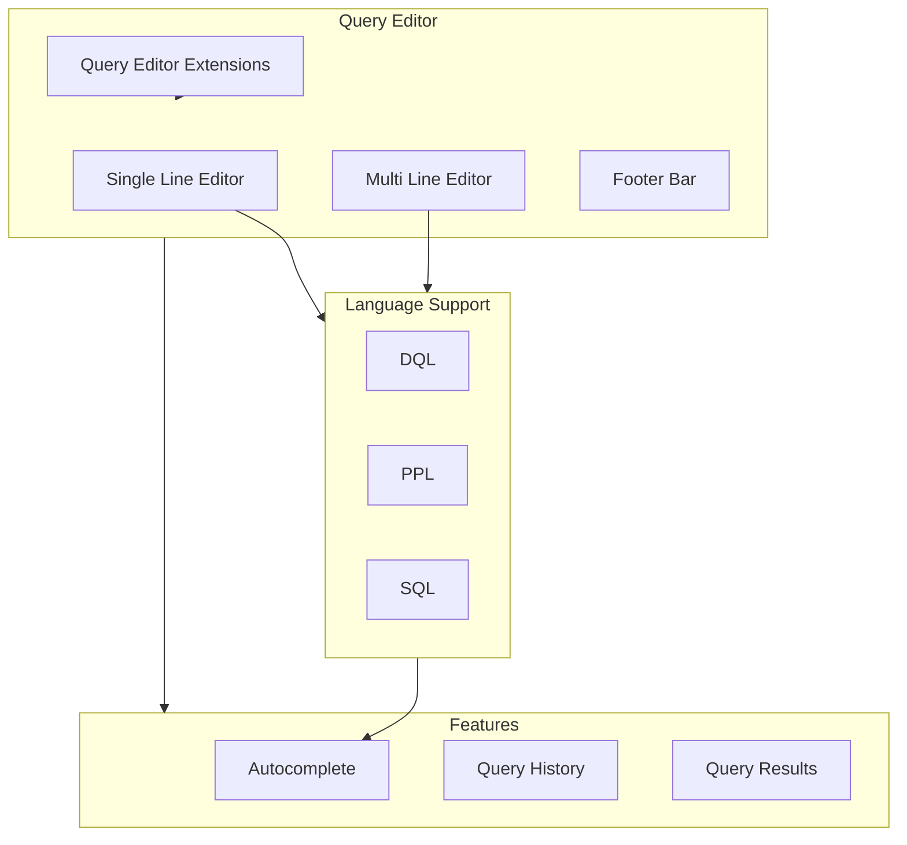
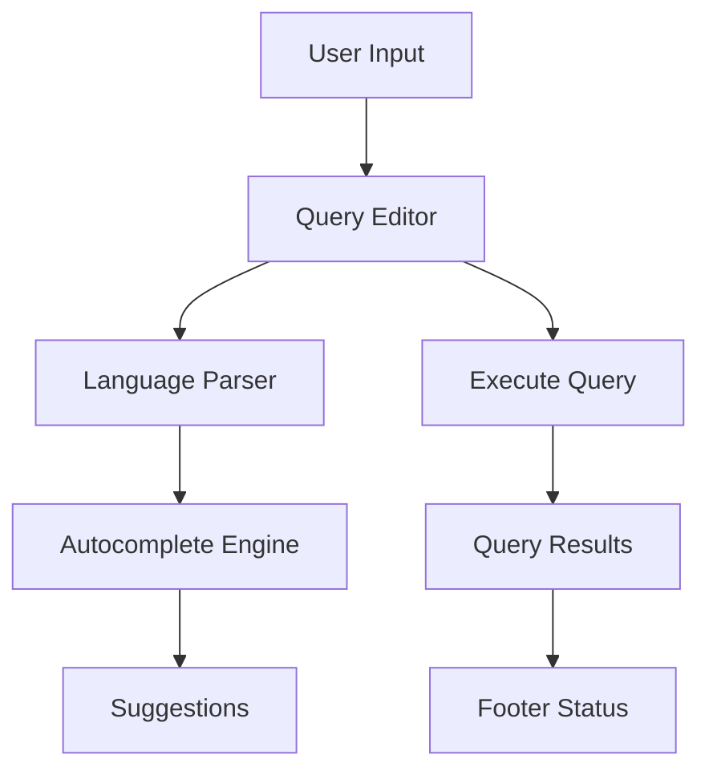

# Query Editor

## Summary

The Query Editor is a core component of OpenSearch Dashboards that provides an interface for writing and executing queries in various query languages including DQL (Dashboards Query Language), PPL (Piped Processing Language), and SQL. It supports both single-line and multi-line editing modes with features like autocomplete, syntax highlighting, query history, and extensibility through plugins.

## Details

### Architecture



### Data Flow



### Components

| Component | Description |
|-----------|-------------|
| `QueryEditorUI` | Main query editor React component |
| `SingleLineInput` | Single-line Monaco editor wrapper |
| `CodeEditor` | Multi-line Monaco editor wrapper |
| `QueryEditorExtensions` | Extension point for plugins |
| `QueryResult` | Query execution status display |
| `RecentQueriesTable` | Query history panel |

### Configuration

| Setting | Description | Default |
|---------|-------------|---------|
| `query.language` | Default query language | `DQL` |
| `query.dataset` | Associated dataset/index pattern | - |
| `query.dataset.timeFieldName` | Time field for the dataset | - |

### Query Languages

#### DQL (Dashboards Query Language)
Simple text-based query language for filtering data:
```
status:200 AND response_time:>100
```

#### PPL (Piped Processing Language)
Pipe-based query language for data exploration:
```
source = logs | where status = 200 | stats count() by host
```

#### SQL
Standard SQL syntax for querying:
```sql
SELECT * FROM logs WHERE status = 200
```

### Autocomplete System

The autocomplete system provides context-aware suggestions:

- **Keywords**: Language-specific keywords (source, where, stats, etc.)
- **Fields**: Index field names from the selected dataset
- **Functions**: Aggregate and scalar functions
- **Tables**: Available index patterns/data sources

### Query Editor Extensions

Plugins can extend the query editor through the extension API:

```typescript
queryEditorExtensions.register({
  id: 'my-extension',
  order: 100,
  isEnabled: async () => true,
  getComponent: () => MyExtensionComponent,
});
```

### Footer Bar

The footer bar displays:
- Line count
- Timestamp field name
- Query execution status (loading/success/error)
- Recent queries button

## Limitations

- Single-line editor footer only visible when focused
- PPL and SQL require additional plugins for full functionality
- Autocomplete suggestions depend on index pattern field mappings

## Change History

- **v3.3.0**: Added PPL Formatter (`Shift+Option+F`), updated PPL grammar to latest version, removed redundant error popover, fixed Enter key behavior when switching query languages
- **v3.2.0**: Fixed autocomplete stale query issue, improved Tab/Enter key handling for suggestions, made generated query scrollable, refined "Replace query" button placement
- **v2.18.0** (2024-11-05): Added footer bar to single-line editor, fixed query editor extension ordering, improved PPL autocomplete

## References

### Documentation
- [Dashboards Query Language (DQL)](https://docs.opensearch.org/3.3/dashboards/dql/): Official DQL documentation
- [Query Workbench](https://docs.opensearch.org/3.3/dashboards/query-workbench/): Query Workbench documentation
- [PPL Documentation](https://docs.opensearch.org/3.3/search-plugins/sql/ppl/index/): Official PPL documentation

### Pull Requests
| Version | PR | Description |
|---------|-----|-------------|
| v3.3.0 | [#10503](https://github.com/opensearch-project/OpenSearch-Dashboards/pull/10503) | Add PPL Formatter in Query panel |
| v3.3.0 | [#10536](https://github.com/opensearch-project/OpenSearch-Dashboards/pull/10536) | Update Simplified PPL grammar to latest version |
| v3.3.0 | [#10581](https://github.com/opensearch-project/OpenSearch-Dashboards/pull/10581) | Remove error popover from query panel |
| v3.3.0 | [#10446](https://github.com/opensearch-project/OpenSearch-Dashboards/pull/10446) | Fix Enter command behaviour in query editor |
| v3.2.0 | [#9960](https://github.com/opensearch-project/OpenSearch-Dashboards/pull/9960) | Fix autocomplete for new query panel |
| v3.2.0 | [#10259](https://github.com/opensearch-project/OpenSearch-Dashboards/pull/10259) | Change query editor UI - edit button placement |
| v3.2.0 | [#10337](https://github.com/opensearch-project/OpenSearch-Dashboards/pull/10337) | Change generated query UI - scrollable display |
| v2.18.0 | [#8565](https://github.com/opensearch-project/OpenSearch-Dashboards/pull/8565) | Adds editor footer to single line editor on focus |
| v2.18.0 | [#8045](https://github.com/opensearch-project/OpenSearch-Dashboards/pull/8045) | Fix order of query editor extensions not working |
| v2.18.0 | [#8087](https://github.com/opensearch-project/OpenSearch-Dashboards/pull/8087) | PPL Autocomplete functions, fields, & table suggestion |
