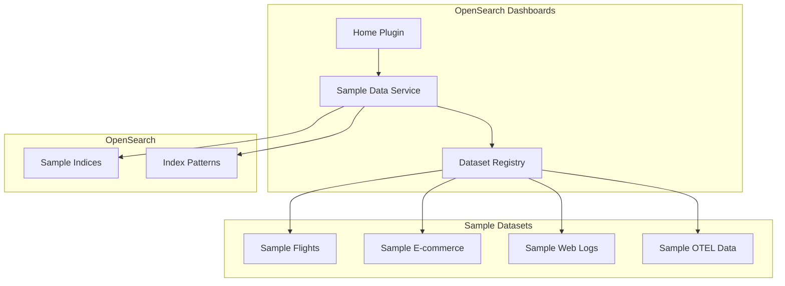

# Sample Data

## Summary

Sample Data in OpenSearch Dashboards provides pre-loaded datasets with visualizations and dashboards that allow users to explore OpenSearch features without importing their own data. The sample datasets include flight data, e-commerce data, web logs, and OpenTelemetry (OTEL) observability data for traces, metrics, and logs.

## Details

### Architecture

### Components

| Component | Description |
|-----------|-------------|
| Sample Data Service | Core service that manages sample dataset installation and removal |
| Dataset Registry | Registry of available sample datasets with metadata |
| Sample Flights | Flight data with delays, carriers, and destinations |
| Sample E-commerce | E-commerce transaction data |
| Sample Web Logs | Web server access logs |
| Sample OTEL Data | OpenTelemetry traces, metrics, logs, and service maps |

### OTEL Sample Data

The OTEL sample data provides correlated observability signals for an e-commerce application in OpenTelemetry standard format. It includes:

| Index | Description | Time Fields |
|-------|-------------|-------------|
| `otel-v1-apm-span-sample` | Trace spans | startTime, endTime |
| `otel-v1-apm-service-map-sample` | Service dependency map | - |
| `ss4o_metrics-otel-sample` | Metrics data | @timestamp, startTime, time |
| `ss4o_logs-otel-sample` | Log data | time, observedTime |

### Configuration

| Setting | Description | Default |
|---------|-------------|---------|
| `home.sampleData.otelSpecTitle` | OTEL sample data title | "Sample Observability Logs, Traces, and Metrics" |
| `home.sampleData.otelSpecDescription` | OTEL sample data description | Includes compatibility note |

### Usage

1. Navigate to OpenSearch Dashboards Home page
2. Click "Add sample data"
3. Select the desired sample dataset
4. Click "Add data" to install

### App Links

The OTEL sample data provides quick links to:

- **View traces**: Navigate to `observability-traces#/traces`
- **View services**: Navigate to `observability-traces#/services`

## Limitations

- OTEL sample data is compatible only with OpenSearch 2.13+ domains
- Sample data is for demonstration and learning purposes only
- Data is static and does not update in real-time

## Related PRs

| Version | PR | Description |
|---------|-----|-------------|
| v2.18.0 | [#8693](https://github.com/opensearch-project/OpenSearch-Dashboards/pull/8693) | Update OTEL sample data description with compatible OS version |

## References

- [OpenSearch Dashboards Quickstart Guide](https://docs.opensearch.org/latest/dashboards/quickstart/): Official documentation on adding sample data
- [Trace Analytics Getting Started](https://docs.opensearch.org/latest/observing-your-data/trace/getting-started/): Using OTEL data with trace analytics

## Change History

- **v2.18.0** (2024-11-12): Added compatibility warning to OTEL sample data description (OpenSearch 2.13+ required)
