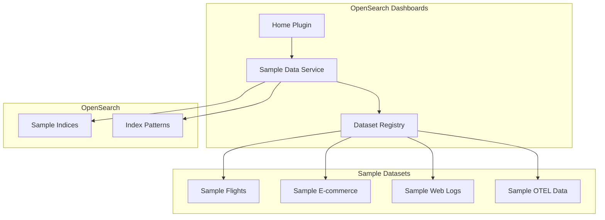
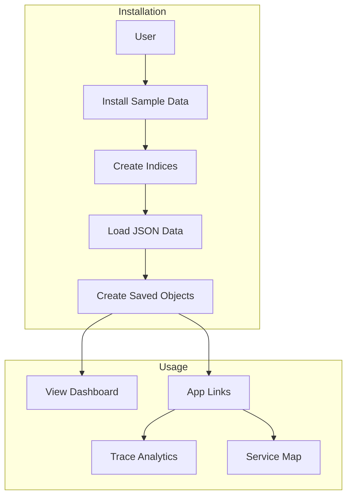

---
tags:
  - dashboards
  - indexing
  - observability
---

# Sample Data

## Summary

Sample Data in OpenSearch Dashboards provides pre-loaded datasets with visualizations and dashboards that allow users to explore OpenSearch features without importing their own data. The sample datasets include flight data, e-commerce data, web logs, and OpenTelemetry (OTEL) observability data for traces, metrics, and logs.

## Details

### Architecture



### Data Flow



### Components

| Component | Description |
|-----------|-------------|
| Sample Data Service | Core service that manages sample dataset installation and removal |
| Dataset Registry | Registry of available sample datasets with metadata |
| Sample Flights | Flight data with delays, carriers, and destinations |
| Sample E-commerce | E-commerce transaction data |
| Sample Web Logs | Web server access logs |
| Sample OTEL Data | OpenTelemetry traces, metrics, logs, and service maps |
| MountPointPortal | Portal component for rendering DataSourceMenu in header (v2.18.0+) |
| HeaderControl | Navigation UI component for page description (v2.18.0+) |

### OTEL Sample Data

The OTEL sample data provides correlated observability signals for an e-commerce application in OpenTelemetry standard format. It includes:

| Index | Description | Time Fields |
|-------|-------------|-------------|
| `otel-v1-apm-span-sample` | Trace spans | startTime, endTime, traceGroupFields.endTime |
| `otel-v1-apm-service-map-sample` | Service dependency map | - |
| `ss4o_metrics-otel-sample` | Metrics data | @timestamp, exemplar.time, startTime, time, observedTimestamp |
| `ss4o_logs-otel-sample` | Log data | time, observedTime |

### Configuration

| Setting | Description | Default |
|---------|-------------|---------|
| `home:useNewHomePage` | Enable updated UX for sample data page | false |
| `home.sampleData.otelSpecTitle` | OTEL sample data title | "Sample Observability Logs, Traces, and Metrics" |
| `home.sampleData.otelSpecDescription` | OTEL sample data description | Includes compatibility note |
| `indexName` (DataIndexSchema) | Optional custom index name for sample data | - |
| `newPath` (AppLinkSchema) | Alternative app path for new navigation | - |
| `appendDatasourceToPath` (AppLinkSchema) | Append datasource ID to navigation path | false |

### Usage

1. Navigate to OpenSearch Dashboards Home page
2. Click "Add sample data" (or "Sample data" with updated UX)
3. Select the desired sample dataset
4. Click "Add data" to install

### App Links

The OTEL sample data provides quick links to:

- **View traces**: Navigate to `observability-traces#/traces` (or `observability-traces-nav#/traces` with new nav)
- **View services**: Navigate to `observability-traces#/services` (or `observability-services-nav#/services` with new nav)

### Usage Example

```typescript
// OTEL sample data app links configuration
const appLinks: AppLinkSchema[] = [
  {
    path: 'observability-traces#/traces',
    icon: 'apmTrace',
    label: 'View traces',
    newPath: 'observability-traces-nav#/traces',
    appendDatasourceToPath: true,
  },
  {
    path: 'observability-traces#/services',
    icon: 'graphApp',
    label: 'View services',
    newPath: 'observability-services-nav#/services',
    appendDatasourceToPath: true,
  },
];
```

## Limitations

- OTEL sample data is compatible only with OpenSearch 2.13+ domains
- Sample data is for demonstration and learning purposes only
- Data is static and does not update in real-time
- OTEL sample data has no associated dashboard; users navigate directly to Trace Analytics
- Updated UI only visible when `useUpdatedUX` flag is enabled

## Change History

- **v2.18.0** (2024-11-12): Updated sample data page UI with new UX; Added OTEL sample data for traces, metrics, logs, and service maps; Added compatibility warning to OTEL sample data description (OpenSearch 2.13+ required)

## Related Features
- [OpenSearch Core](../opensearch/actionplugin-rest-handler-wrapper.md)

## References

### Documentation
- [OpenSearch Dashboards Quickstart Guide](https://docs.opensearch.org/latest/dashboards/quickstart/): Official documentation on adding sample data
- [Trace Analytics Getting Started](https://docs.opensearch.org/latest/observing-your-data/trace/getting-started/): Using OTEL data with trace analytics

### Pull Requests
| Version | PR | Description | Related Issue |
|---------|-----|-------------|---------------|
| v2.18.0 | [#8291](https://github.com/opensearch-project/OpenSearch-Dashboards/pull/8291) | Update sample data page UI when useUpdatedUX enabled | [#1234](https://github.com/opensearch-project/OpenSearch-Dashboards/issues/1234) |
| v2.18.0 | [#8587](https://github.com/opensearch-project/OpenSearch-Dashboards/pull/8587) | Add support for OTEL sample data - logs, traces and metrics |   |
| v2.18.0 | [#8693](https://github.com/opensearch-project/OpenSearch-Dashboards/pull/8693) | Update OTEL sample data description with compatible OS version |   |

### Issues (Design / RFC)
- [Issue #8312](https://github.com/opensearch-project/OpenSearch-Dashboards/issues/8312): Update Sample Data Page UI for New Updated UX
