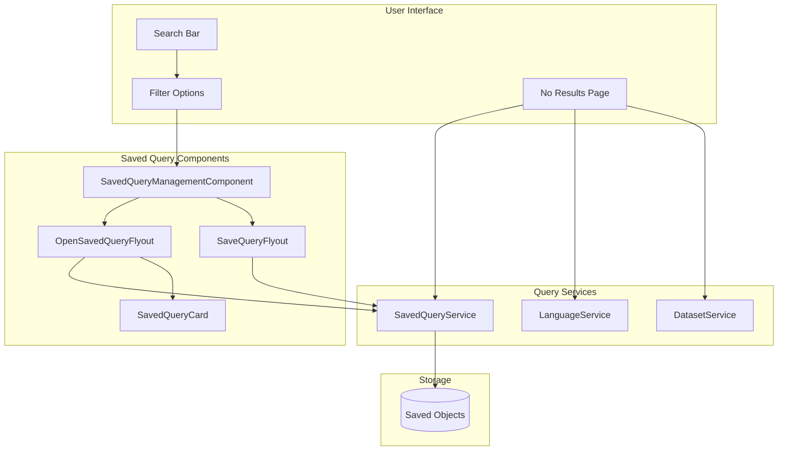

---
tags:
  - dashboards
  - search
---

# Saved Query UX

## Summary

Saved Query UX provides an enhanced interface for managing saved queries in OpenSearch Dashboards Discover. Users can save, organize, and reuse queries across sessions. The feature includes a flyout-based management interface, sample queries for learning query syntax, and support for query templates.

## Details

### Architecture



### Data Flow

```mermaid
flowchart TB
    subgraph "Save Query Flow"
        A[User clicks Save] --> B[SaveQueryFlyout opens]
        B --> C{Save as new?}
        C -->|Yes| D[Create new saved object]
        C -->|No| E[Update existing saved object]
        D --> F[Query saved]
        E --> F
    end
    
    subgraph "Open Query Flow"
        G[User clicks Open] --> H[OpenSavedQueryFlyout opens]
        H --> I[Fetch all saved queries]
        I --> J[Filter by language/dataset]
        J --> K[User selects query]
        K --> L[Load query into search bar]
    end
    
    subgraph "No Results Flow"
        M[Search returns no results] --> N[DiscoverNoResults renders]
        N --> O[Fetch sample queries from DatasetService]
        N --> P[Fetch sample queries from LanguageService]
        N --> Q[Fetch saved queries from SavedQueryService]
        O --> R[Display in Sample Queries tab]
        P --> R
        Q --> S[Display in Saved Queries tab]
    end
```



### Components

| Component | Description |
|-----------|-------------|
| `SavedQueryManagementComponent` | Main entry point for saved query management, renders either flyout or legacy modal UI |
| `SaveQueryFlyout` | Flyout for creating or updating saved queries |
| `OpenSavedQueryFlyout` | Flyout for browsing, searching, and opening saved queries |
| `SavedQueryCard` | Card component displaying query details with Monaco editor preview |
| `SaveQueryForm` | Form component supporting both Modal and Flyout rendering modes |
| `DiscoverNoResults` | No results page component that displays sample and saved queries |

### Configuration

| Setting | Description | Default |
|---------|-------------|---------|
| `data.savedQueriesNewUI.enabled` | Enable the new flyout-based saved query UI | `false` |
| `uiSettings.QUERY_ENHANCEMENTS_ENABLED` | Required for new UI to be active | - |

### Saved Query Attributes

| Field | Type | Description |
|-------|------|-------------|
| `title` | `string` | Query name (required, must be unique) |
| `description` | `string` | Optional description |
| `query` | `Query` | The query object containing query string and language |
| `query.dataset` | `Dataset` | Optional associated dataset |
| `filters` | `Filter[]` | Optional saved filters |
| `timefilter` | `TimeFilter` | Optional time range |
| `isTemplate` | `boolean` | If true, query is read-only and appears in Templates tab |

### Sample Queries

Sample queries are provided by:

1. **Language Service**: Each language (DQL, Lucene, SQL, PPL) defines sample queries
2. **Dataset Type**: Each dataset type can provide context-specific sample queries

**DQL/Lucene Sample Queries:**
- Field contains word: `title: wind`
- OR condition: `title: (wind OR windy)`
- Phrase match: `title: "wind rises"`
- Exact match: `title.keyword: The wind rises`
- Wildcard field: `title*: wind`
- Field exists: `description:*`

**SQL Sample Queries:**
- Basic SELECT with LIKE
- OR conditions
- Exact match with WHERE
- NULL checks

**PPL Sample Queries:**
- Basic source query: `source = {dataset}`

### Usage Example

**Enable new saved query UI:**

```yaml
# opensearch_dashboards.yml
data.savedQueriesNewUI.enabled: true
```

**Programmatic access to saved queries:**

```typescript
// Get saved query service
const savedQueryService = data.query.savedQueries;

// Find saved queries
const { queries } = await savedQueryService.findSavedQueries('search term', 100);

// Save a query
const savedQuery = await savedQueryService.saveQuery({
  title: 'My Query',
  description: 'Description',
  query: { query: 'field: value', language: 'kuery' },
  filters: [],
});

// Delete a query
await savedQueryService.deleteSavedQuery(savedQuery.id);
```

## Limitations

- Template queries cannot be modified or deleted through the UI
- Maximum 5 sample queries displayed on No Results page
- New flyout UI requires query enhancements to be enabled
- Saved queries are stored as saved objects and subject to saved object permissions

## Change History

- **v2.18.0** (2024-10-29): Initial implementation with flyout-based UI and sample queries on no results page

## Related Features
- [OpenSearch Core](../opensearch/actionplugin-rest-handler-wrapper.md)

## References

### Documentation
- [Discover Documentation](https://docs.opensearch.org/2.18/dashboards/discover/index-discover/): Official Discover documentation
- [PR #8469](https://github.com/opensearch-project/OpenSearch-Dashboards/pull/8469): Main implementation
- [PR #8616](https://github.com/opensearch-project/OpenSearch-Dashboards/pull/8616): Sample queries feature

### Pull Requests
| Version | PR | Description | Related Issue |
|---------|-----|-------------|---------------|
| v2.18.0 | [#8469](https://github.com/opensearch-project/OpenSearch-Dashboards/pull/8469) | Enhances the saved query UX with flyout-based interface |   |
| v2.18.0 | [#8616](https://github.com/opensearch-project/OpenSearch-Dashboards/pull/8616) | Adds sample queries and saved queries to Discover no results page | [#1234](https://github.com/opensearch-project/OpenSearch-Dashboards/issues/1234) |
