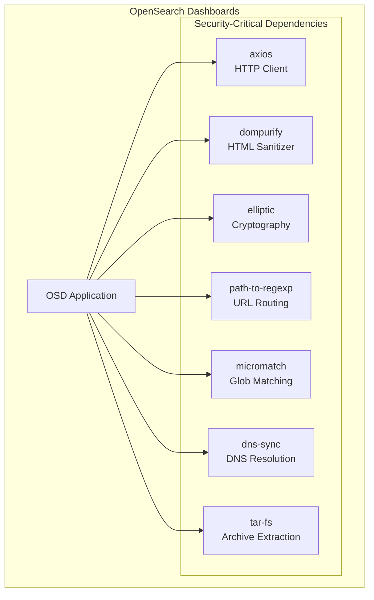

# Security CVE Fixes (Dashboards)

## Summary

OpenSearch Dashboards maintains security by regularly updating npm dependencies to address known CVEs (Common Vulnerabilities and Exposures). This ongoing effort ensures that the dashboard application remains protected against security vulnerabilities in third-party libraries.

## Details

### Architecture

### Components

| Component | Purpose | Security Concern |
|-----------|---------|------------------|
| axios | HTTP client for API requests | SSRF vulnerabilities |
| dompurify | HTML sanitization to prevent XSS | XSS bypass vulnerabilities |
| elliptic | Elliptic curve cryptography | Signature malleability |
| path-to-regexp | URL path matching for routing | ReDoS vulnerabilities |
| micromatch | Glob pattern matching | ReDoS vulnerabilities |
| dns-sync | Synchronous DNS resolution | Command injection |
| tar-fs | Filesystem bindings for tar archives | Path traversal |

### CVE Summary

| CVE | Package | Description | Severity |
|-----|---------|-------------|----------|
| CVE-2025-48387 | tar-fs | Path traversal during tar extraction | High |
| CVE-2017-16100 | dns-sync | Command injection via DNS lookup | Critical |
| CVE-2024-39338 | axios | Server-Side Request Forgery | High |
| CVE-2024-45296 | path-to-regexp | Regular Expression DoS | High |
| CVE-2024-45801 | dompurify | XSS sanitization bypass | High |
| CVE-2024-48948 | elliptic | ECDSA signature malleability | Low |
| CVE-2024-42459 | elliptic | Signature verification issue | Medium |
| CVE-2024-42460 | elliptic | Signature verification issue | Medium |
| CVE-2024-42461 | elliptic | Signature verification issue | Medium |

### Security Update Process

The OpenSearch Dashboards team follows a proactive security update process:

1. **Monitoring**: Automated tools (Dependabot, Mend) scan for CVEs
2. **Assessment**: Security team evaluates impact and urgency
3. **Patching**: Dependencies are updated to fixed versions
4. **Testing**: Comprehensive testing ensures no regressions
5. **Release**: Updates are included in the next release

## Limitations

- Some upstream packages may not receive timely updates, requiring forked/patched versions
- Transitive dependencies may require multiple version updates across the dependency tree
- Low-severity CVEs may still cause administrative overhead (e.g., security scanner alerts)

## Related PRs

| Version | PR | Description |
|---------|-----|-------------|
| v3.2.0 | [#10225](https://github.com/opensearch-project/OpenSearch-Dashboards/pull/10225) | [CVE-2025-48387] tar-fs 2.1.2 → 2.1.3, 3.0.8 → 3.1.0 |
| v2.18.0 | [#7811](https://github.com/opensearch-project/OpenSearch-Dashboards/pull/7811) | [CVE-2017-16100] dns-sync patched version |
| v2.18.0 | [#8026](https://github.com/opensearch-project/OpenSearch-Dashboards/pull/8026) | micromatch 4.0.7 → 4.0.8 |
| v2.18.0 | [#8197](https://github.com/opensearch-project/OpenSearch-Dashboards/pull/8197) | [CVE-2024-45296] path-to-regexp updates |
| v2.18.0 | [#8346](https://github.com/opensearch-project/OpenSearch-Dashboards/pull/8346) | [CVE-2024-45801] dompurify 3.0.11 → 3.1.6 |
| v2.18.0 | [#8490](https://github.com/opensearch-project/OpenSearch-Dashboards/pull/8490) | [CVE-2024-39338] axios 1.7.2 → 1.7.7 |
| v2.18.0 | [#8742](https://github.com/opensearch-project/OpenSearch-Dashboards/pull/8742) | [CVE-2024-48948] elliptic 6.5.7 → 6.6.0 |

## References

- [CVE-2025-48387](https://nvd.nist.gov/vuln/detail/CVE-2025-48387): tar-fs path traversal
- [CVE-2017-16100](https://nvd.nist.gov/vuln/detail/CVE-2017-16100): dns-sync command injection
- [CVE-2024-39338](https://nvd.nist.gov/vuln/detail/CVE-2024-39338): axios SSRF vulnerability
- [CVE-2024-45296](https://nvd.nist.gov/vuln/detail/CVE-2024-45296): path-to-regexp ReDoS
- [CVE-2024-45801](https://nvd.nist.gov/vuln/detail/CVE-2024-45801): dompurify XSS bypass
- [CVE-2024-48948](https://nvd.nist.gov/vuln/detail/CVE-2024-48948): elliptic signature malleability

## Change History

- **v3.2.0** (2026-01-10): Fixed CVE-2025-48387; bumped tar-fs 2.1.2 → 2.1.3, 3.0.8 → 3.1.0
- **v2.18.0** (2024-11-05): Fixed CVE-2017-16100, CVE-2024-39338, CVE-2024-45296, CVE-2024-45801, CVE-2024-48948; bumped micromatch
