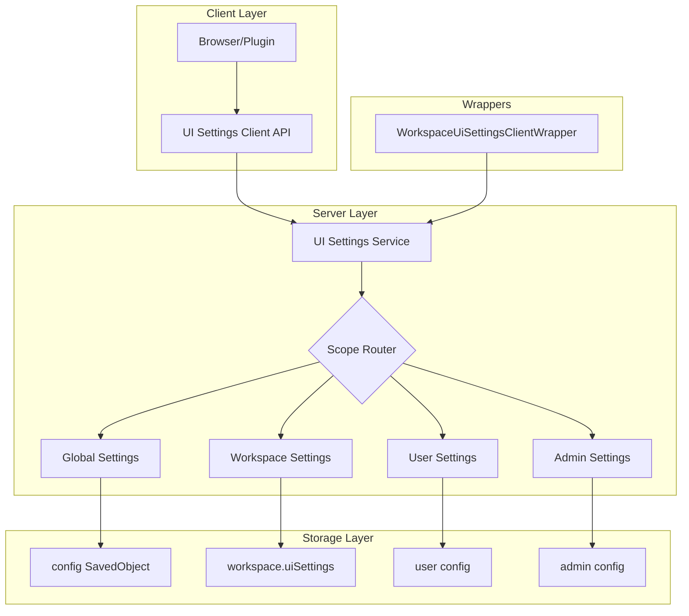
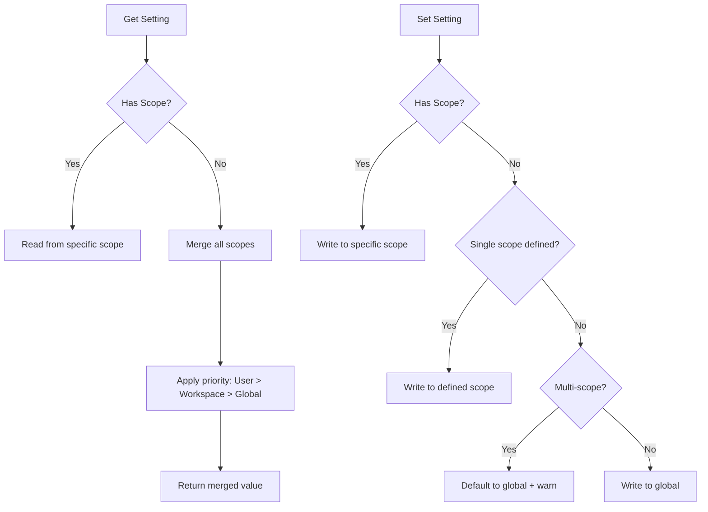

---
tags:
  - dashboards
---

# UI Settings

## Summary

UI Settings in OpenSearch Dashboards provides a centralized configuration system for managing user preferences and application settings. The system supports multiple scopes (global, workspace, user, dashboard admin) allowing settings to be applied at different levels with a defined priority hierarchy.

## Details

### Architecture



### Data Flow



### Components

| Component | Description |
|-----------|-------------|
| `UiSettingsClient` | Core client for reading/writing UI settings |
| `UiSettingsService` | Server-side service managing settings lifecycle |
| `WorkspaceUiSettingsClientWrapper` | Wrapper handling workspace-scoped settings |
| `UiSettingScope` | Enum defining available scopes: GLOBAL, WORKSPACE, USER, DASHBOARD_ADMIN |

### Configuration

| Setting | Description | Default |
|---------|-------------|---------|
| `scope` | Defines which scopes a setting supports | `undefined` (global) |
| `value` | Default value for the setting | Setting-specific |
| `requiresPageReload` | Whether changing requires page reload | `false` |

### Scope Priority

When reading settings without specifying a scope, values are merged with the following priority (highest to lowest):

1. **User** - User-specific preferences
2. **Workspace** - Workspace-level settings
3. **Global** - System-wide defaults

### Usage Example

```typescript
// Register a multi-scope setting
uiSettings.register({
  defaultDataSource: {
    name: 'Default Data Source',
    value: '',
    description: 'The default data source for queries',
    scope: [UiSettingScope.GLOBAL, UiSettingScope.WORKSPACE],
    category: ['general'],
  },
});

// Read with scope
const workspaceDefault = await uiSettings.getWithScope(
  'defaultDataSource',
  UiSettingScope.WORKSPACE
);

// Write with scope
await uiSettings.setWithScope(
  'defaultDataSource',
  'my-data-source-id',
  UiSettingScope.WORKSPACE
);

// Read merged value (applies priority)
const effectiveDefault = await uiSettings.get('defaultDataSource');
```

### API Endpoints

| Endpoint | Method | Description |
|----------|--------|-------------|
| `/api/opensearch-dashboards/settings` | GET | Get all settings (merged) |
| `/api/opensearch-dashboards/settings` | POST | Update settings |
| `/api/opensearch-dashboards/settings/{key}` | GET | Get specific setting |

## Limitations

- Settings with multiple scopes require explicit scope specification for writes (deprecated fallback to global in v3.2.0)
- Workspace-scoped settings require workspace context to be active
- User-scoped settings require authentication

## Change History

- **v3.2.0** (2026-01-10): Added backward compatibility for multi-scope settings, deprecation warnings for legacy API usage
- **v3.1.0**: Initial multi-scope UI settings support with workspace integration

## Related Features
- [OpenSearch Core](../opensearch/actionplugin-rest-handler-wrapper.md)

## References

### Pull Requests
| Version | PR | Description | Related Issue |
|---------|-----|-------------|---------------|
| v3.2.0 | [#9854](https://github.com/opensearch-project/OpenSearch-Dashboards/pull/9854) | Backward compatibility for UI setting client | [#1234](https://github.com/opensearch-project/OpenSearch-Dashboards/issues/1234) |
| v3.2.0 | [#9726](https://github.com/opensearch-project/OpenSearch-Dashboards/pull/9726) | Multi-scope UI settings support | [#7821](https://github.com/opensearch-project/OpenSearch-Dashboards/issues/7821) |

### Issues (Design / RFC)
- [Issue #7821](https://github.com/opensearch-project/OpenSearch-Dashboards/issues/7821): Original feature request for workspace-scoped UI settings
