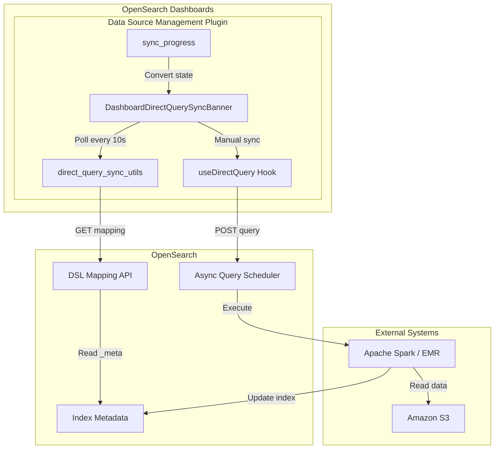
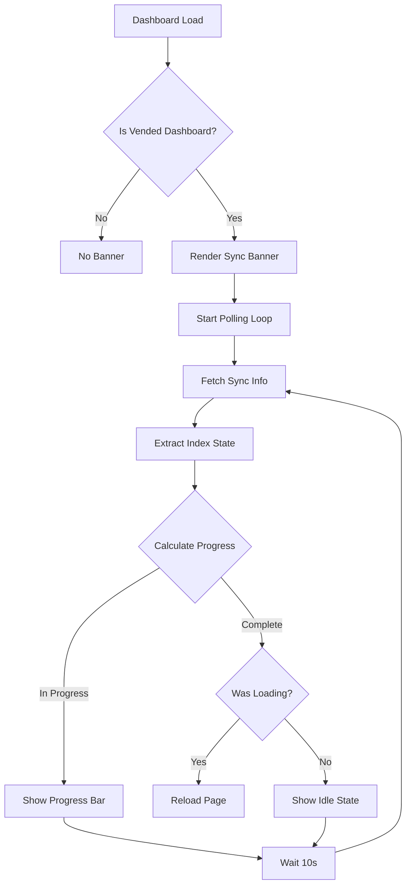
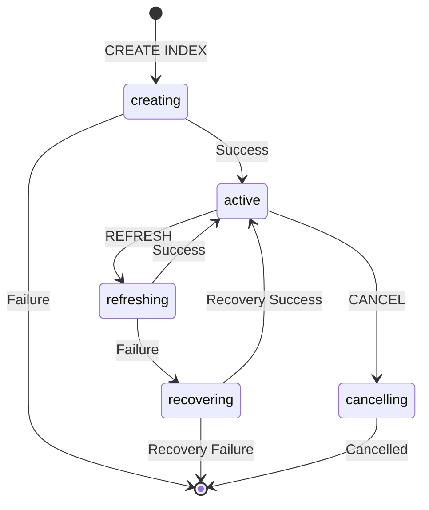

---
tags:
  - dashboards
  - indexing
  - search
---

# Vended Dashboard Progress

## Summary

Vended Dashboard Progress provides real-time visibility into data synchronization status for dashboards backed by direct query data sources like Amazon S3. The feature displays a progress banner showing sync status, last refresh time, and scheduled refresh intervals. Users can manually trigger data synchronization or monitor automatic background refresh jobs managed by Apache Spark.

## Details

### Architecture



### Data Flow



### Components

| Component | File | Description |
|-----------|------|-------------|
| `DashboardDirectQuerySyncBanner` | `direct_query_sync_banner.tsx` | Main React component displaying sync status |
| `fetchDirectQuerySyncInfo` | `direct_query_sync_utils.ts` | Fetches dashboard metadata and index mapping |
| `asSyncProgress` | `sync_progress.tsx` | Converts index state to progress percentage |
| `useDirectQuery` | `direct_query_hook.ts` | Hook for executing direct queries |
| `ExternalIndexState` | `types.tsx` | Enum defining Flint index states |
| `DirectQueryLoadingStatus` | `types.tsx` | Enum defining query execution states |

### Configuration

| Setting | Description | Default | Configurable |
|---------|-------------|---------|--------------|
| `SYNC_INFO_POLLING_INTERVAL_MS` | Polling interval for index state | 10000ms | No (hardcoded) |
| `auto_refresh` | Enable automatic index refresh | false | Yes (via SQL) |
| `refresh_interval` | Time between auto-refresh operations | - | Yes (via SQL) |
| `scheduler_mode` | Internal or external scheduler | external | Yes (via SQL) |

### Index State Machine

The feature integrates with the Flint Index State Machine:



### Progress Calculation

Progress is calculated based on two sources:

1. **Query Status** (takes precedence when active):
   - `submitted`: 0%
   - `scheduled`: 25%
   - `waiting`: 50%
   - `running`: 75%
   - `success`/`failed`/`canceled`: Terminal (triggers reload if was loading)

2. **Index State** (used when no query is running):
   - `creating`: 30%
   - `active` (no lastRefreshTime): 30%
   - `active` (with lastRefreshTime): Complete
   - `refreshing`: 60%
   - `recovering`: 60%
   - `cancelling`: 90%

### Usage Example

```sql
-- Create a materialized view with auto-refresh
CREATE MATERIALIZED VIEW my_dashboard_mv
AS SELECT * FROM s3_datasource.database.table
WITH (
    auto_refresh = true,
    refresh_interval = '15 minutes',
    scheduler_mode = 'external'
);
```

The sync banner automatically appears on dashboards using this materialized view:

```
┌─────────────────────────────────────────────────────────────────┐
│ Data scheduled to sync every 15 minutes. Last synced: 10:30 AM │
│ [Sync data]                                                     │
└─────────────────────────────────────────────────────────────────┘
```

During sync:

```
┌─────────────────────────────────────────────────────────────────┐
│ ⟳ Data sync is in progress (60% complete).                     │
│   The dashboard will reload on completion.                      │
└─────────────────────────────────────────────────────────────────┘
```

## Limitations

- Polling interval is fixed at 10 seconds and not user-configurable
- Progress percentages are approximations based on state machine stages
- Requires compatible opensearch-spark version for index state reporting
- Only works with direct query data sources (S3, Prometheus)
- Banner only appears when dashboard contains visualizations from vended data sources

## Change History

- **v3.2.0** (2025-06-13): Added polling for external index state detection, enabling progress tracking for background auto-refresh jobs

## References

### Documentation
- [Scheduled Query Acceleration](https://docs.opensearch.org/3.0/dashboards/management/scheduled-query-acceleration/): Official documentation
- [Flint Index State Machine](https://github.com/opensearch-project/opensearch-spark/blob/main/docs/index.md#index-state-transition): State transition documentation
- [Optimizing query performance using OpenSearch indexing](https://docs.opensearch.org/3.0/dashboards/management/accelerate-external-data/): Query acceleration overview
- [opensearch-spark #1195](https://github.com/opensearch-project/opensearch-spark/pull/1195): Index state reporting support

### Pull Requests
| Version | PR | Description | Related Issue |
|---------|-----|-------------|---------------|
| v3.2.0 | [#9862](https://github.com/opensearch-project/OpenSearch-Dashboards/pull/9862) | Implement polling for index state in Vended Dashboard progress |   |
