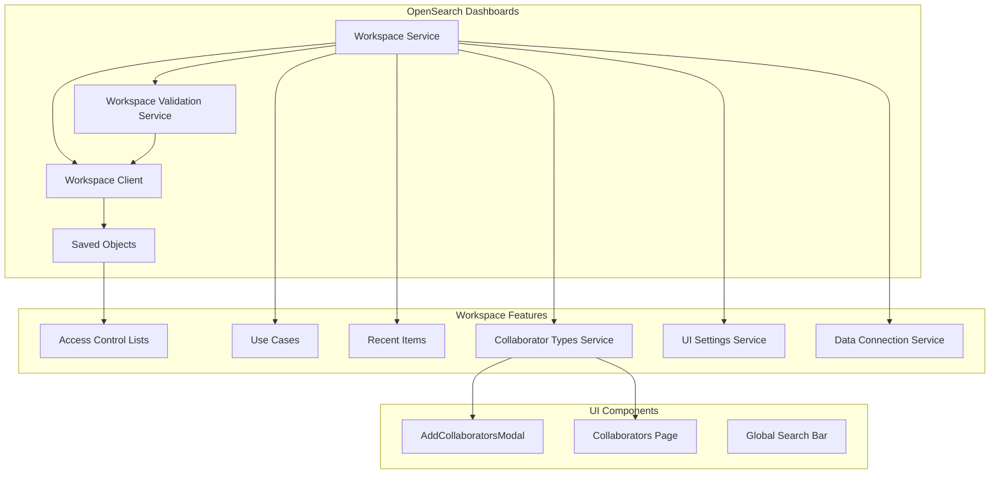
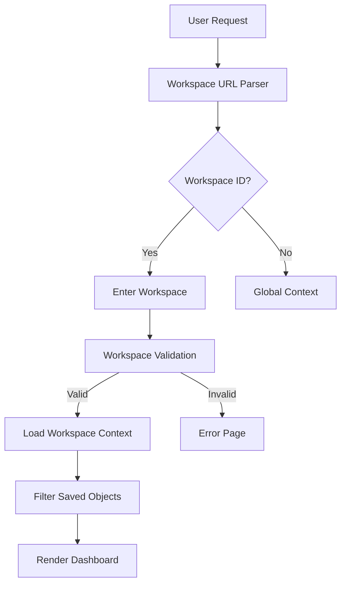

---
tags:
  - dashboards
  - search
---

# Workspace

## Summary

Workspace is a feature in OpenSearch Dashboards that enables users to tailor their environment with use-case-specific configurations. It provides isolated storage for visual assets like dashboards and visualizations, allowing teams to organize and manage their resources independently. The feature includes collaborator management, data source association, workspace-level UI settings, and ACL-based access control.

## Details

### Architecture



### Data Flow



### Components

| Component | Description |
|-----------|-------------|
| `WorkspacesService` | Core service managing workspace state and lifecycle |
| `WorkspaceClient` | Client for workspace CRUD operations |
| `WorkspaceValidationService` | Validates workspace state during initialization |
| `RecentWorkspaceManager` | Manages recently accessed workspaces |
| `WorkspaceError` | Enum defining workspace error types |
| `WorkspaceCollaboratorTypesService` | Service for registering custom collaborator types |
| `AddCollaboratorsModal` | Modal component for adding users/groups to workspace |
| `WorkspaceCollaboratorsPage` | Dedicated page for managing workspace collaborators |
| `ACLAuditor` | Audits saved object client calls for ACL bypass |
| `GlobalSearchBar` | Search bar in left nav for searching pages across workspaces |

### Configuration

| Setting | Description | Default |
|---------|-------------|---------|
| `workspace.enabled` | Enable workspace feature | `false` |
| `home:useNewHomePage` | Use new home page with workspace support | `false` |
| `opensearch_security.multitenancy.enabled` | Must be disabled when using workspaces | `true` |
| `savedObjects.permission.enabled` | Enable permission control for ACL auditor | `false` |
| `opensearchDashboards.dashboardAdmin.users` | Users designated as dashboard admins | `[]` |

### Workspace Data Model

```typescript
interface Workspace {
  id: string;
  name: string;
  description?: string;
  features?: string[];  // Use case IDs
  color: string;
  uiSettings: Record<string, unknown>;
}
```

### Use Cases

Workspaces support predefined use cases that limit functionality:

- `use-case-observability`
- `use-case-security-analytics`
- `use-case-search`
- `use-case-essentials`
- `use-case-all`

### Saved Object Association

Saved objects can be associated with workspaces via the `workspaces` attribute:

```json
{
  "type": "dashboard",
  "id": "da123f20-6680-11ee-93fa-df944ec23359",
  "workspaces": ["M5NqCu"]
}
```

### Collaborator Types API

Register custom collaborator types for workspace member management:

```typescript
export interface WorkspaceCollaboratorType {
  id: string;
  name: string;
  buttonLabel: string;
  getDisplayedType?: (collaborator: WorkspaceCollaborator) => boolean;
  onAdd: ({ onAddCollaborators }: OnAddOptions) => Promise<void>;
}

export interface WorkspacePluginSetup {
  setCollaboratorTypes: (collaboratorTypes: WorkspaceCollaboratorType[]) => void;
  getAddCollaboratorsModal: () => typeof AddCollaboratorsModal;
}
```

### Usage Example

Enable workspaces in `opensearch_dashboards.yml`:

```yaml
workspace.enabled: true
uiSettings:
  overrides:
    "home:useNewHomePage": true

# If security plugin is installed
opensearch_security.multitenancy.enabled: false
```

## Limitations

- Multi-tenancy must be disabled when using workspaces (conflicts with similar functionality)
- Not all saved objects are workspace-aware; some operate globally
- Stale workspace state requires manual navigation back to home page
- ACL auditor only logs bypass attempts; does not block operations
- Global search bar does not yet support searching saved objects
- Collaborator types must be registered during plugin setup phase

## Change History

- **v3.4.0** (2026-02-18): Removed restriction requiring data source selection during workspace creation; workspaces can now be created without associated data sources
- **v3.3.0** (2026-01-14): Added batch delete method for workspaces with improved error handling and detailed success/failure notifications
- **v3.0.0** (2025-05-06): Bug fixes for saved object isolation, recent items error filtering, and stale workspace error handling
- **v2.18.0** (2024-11-05): Major feature additions including workspace-level UI settings, collaborator management system (WorkspaceCollaboratorTypesService, AddCollaboratorsModal, Collaborators Page), data connection integration, global search bar in left nav, ACL auditor for permission bypass detection; 14 bug fixes for UI/UX improvements

## References

### Documentation
- [Workspace Documentation](https://docs.opensearch.org/3.0/dashboards/workspace/workspace/): Official workspace feature documentation
- [Getting Started with Workspaces](https://docs.opensearch.org/3.0/dashboards/workspace/index/): Introduction to workspaces
- [Create a Workspace](https://docs.opensearch.org/3.0/dashboards/workspace/create-workspace/): How to create workspaces
- [Manage Workspaces](https://docs.opensearch.org/3.0/dashboards/workspace/manage-workspace/): Workspace management guide
- [Workspace ACLs](https://docs.opensearch.org/3.0/dashboards/workspace/workspace-acl/): Access control documentation
- [Workspaces APIs](https://docs.opensearch.org/3.0/dashboards/workspace/apis/): API reference
- [v2.18 Workspace Documentation](https://docs.opensearch.org/2.18/dashboards/workspace/workspace/): v2.18 workspace documentation

### Pull Requests
| Version | PR | Description | Related Issue |
|---------|-----|-------------|---------------|
| v3.4.0 | [#10861](https://github.com/opensearch-project/OpenSearch-Dashboards/pull/10861) | Remove restriction that workspace cannot be created without datasource | [#1234](https://github.com/opensearch-project/OpenSearch-Dashboards/issues/1234) |
| v3.3.0 | [#9781](https://github.com/opensearch-project/OpenSearch-Dashboards/pull/9781) | Add batch delete method for workspaces, fix deletion error |   |
| v3.0.0 | [#9420](https://github.com/opensearch-project/OpenSearch-Dashboards/pull/9420) | Fix saved objects find returning all workspaces |   |
| v3.0.0 | [#9346](https://github.com/opensearch-project/OpenSearch-Dashboards/pull/9346) | Filter out recent items with errors | [#1234](https://github.com/opensearch-project/OpenSearch-Dashboards/issues/1234) |
| v3.0.0 | [#9478](https://github.com/opensearch-project/OpenSearch-Dashboards/pull/9478) | Add error handling page for stale workspace state |   |
| v2.18.0 | [#8500](https://github.com/opensearch-project/OpenSearch-Dashboards/pull/8500) | Workspace-level UI settings and hide non-global settings | [#1234](https://github.com/opensearch-project/OpenSearch-Dashboards/issues/1234) |
| v2.18.0 | [#8594](https://github.com/opensearch-project/OpenSearch-Dashboards/pull/8594) | Add workspace collaborators page |   |
| v2.18.0 | [#8486](https://github.com/opensearch-project/OpenSearch-Dashboards/pull/8486) | Add WorkspaceCollaboratorTypesService and AddCollaboratorsModal |   |
| v2.18.0 | [#8557](https://github.com/opensearch-project/OpenSearch-Dashboards/pull/8557) | Add ACL auditor | [#1234](https://github.com/opensearch-project/OpenSearch-Dashboards/issues/1234) |
| v2.18.0 | [#8538](https://github.com/opensearch-project/OpenSearch-Dashboards/pull/8538) | Add global search bar into left nav | [#1234](https://github.com/opensearch-project/OpenSearch-Dashboards/issues/1234) |
| v2.18.0 | [#8013](https://github.com/opensearch-project/OpenSearch-Dashboards/pull/8013) | Integrate workspace with data connections frontend |   |
| v2.18.0 | [#8200](https://github.com/opensearch-project/OpenSearch-Dashboards/pull/8200) | Update workspace server for data connection type |   |
| v2.18.0 | [#8501](https://github.com/opensearch-project/OpenSearch-Dashboards/pull/8501) | Add collaborator table to workspace detail page |   |
| v2.18.0 | [#8520](https://github.com/opensearch-project/OpenSearch-Dashboards/pull/8520) | Remove collaborators in workspace creation page |   |
| v2.18.0 | [#8461](https://github.com/opensearch-project/OpenSearch-Dashboards/pull/8461) | Require at least one data source in workspace creation |   |
| v2.18.0 | [#8435](https://github.com/opensearch-project/OpenSearch-Dashboards/pull/8435) | Remove What's New card in workspace overview | [#1234](https://github.com/opensearch-project/OpenSearch-Dashboards/issues/1234) |
| v2.18.0 | [#8445](https://github.com/opensearch-project/OpenSearch-Dashboards/pull/8445) | Fix use case hidden features not accessible |   |
| v2.18.0 | [#8524](https://github.com/opensearch-project/OpenSearch-Dashboards/pull/8524) | Fix Analytics/Essential use case overview crash |   |
| v2.18.0 | [#8541](https://github.com/opensearch-project/OpenSearch-Dashboards/pull/8541) | Fix workspace selector jump on hover/click |   |
| v2.18.0 | [#8570](https://github.com/opensearch-project/OpenSearch-Dashboards/pull/8570) | Fix workspace update navigation modal issue | [#1234](https://github.com/opensearch-project/OpenSearch-Dashboards/issues/1234) |
| v2.18.0 | [#8581](https://github.com/opensearch-project/OpenSearch-Dashboards/pull/8581) | Disable copy all button when no saved objects | [#1234](https://github.com/opensearch-project/OpenSearch-Dashboards/issues/1234) |
| v2.18.0 | [#8592](https://github.com/opensearch-project/OpenSearch-Dashboards/pull/8592) | Fix workspace selector style alignment |   |
| v2.18.0 | [#8606](https://github.com/opensearch-project/OpenSearch-Dashboards/pull/8606) | Fix duplicate visualizations in dashboard | [#1234](https://github.com/opensearch-project/OpenSearch-Dashboards/issues/1234) |
| v2.18.0 | [#8648](https://github.com/opensearch-project/OpenSearch-Dashboards/pull/8648) | Fix assets page crash after permission revocation | [#1234](https://github.com/opensearch-project/OpenSearch-Dashboards/issues/1234) |
| v2.18.0 | [#8649](https://github.com/opensearch-project/OpenSearch-Dashboards/pull/8649) | Finetune search bar and workspace selector style | [#1234](https://github.com/opensearch-project/OpenSearch-Dashboards/issues/1234) |
| v2.18.0 | [#8675](https://github.com/opensearch-project/OpenSearch-Dashboards/pull/8675) | Fix non-workspace admin defaultIndex update | [#1234](https://github.com/opensearch-project/OpenSearch-Dashboards/issues/1234) |
| v2.18.0 | [#8718](https://github.com/opensearch-project/OpenSearch-Dashboards/pull/8718) | Fix index pattern issues |   |
| v2.18.0 | [#8719](https://github.com/opensearch-project/OpenSearch-Dashboards/pull/8719) | Generate short URL with workspace info | [#1234](https://github.com/opensearch-project/OpenSearch-Dashboards/issues/1234) |
