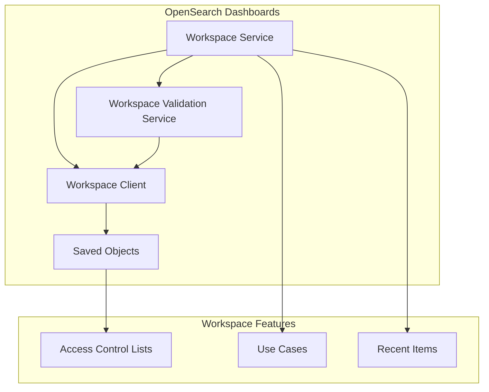
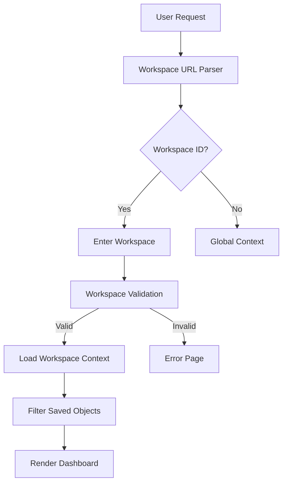

# Workspace

## Summary

Workspace is a feature in OpenSearch Dashboards that enables users to tailor their environment with use-case-specific configurations. It provides isolated storage for visual assets like dashboards and visualizations, allowing teams to organize and manage their resources independently.

## Details

### Architecture



### Data Flow



### Components

| Component | Description |
|-----------|-------------|
| `WorkspacesService` | Core service managing workspace state and lifecycle |
| `WorkspaceClient` | Client for workspace CRUD operations |
| `WorkspaceValidationService` | Validates workspace state during initialization |
| `RecentWorkspaceManager` | Manages recently accessed workspaces |
| `WorkspaceError` | Enum defining workspace error types |

### Configuration

| Setting | Description | Default |
|---------|-------------|---------|
| `workspace.enabled` | Enable workspace feature | `false` |
| `home:useNewHomePage` | Use new home page with workspace support | `false` |
| `opensearch_security.multitenancy.enabled` | Must be disabled when using workspaces | `true` |

### Workspace Data Model

```typescript
interface Workspace {
  id: string;
  name: string;
  description?: string;
  features?: string[];  // Use case IDs
  color: string;
  uiSettings: Record<string, unknown>;
}
```

### Use Cases

Workspaces support predefined use cases that limit functionality:

- `use-case-observability`
- `use-case-security-analytics`
- `use-case-search`
- `use-case-essentials`
- `use-case-all`

### Saved Object Association

Saved objects can be associated with workspaces via the `workspaces` attribute:

```json
{
  "type": "dashboard",
  "id": "da123f20-6680-11ee-93fa-df944ec23359",
  "workspaces": ["M5NqCu"]
}
```

### Usage Example

Enable workspaces in `opensearch_dashboards.yml`:

```yaml
workspace.enabled: true
uiSettings:
  overrides:
    "home:useNewHomePage": true

# If security plugin is installed
opensearch_security.multitenancy.enabled: false
```

## Limitations

- Multi-tenancy must be disabled when using workspaces (conflicts with similar functionality)
- Not all saved objects are workspace-aware; some operate globally
- Stale workspace state requires manual navigation back to home page

## Related PRs

| Version | PR | Description |
|---------|-----|-------------|
| v3.0.0 | [#9420](https://github.com/opensearch-project/OpenSearch-Dashboards/pull/9420) | Fix saved objects find returning all workspaces |
| v3.0.0 | [#9346](https://github.com/opensearch-project/OpenSearch-Dashboards/pull/9346) | Filter out recent items with errors |
| v3.0.0 | [#9478](https://github.com/opensearch-project/OpenSearch-Dashboards/pull/9478) | Add error handling page for stale workspace state |

## References

- [Workspace Documentation](https://docs.opensearch.org/3.0/dashboards/workspace/workspace/): Official workspace feature documentation
- [Getting Started with Workspaces](https://docs.opensearch.org/3.0/dashboards/workspace/index/): Introduction to workspaces
- [Create a Workspace](https://docs.opensearch.org/3.0/dashboards/workspace/create-workspace/): How to create workspaces
- [Manage Workspaces](https://docs.opensearch.org/3.0/dashboards/workspace/manage-workspace/): Workspace management guide
- [Workspace ACLs](https://docs.opensearch.org/3.0/dashboards/workspace/workspace-acl/): Access control documentation
- [Workspaces APIs](https://docs.opensearch.org/3.0/dashboards/workspace/apis/): API reference

## Change History

- **v3.0.0** (2025-05-06): Bug fixes for saved object isolation, recent items error filtering, and stale workspace error handling
- **v2.18.0**: Initial workspace feature introduction
