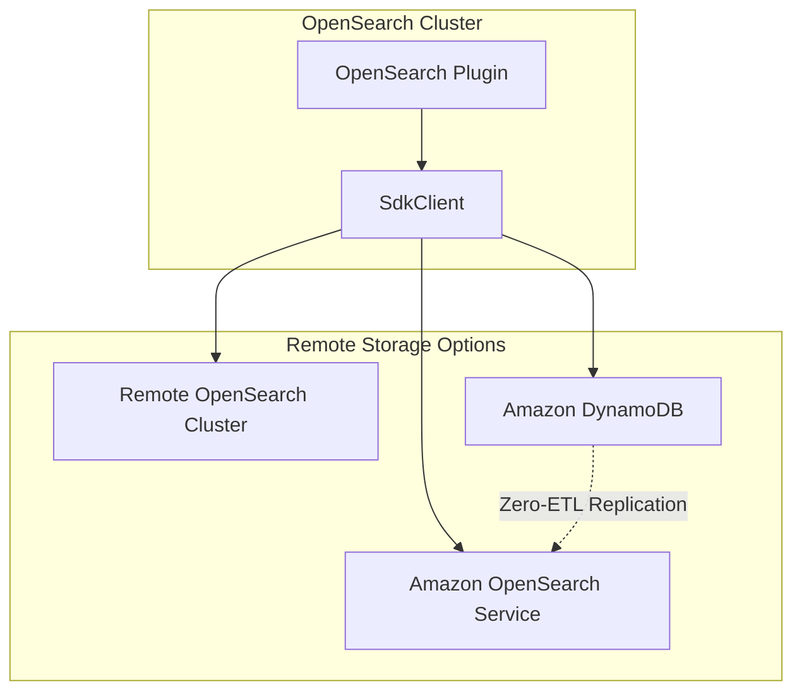
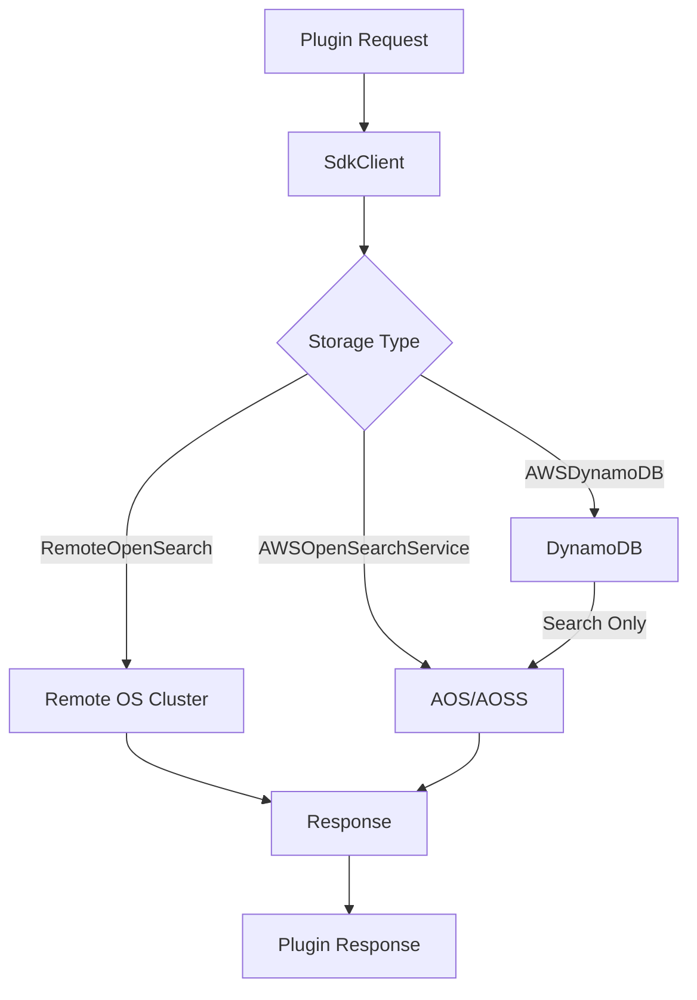

# OpenSearch Remote Metadata SDK

## Summary

The OpenSearch Remote Metadata SDK enables plugin developers to build stateless OpenSearch plugins by abstracting metadata storage to external data stores. Instead of storing metadata in local system indices within the OpenSearch cluster, plugins can use remote storage solutions like other OpenSearch clusters, Amazon OpenSearch Service, or Amazon DynamoDB. This approach improves scalability, reduces resource contention, and enables multi-tenancy support.

## Details

### Architecture



### Data Flow



### Components

| Component | Description |
|-----------|-------------|
| `SdkClient` | Main client interface for remote metadata operations |
| `SdkClientFactory` | Factory class to instantiate appropriate client based on configuration |
| `PutDataObjectRequest` | SDK wrapper for index operations with optional CMK encryption |
| `GetDataObjectRequest` | SDK wrapper for get operations with optional CMK decryption |
| `UpdateDataObjectRequest` | SDK wrapper for update operations |
| `DeleteDataObjectRequest` | SDK wrapper for delete operations |
| `SearchDataObjectRequest` | SDK wrapper for search operations |
| `SdkClientUtils` | Utility class with completion wrappers for async operations |
| `DynamoDbItemEncryptor` | Encryptor for DynamoDB items using AWS KMS (DDB backend only) |
| `FixedCredsKmsClientSupplier` | KMS client supplier with configurable credentials (DDB backend only) |

### Configuration

| Setting | Description | Default |
|---------|-------------|---------|
| `remote_metadata_type` | Storage backend type: `RemoteOpenSearch`, `AWSDynamoDB`, `AWSOpenSearchService` | - |
| `remote_metadata_endpoint` | Remote storage endpoint URL | - |
| `remote_metadata_region` | AWS region for remote storage | - |
| `remote_metadata_service_name` | Service name for remote storage | - |
| `multi_tenancy_enabled` | Enable multi-tenancy support | `false` |
| `cmkRoleArn` | AWS KMS key ARN for encrypting/decrypting data (per-request) | `null` |
| `assumeRoleArn` | IAM role ARN to assume for CMK access (per-request) | `null` |

### Supported Storage Backends

| Backend | Client Module | Use Case |
|---------|---------------|----------|
| Remote OpenSearch | `remote-client` | Self-managed remote OpenSearch cluster |
| Amazon OpenSearch Service | `aos-client` | AWS managed OpenSearch or Serverless |
| Amazon DynamoDB | `ddb-client` | DynamoDB for CRUD with zero-ETL to AOS for search |

### Usage Example

```groovy
// build.gradle dependencies
implementation ("org.opensearch:opensearch-remote-metadata-sdk:${opensearch_build}")
// For DynamoDB backend:
implementation ("org.opensearch:opensearch-remote-metadata-sdk-ddb-client:${opensearch_build}")
```

```java
// Initialize in createComponents()
SdkClient sdkClient = SdkClientFactory.createSdkClient(
    client,
    xContentRegistry,
    Map.ofEntries(
        Map.entry(REMOTE_METADATA_TYPE_KEY, REMOTE_METADATA_TYPE.get(settings)),
        Map.entry(REMOTE_METADATA_ENDPOINT_KEY, REMOTE_METADATA_ENDPOINT.get(settings)),
        Map.entry(REMOTE_METADATA_REGION_KEY, REMOTE_METADATA_REGION.get(settings)),
        Map.entry(REMOTE_METADATA_SERVICE_NAME_KEY, REMOTE_METADATA_SERVICE_NAME.get(settings)),
        Map.entry(TENANT_AWARE_KEY, "true"),
        Map.entry(TENANT_ID_FIELD_KEY, TENANT_ID_FIELD)
    ),
    client.threadPool().executor(ThreadPool.Names.GENERIC)
);

// Use SDK client for operations
GetDataObjectRequest request = GetDataObjectRequest.builder()
    .index(indexName)
    .id(documentId)
    .tenantId(tenantId)  // For multi-tenancy
    .build();
sdkClient.getDataObjectAsync(request)
    .whenComplete(SdkClientUtils.wrapGetCompletion(actionListener));
```

### Supported Plugins

The following plugins support multi-tenancy with remote metadata storage:

- **ML Commons**: Connectors, model groups, externally hosted models, agents, tasks
- **Flow Framework**: Workflow configurations and state

## Limitations

- Indices (OpenSearch) or tables (DynamoDB) must be created manually before use
- Thread pool parameter currently unused but reserved for future implementations
- DynamoDB backend requires zero-ETL replication setup for search operations
- CMK encryption is only supported for the DynamoDB backend
- Existing unencrypted data cannot be read with CMK parameters enabled

## Change History

- **v3.4.0** (2026-01-14): Add CMK support for encrypting/decrypting customer data in DynamoDB backend with STS role assumption for cross-account access (PRs #271, #295); Fix error when updating global model status (PR #291)
- **v3.3.0** (2025-09-22): Added SeqNo/PrimaryTerm support for Put and Delete requests, RefreshPolicy and timeout configuration for write operations, empty string ID validation fix, and ThreadContextAccess API compatibility fixes (PRs #234, #244, #236, #250, #254)
- **v3.0.0** (2025-05-06): Update `Client` import path from `org.opensearch.client.Client` to `org.opensearch.transport.client.Client` for JPMS compatibility with OpenSearch 3.0.0 (PR #73)
- **v3.0.0** (2025-05-06): Bug fixes for version conflict detection, DynamoDB consistency, error handling, response passthrough, URL encoding, and request validation (PRs #114, #121, #128, #130, #141, #156, #157, #158)
- **v3.0.0** (2025-05-06): Added developer guide with migration instructions (PR #124)

## References

### Documentation
- [Plugin as a Service Documentation](https://docs.opensearch.org/3.0/developer-documentation/plugin-as-a-service/index/): Official OpenSearch documentation
- [AWS Database Encryption SDK](https://docs.aws.amazon.com/database-encryption-sdk/latest/devguide/what-is-database-encryption-sdk.html): AWS documentation for database encryption
- [AWS KMS Multi-Region Keys](https://docs.aws.amazon.com/kms/latest/developerguide/multi-region-keys-overview.html): Multi-region key documentation
- [PR #124](https://github.com/opensearch-project/opensearch-remote-metadata-sdk/pull/124): Add a developer guide
- [PR #271](https://github.com/opensearch-project/opensearch-remote-metadata-sdk/pull/271): CMK encryption support
- [PR #295](https://github.com/opensearch-project/opensearch-remote-metadata-sdk/pull/295): Assume role for CMK
- [DEVELOPER_GUIDE.md](https://github.com/opensearch-project/opensearch-remote-metadata-sdk/blob/main/DEVELOPER_GUIDE.md): Full developer guide
- [SDK Client Repository](https://github.com/opensearch-project/opensearch-remote-metadata-sdk): Source repository
- [Zero-ETL Replication](https://docs.aws.amazon.com/amazondynamodb/latest/developerguide/OpenSearchIngestionForDynamoDB.html): DynamoDB to OpenSearch replication

### Pull Requests
| Version | PR | Description | Related Issue |
|---------|-----|-------------|---------------|
| v3.4.0 | [#271](https://github.com/opensearch-project/opensearch-remote-metadata-sdk/pull/271) | Add CMK support to encrypt/decrypt customer data |   |
| v3.4.0 | [#295](https://github.com/opensearch-project/opensearch-remote-metadata-sdk/pull/295) | Add assume role for CMK |   |
| v3.4.0 | [#291](https://github.com/opensearch-project/opensearch-remote-metadata-sdk/pull/291) | Fix error when updating model status |   |
| v3.3.0 | [#234](https://github.com/opensearch-project/opensearch-remote-metadata-sdk/pull/234) | Add SeqNo and PrimaryTerm support to Put and Delete requests | [#233](https://github.com/opensearch-project/opensearch-remote-metadata-sdk/issues/233) |
| v3.3.0 | [#244](https://github.com/opensearch-project/opensearch-remote-metadata-sdk/pull/244) | Add RefreshPolicy and timeout support to Put, Update, Delete, and Bulk requests | [#178](https://github.com/opensearch-project/opensearch-remote-metadata-sdk/issues/178) |
| v3.3.0 | [#236](https://github.com/opensearch-project/opensearch-remote-metadata-sdk/pull/236) | Throw exception on empty string for put request ID | [#191](https://github.com/opensearch-project/opensearch-remote-metadata-sdk/issues/191) |
| v3.3.0 | [#250](https://github.com/opensearch-project/opensearch-remote-metadata-sdk/pull/250) | Update argument type for ThreadContextAccess:doPrivileged |   |
| v3.3.0 | [#254](https://github.com/opensearch-project/opensearch-remote-metadata-sdk/pull/254) | Use AccessController instead of ThreadContextAccess |   |
| v3.0.0 | [#73](https://github.com/opensearch-project/opensearch-remote-metadata-sdk/pull/73) | Update o.o.client imports to o.o.transport.client for JPMS compatibility |   |
| v3.0.0 | [#124](https://github.com/opensearch-project/opensearch-remote-metadata-sdk/pull/124) | Add a developer guide |   |
| v3.0.0 | [#114](https://github.com/opensearch-project/opensearch-remote-metadata-sdk/pull/114) | Fix version conflict check for update |   |
| v3.0.0 | [#121](https://github.com/opensearch-project/opensearch-remote-metadata-sdk/pull/121) | Use SdkClientDelegate's classloader for ServiceLoader |   |
| v3.0.0 | [#128](https://github.com/opensearch-project/opensearch-remote-metadata-sdk/pull/128) | Ensure consistent reads on DynamoDB getItem calls | [#127](https://github.com/opensearch-project/opensearch-remote-metadata-sdk/issues/127) |
| v3.0.0 | [#130](https://github.com/opensearch-project/opensearch-remote-metadata-sdk/pull/130) | Return 404 for Index not found on Local Cluster search |   |
| v3.0.0 | [#141](https://github.com/opensearch-project/opensearch-remote-metadata-sdk/pull/141) | Directly return responses from Local Cluster client | [#132](https://github.com/opensearch-project/opensearch-remote-metadata-sdk/issues/132) |
| v3.0.0 | [#156](https://github.com/opensearch-project/opensearch-remote-metadata-sdk/pull/156) | Make generated responses robust to URL encoded values |   |
| v3.0.0 | [#157](https://github.com/opensearch-project/opensearch-remote-metadata-sdk/pull/157) | Validate request fields in DDB Put and Update | [#154](https://github.com/opensearch-project/opensearch-remote-metadata-sdk/issues/154) |
| v3.0.0 | [#158](https://github.com/opensearch-project/opensearch-remote-metadata-sdk/pull/158) | Properly handle remote client search failures |   |

### Issues (Design / RFC)
- [Issue #127](https://github.com/opensearch-project/opensearch-remote-metadata-sdk/issues/127): DDB getItem() eventually consistent bug
- [Issue #132](https://github.com/opensearch-project/opensearch-remote-metadata-sdk/issues/132): Aggregation API failure bug
- [Issue #154](https://github.com/opensearch-project/opensearch-remote-metadata-sdk/issues/154): DDBClient validation bug
- [Issue #178](https://github.com/opensearch-project/opensearch-remote-metadata-sdk/issues/178): RefreshPolicy support request
- [Issue #191](https://github.com/opensearch-project/opensearch-remote-metadata-sdk/issues/191): Empty string ID validation
- [Issue #233](https://github.com/opensearch-project/opensearch-remote-metadata-sdk/issues/233): SeqNo/PrimaryTerm support request
- [Issue #1082](https://github.com/opensearch-project/flow-framework/issues/1082): Version conflict bug in flow-framework
