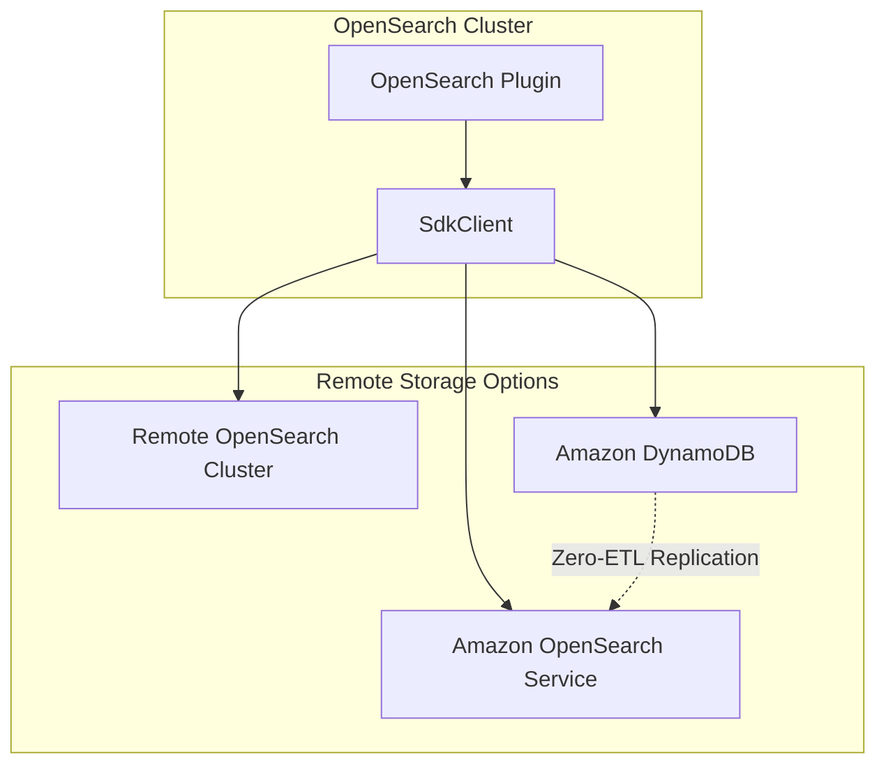
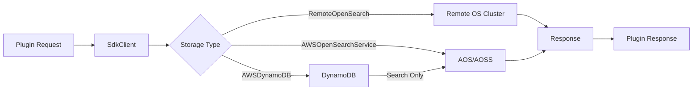

# OpenSearch Remote Metadata SDK

## Summary

The OpenSearch Remote Metadata SDK enables plugin developers to build stateless OpenSearch plugins by abstracting metadata storage to external data stores. Instead of storing metadata in local system indices within the OpenSearch cluster, plugins can use remote storage solutions like other OpenSearch clusters, Amazon OpenSearch Service, or Amazon DynamoDB. This approach improves scalability, reduces resource contention, and enables multi-tenancy support.

## Details

### Architecture



### Data Flow



### Components

| Component | Description |
|-----------|-------------|
| `SdkClient` | Main client interface for remote metadata operations |
| `SdkClientFactory` | Factory class to instantiate appropriate client based on configuration |
| `PutDataObjectRequest` | SDK wrapper for index operations |
| `GetDataObjectRequest` | SDK wrapper for get operations |
| `UpdateDataObjectRequest` | SDK wrapper for update operations |
| `DeleteDataObjectRequest` | SDK wrapper for delete operations |
| `SearchDataObjectRequest` | SDK wrapper for search operations |
| `SdkClientUtils` | Utility class with completion wrappers for async operations |

### Configuration

| Setting | Description | Default |
|---------|-------------|---------|
| `remote_metadata_type` | Storage backend type: `RemoteOpenSearch`, `AWSDynamoDB`, `AWSOpenSearchService` | - |
| `remote_metadata_endpoint` | Remote storage endpoint URL | - |
| `remote_metadata_region` | AWS region for remote storage | - |
| `remote_metadata_service_name` | Service name for remote storage | - |
| `multi_tenancy_enabled` | Enable multi-tenancy support | `false` |

### Supported Storage Backends

| Backend | Client Module | Use Case |
|---------|---------------|----------|
| Remote OpenSearch | `remote-client` | Self-managed remote OpenSearch cluster |
| Amazon OpenSearch Service | `aos-client` | AWS managed OpenSearch or Serverless |
| Amazon DynamoDB | `ddb-client` | DynamoDB for CRUD with zero-ETL to AOS for search |

### Usage Example

```groovy
// build.gradle dependencies
implementation ("org.opensearch:opensearch-remote-metadata-sdk:${opensearch_build}")
// For DynamoDB backend:
implementation ("org.opensearch:opensearch-remote-metadata-sdk-ddb-client:${opensearch_build}")
```

```java
// Initialize in createComponents()
SdkClient sdkClient = SdkClientFactory.createSdkClient(
    client,
    xContentRegistry,
    Map.ofEntries(
        Map.entry(REMOTE_METADATA_TYPE_KEY, REMOTE_METADATA_TYPE.get(settings)),
        Map.entry(REMOTE_METADATA_ENDPOINT_KEY, REMOTE_METADATA_ENDPOINT.get(settings)),
        Map.entry(REMOTE_METADATA_REGION_KEY, REMOTE_METADATA_REGION.get(settings)),
        Map.entry(REMOTE_METADATA_SERVICE_NAME_KEY, REMOTE_METADATA_SERVICE_NAME.get(settings)),
        Map.entry(TENANT_AWARE_KEY, "true"),
        Map.entry(TENANT_ID_FIELD_KEY, TENANT_ID_FIELD)
    ),
    client.threadPool().executor(ThreadPool.Names.GENERIC)
);

// Use SDK client for operations
GetDataObjectRequest request = GetDataObjectRequest.builder()
    .index(indexName)
    .id(documentId)
    .tenantId(tenantId)  // For multi-tenancy
    .build();
sdkClient.getDataObjectAsync(request)
    .whenComplete(SdkClientUtils.wrapGetCompletion(actionListener));
```

### Supported Plugins

The following plugins support multi-tenancy with remote metadata storage:

- **ML Commons**: Connectors, model groups, externally hosted models, agents, tasks
- **Flow Framework**: Workflow configurations and state

## Limitations

- Indices (OpenSearch) or tables (DynamoDB) must be created manually before use
- Thread pool parameter currently unused but reserved for future implementations
- DynamoDB backend requires zero-ETL replication setup for search operations

## Related PRs

| Version | PR | Description |
|---------|-----|-------------|
| v3.0.0 | [#124](https://github.com/opensearch-project/opensearch-remote-metadata-sdk/pull/124) | Add a developer guide |

## References

- [PR #124](https://github.com/opensearch-project/opensearch-remote-metadata-sdk/pull/124): Add a developer guide
- [DEVELOPER_GUIDE.md](https://github.com/opensearch-project/opensearch-remote-metadata-sdk/blob/main/DEVELOPER_GUIDE.md): Full developer guide
- [Plugin as a Service Documentation](https://docs.opensearch.org/3.0/developer-documentation/plugin-as-a-service/index/): Official OpenSearch documentation
- [SDK Client Repository](https://github.com/opensearch-project/opensearch-remote-metadata-sdk): Source repository
- [Zero-ETL Replication](https://docs.aws.amazon.com/amazondynamodb/latest/developerguide/OpenSearchIngestionForDynamoDB.html): DynamoDB to OpenSearch replication

## Change History

- **v3.0.0** (2025-04-02): Added developer guide with migration instructions (PR #124)
