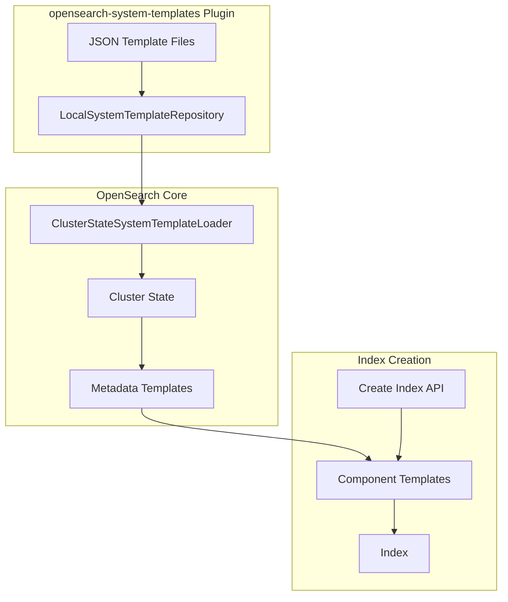
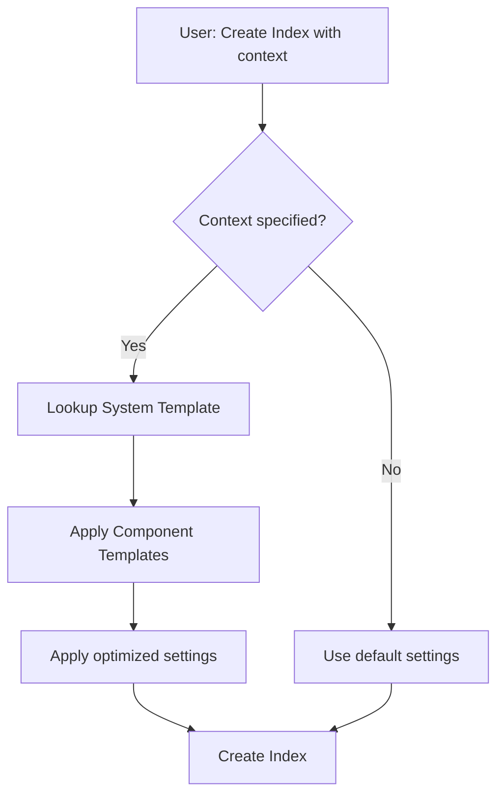

# System Templates (Application-Based Configuration)

## Summary

System Templates provide pre-configured index templates optimized for specific use cases like logs and metrics. Instead of manually configuring index settings, users specify an application context (e.g., `logs`, `metrics`, `nginx-logs`) and OpenSearch automatically applies optimized settings including compression codecs, merge policies, and refresh intervals.

Key benefits:
- ~20% storage reduction with `zstd_no_dict` codec
- ~6% p99 latency improvement
- Simplified index configuration for common use cases
- Consistent best practices across deployments

## Details

### Architecture



### Data Flow



### Components

| Component | Description |
|-----------|-------------|
| `LocalSystemTemplateRepository` | Loads JSON template definitions from plugin resources |
| `ClusterStateSystemTemplateLoader` | Applies templates to cluster state on startup |
| `SystemTemplateMetadata` | Stores template metadata in cluster state |
| `SystemTemplatesPlugin` | Main plugin entry point |

### Available Templates

| Template | Context | Use Case |
|----------|---------|----------|
| `logs` | `logs` | General log data |
| `metrics` | `metrics` | Time-series metrics |
| `nginx-logs` | `nginx-logs` | Nginx access/error logs |
| `apache-web-logs` | `apache-web-logs` | Apache HTTP server logs |
| `amazon-cloudtrail-logs` | `amazon-cloudtrail-logs` | AWS CloudTrail audit logs |
| `amazon-elb-logs` | `amazon-elb-logs` | AWS Elastic Load Balancer logs |
| `amazon-s3-logs` | `amazon-s3-logs` | AWS S3 access logs |
| `k8s-logs` | `k8s-logs` | Kubernetes container logs |

### Configuration

| Setting | Description | Default |
|---------|-------------|---------|
| `cluster.application_templates.enabled` | Enable system templates feature | `false` |

### Optimized Settings Applied

Templates apply these optimizations:

| Setting | Value | Benefit |
|---------|-------|---------|
| `index.codec` | `zstd_no_dict` | ~20% storage reduction |
| `index.merge.policy` | `log_byte_size` | Improved merge efficiency |
| `index.refresh_interval` | `60s` | Reduced refresh overhead |

### Usage Example

Enable the feature:
```yaml
# opensearch.yml
cluster.application_templates.enabled: true
```

Create an index with application context:
```json
PUT /my-nginx-logs
{
  "settings": {
    "index.context.created": "nginx-logs"
  }
}
```

The index automatically inherits optimized settings from the `nginx-logs` template.

### Dependencies

- Requires `opensearch-custom-codecs` plugin for `zstd_no_dict` codec support

## Limitations

- Feature is experimental in v2.17.0
- Context cannot be changed after index creation
- Requires explicit enablement via cluster setting
- Custom codec requires additional plugin installation

## Related PRs

| Version | PR | Description |
|---------|-----|-------------|
| v2.17.0 | [opensearch-system-templates#3](https://github.com/opensearch-project/opensearch-system-templates/pull/3) | Initial implementation with basic templates |
| v2.17.0 | [opensearch-system-templates#8](https://github.com/opensearch-project/opensearch-system-templates/pull/8) | Add nginx, apache, AWS, k8s templates + zstd support |
| v2.17.0 | [opensearch-system-templates#11](https://github.com/opensearch-project/opensearch-system-templates/pull/11) | Backport to 2.x branch |

## References

- [OpenSearch Blog: Application-Based Configuration Templates](https://opensearch.org/blog/abc-templates/): Feature announcement and details
- [opensearch-system-templates Repository](https://github.com/opensearch-project/opensearch-system-templates): Source code

## Change History

- **v2.17.0** (2024-10-22): Initial experimental release with 8 templates (logs, metrics, nginx-logs, apache-web-logs, amazon-cloudtrail-logs, amazon-elb-logs, amazon-s3-logs, k8s-logs)
