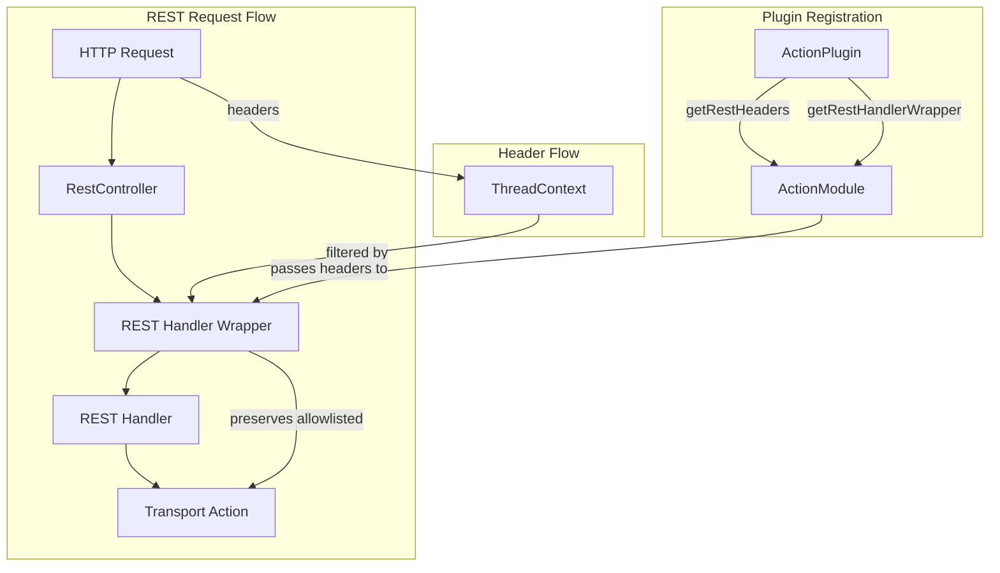
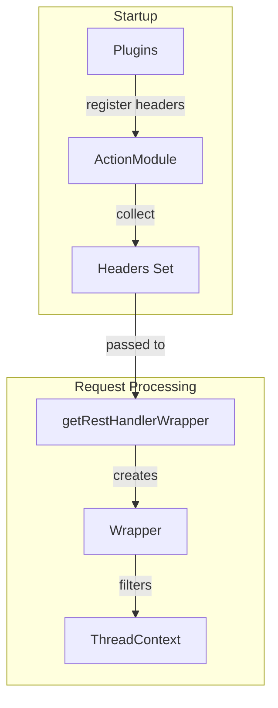

---
tags:
  - security
---

# ActionPlugin REST Handler Wrapper

## Summary

The `ActionPlugin.getRestHandlerWrapper` extension point allows plugins to wrap REST handlers with custom functionality such as authentication, authorization, logging, or request modification. In v3.4.0, this API was enhanced to pass the registry of allowlisted REST headers, enabling plugins to efficiently access and preserve headers that should be propagated through the transport layer.

## Details

### Architecture



### Data Flow



### Components

| Component | Description |
|-----------|-------------|
| `ActionPlugin` | Plugin interface for registering actions and REST handlers |
| `ActionModule` | Core module that manages action and REST handler registration |
| `RestHeaderDefinition` | Definition of a REST header including name and multi-value support |
| `ThreadContext` | Thread-local storage for request context including headers |
| `RestHandler.Wrapper` | Decorator pattern for wrapping REST handlers |

### Configuration

This feature is API-based and does not require configuration. Plugins implement the interface methods to participate.

### API Methods

| Method | Description |
|--------|-------------|
| `getRestHeaders()` | Returns headers to copy from REST requests to ThreadContext |
| `getRestHandlerWrapper(ThreadContext, Set<RestHeaderDefinition>)` | Returns a function to wrap REST handlers (v3.4.0+) |
| `getRestHandlerWrapper(ThreadContext)` | Deprecated single-parameter version |

### Usage Example

```java
public class MySecurityPlugin extends Plugin implements ActionPlugin {
    
    @Override
    public Collection<RestHeaderDefinition> getRestHeaders() {
        return List.of(
            new RestHeaderDefinition("X-Custom-Auth", false),
            new RestHeaderDefinition("X-Trace-Id", false)
        );
    }
    
    @Override
    public UnaryOperator<RestHandler> getRestHandlerWrapper(
            ThreadContext threadContext, 
            Set<RestHeaderDefinition> headersToCopy) {
        return originalHandler -> new RestHandler() {
            @Override
            public void handleRequest(RestRequest request, RestChannel channel, 
                                       NodeClient client) throws Exception {
                // Efficiently access only allowlisted headers
                for (RestHeaderDefinition header : headersToCopy) {
                    String value = threadContext.getHeader(header.getName());
                    if (value != null) {
                        // Validate or process header
                    }
                }
                originalHandler.handleRequest(request, channel, client);
            }
            
            @Override
            public List<Route> routes() {
                return originalHandler.routes();
            }
        };
    }
}
```

## Limitations

- Only one plugin per cluster can implement `getRestHandlerWrapper`
- If multiple plugins attempt to register wrappers, an error is thrown
- The wrapper applies to all REST handlers, not selectively

## Change History

- **v3.4.0** (2026-01-14): Added `Set<RestHeaderDefinition>` parameter to `getRestHandlerWrapper` method, deprecated single-parameter version

## Related Features
- [OpenSearch Dashboards](../opensearch-dashboards/ai-chat.md)

## References

### Documentation
- [ActionPlugin.java](https://github.com/opensearch-project/OpenSearch/blob/main/server/src/main/java/org/opensearch/plugins/ActionPlugin.java): Source code
- [ActionModule.java](https://github.com/opensearch-project/OpenSearch/blob/main/server/src/main/java/org/opensearch/action/ActionModule.java): Implementation

### Pull Requests
| Version | PR | Description | Related Issue |
|---------|-----|-------------|---------------|
| v3.4.0 | [#19875](https://github.com/opensearch-project/OpenSearch/pull/19875) | Pass registry of headers to getRestHandlerWrapper | [#4799](https://github.com/opensearch-project/OpenSearch/issues/4799) |

### Issues (Design / RFC)
- [Issue #4799](https://github.com/opensearch-project/security/issues/4799): Original bug report about dropped headers
