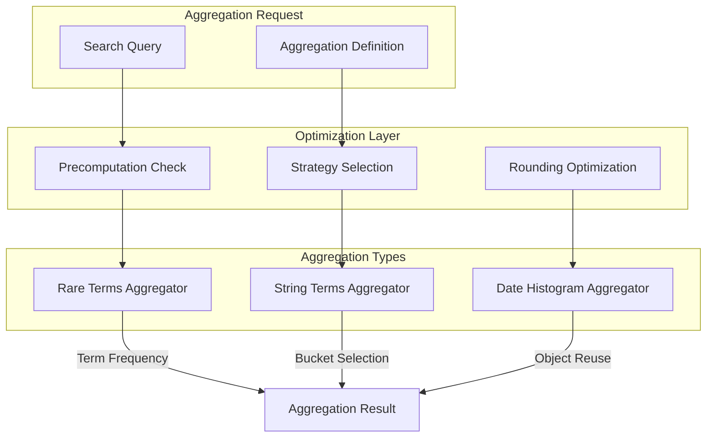
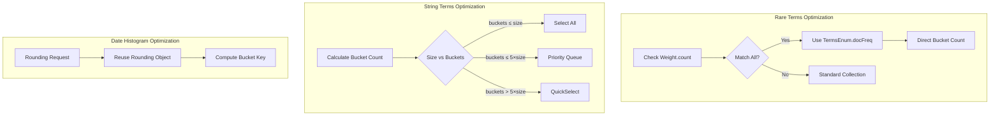

# Aggregation Optimizations

## Summary

OpenSearch provides various performance optimizations for aggregation operations. These optimizations reduce query latency and memory consumption by using smarter algorithms for bucket selection, precomputation techniques, and object reuse patterns. The optimizations target three key aggregation types: rare terms, string terms, and date histogram aggregations.

## Details

### Architecture



### Data Flow



### Components

| Component | Description |
|-----------|-------------|
| `StringRareTermsAggregator` | Aggregator for rare terms with precomputation support |
| `GlobalOrdinalsStringTermsAggregator` | String terms aggregator with adaptive bucket selection |
| `BucketSelectionStrategy` | Strategy enum for selecting bucket selection algorithm |
| `Rounding` | Date rounding utilities with object reuse optimization |
| `TimeUnitPreparedRounding` | Prepared rounding implementations for time units |
| `TimeIntervalPreparedRounding` | Prepared rounding implementations for time intervals |

### Configuration

| Setting | Description | Default |
|---------|-------------|---------|
| `search.bucket_selection_strategy_factor` | Threshold factor for quickselect vs priority queue | 5 |

### Optimization Strategies

#### Rare Terms Precomputation

When the following conditions are met, rare terms aggregation can skip document iteration:

1. `Weight.count(leafContext) == leafContext.reader().maxDoc()` (match-all query)
2. No deleted documents in the segment
3. No sub-aggregations defined
4. No `_doc_count` field present

The aggregator then uses `TermsEnum.docFreq()` to get bucket counts directly from the index.

#### String Terms Bucket Selection

Three strategies are available based on the ratio of requested size to total buckets:

| Strategy | Algorithm | Time Complexity | When Used |
|----------|-----------|-----------------|-----------|
| `select_all` | Direct copy | O(n) | buckets ≤ size |
| `priority_queue` | Heap-based selection | O(n log k) | buckets ≤ 5×size |
| `quick_select` | Partition-based selection | O(n) average | buckets > 5×size |

#### Date Histogram Object Reuse

Rounding utility classes are instantiated once and reused:

```java
// Before: Created new object for each call
return new JavaTimeToMidnightRounding().nextRoundingValue(utcMillis);

// After: Reuses single instance
private final JavaTimeToMidnightRounding MIDNIGHT_ROUNDING = new JavaTimeToMidnightRounding();
return MIDNIGHT_ROUNDING.nextRoundingValue(utcMillis);
```

### Usage Example

```json
// Rare terms aggregation
GET /logs/_search
{
  "size": 0,
  "aggs": {
    "rare_errors": {
      "rare_terms": {
        "field": "error_code.keyword",
        "max_doc_count": 10,
        "precision": 0.001
      }
    }
  }
}

// String terms with large bucket count
GET /events/_search
{
  "size": 0,
  "aggs": {
    "by_user": {
      "terms": {
        "field": "user_id.keyword",
        "size": 10000
      }
    }
  }
}

// Date histogram with sub-aggregation
GET /metrics/_search
{
  "size": 0,
  "aggs": {
    "by_hour": {
      "date_histogram": {
        "field": "@timestamp",
        "calendar_interval": "hour"
      },
      "aggs": {
        "avg_value": {
          "avg": { "field": "value" }
        }
      }
    }
  }
}
```

## Limitations

- Rare terms precomputation requires specific conditions (match-all, no deletions, no sub-aggs)
- String terms quickselect does not apply to significant terms aggregations
- Date histogram optimization benefits are most visible with sub-aggregations
- Precomputation does not work with documents containing `_doc_count` field

## Related PRs

| Version | PR | Description |
|---------|-----|-------------|
| v3.3.0 | [#18978](https://github.com/opensearch-project/OpenSearch/pull/18978) | Rare terms aggregation precomputation |
| v3.3.0 | [#18732](https://github.com/opensearch-project/OpenSearch/pull/18732) | String terms aggregation optimization |
| v3.3.0 | [#19088](https://github.com/opensearch-project/OpenSearch/pull/19088) | Date histogram rounding optimization |

## References

- [Issue #13122](https://github.com/opensearch-project/OpenSearch/issues/13122): Rare Terms Aggregation Performance Optimization
- [Issue #18704](https://github.com/opensearch-project/OpenSearch/issues/18704): Optimize String terms agg
- [Issue #10954](https://github.com/opensearch-project/OpenSearch/issues/10954): Use Collector.setWeight to improve aggregation performance
- [Rare Terms Documentation](https://docs.opensearch.org/3.0/aggregations/bucket/rare-terms/)
- [Terms Aggregation Documentation](https://docs.opensearch.org/3.0/aggregations/bucket/terms/)
- [Date Histogram Documentation](https://docs.opensearch.org/3.0/aggregations/bucket/date-histogram/)

## Change History

- **v3.3.0** (2026-01): Added precomputation for rare terms, quickselect for string terms, object reuse for date histogram
